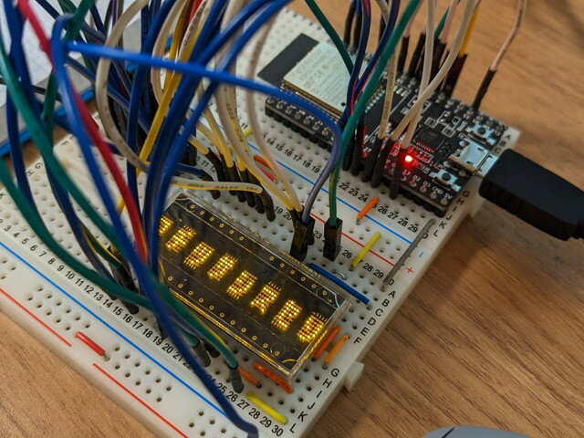
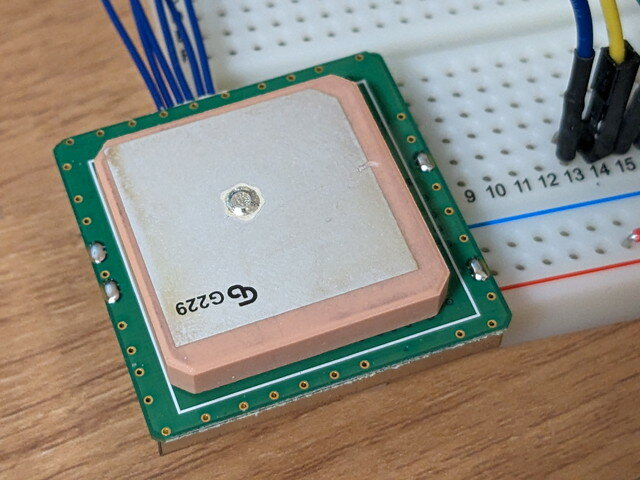
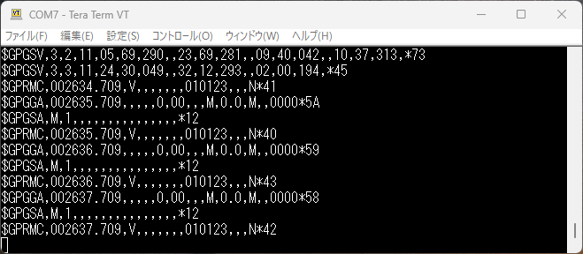
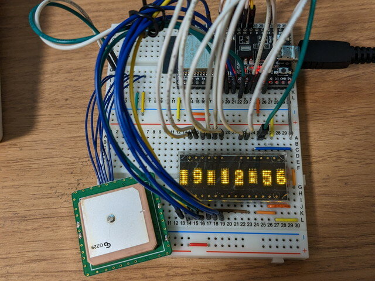

あけましておめでとうございます。  
去年は[m3piで2022年の書き初めをしてみました](https://kanpapa.com/2022/01/m3pi-newyear2022.html "m3piで2022年の書き初めをしてみました")が、今年は何をしようかなと思っていたところで以前[デジット](https://digit.kyohritsu.com/ "デジット")さんで購入した5x7ドット 8桁 LEDディスプレイ(HDSP-2121)が大掃除で見つかりました。

付属の参考資料を確認したところ、通常の英文字以外にもユーザ定義文字が使えるようでちょっとした絵も描けそうです。これを使って新年のメッセージを表示することにしました。

<!--more-->

### LEDディスプレイの動作確認

かなり昔に購入したままになっていたものですので、まずは動作確認からです。付属の参考資料だけでは細かい点が不明だったのでデータシートを入手しました。型番は少し違いますがDigi-keyにありました。

- [Broadcom Limited HDSP-2111](https://www.digikey.jp/ja/products/detail/broadcom-limited/HDSP-2111/637426 "Broadcom Limited HDSP-2111")

これも確認しながら、ESP32-DEVKITに以下のように接続しました。

| **LED Display** | **ESP32-DEVKITC** |
| --- | --- |
| D\[7:0\] | GPIO\[19:12\] |
| A\[2:0\] | GPIO\[23:21\] |
| A3 | GPIO25 |
| A4 | GPIO26 |
| ~FL | GPIO27 |
| ~WR,~CE | GPIO4 |
| ~RST | GPIO5 |
| VDD | 3V3 |
| GND | GND |

プログラミングはArduino IDE ESP32を使用します。このLEDディスプレイはデータバスが8ビットパラレル接続となっているため、ESP32のGPIOレジスタを直接操作することで簡略化を図っています。

- [esp32\_parallel\_bus.ino](https://github.com/kanpapa/newyear2023/blob/main/esp32_parallel_bus/esp32_parallel_bus.ino "esp32_parallel_bus.ino")

このプログラムでLEDに文字を表示することができたのですが、アルファベットを表示したつもりが、なぜかカナ文字が表示されてしまいました。

表示データを0x00～0xFFまで変化させて確認したところ、どうやらDigi-Keyのデータシート通りではなく、日本向けにカナのフォントが配置されているようです。結局以下のキャラクタセットが正解でした。

次はユーザ定義文字をつかってみます。兎年ですから、5x7ドットでうさぎを表示してみます。

これで何とかウサギっぽく見えそうです。このフォントデータを0x81に割り当てました。

完成したあけおめ画面の動画です。

https://youtu.be/\_B-8n0Z9gAg?si=pezdHH6hveYvZaRb

### GPSで時計を作ってみる

ここまでであけおめのメッセージが表示できるようになりました。ただこれだけでは面白くありません。手元にGPSモジュールがあったのでこれを時計の正確な信号源として、LEDに時刻を表示し、0:00になった瞬間にあけおめ画面に切り替わることを考えました。使用したGPSモジュールは[秋月電子](https://akizukidenshi.com/ "秋月電子通商")さんで購入したものです。

- [GPSモジュール GMS6-CR6 (9600bps)](https://akizukidenshi.com/catalog/goods/search.aspx?search=x&keyword=%82f%82o%82r%83%82%83W%83%85%81[%83%8B%81@%82f%82l%82r%82U%81|%82b%82q%82U%81i%82X%82U%82O%82O%82%82%82%90%82%93%81j "GPSモジュール GMS6-CR6 (9600bps)")

早速GPSモジュールの動作確認です。このモジュールは電源をつなぐとGPS衛星からの情報をシリアル出力してくれるようです。

とりあえずUSB-シリアル変換基板に接続して、出力を見てみました。

なにやら情報は取れているようです。

この情報をデコードしてくれるArduinoライブラリはないかと確認したところ、以下のライブラリが使えそうでした。

- [TinyGPSPlus-ESP32 by Mikai Hart](https://github.com/Tinyu-Zhao/TinyGPSPlus-ESP32 "TinyGPSPlus-ESP32 by Mikai Hart")

これを使いサンプルプログラムを修正して、GPSのシリアル信号から時刻情報をシリアルモニタに表示するプログラムを書きました。

- [esp32\_gpsclock\_serial\_test.ino](https://github.com/kanpapa/newyear2023/blob/main/esp32_gpsclock_serial_test/esp32_gpsclock_serial_test.ino "esp32_gpsclock_serial_test.ino")

ESP32-DEVKITとGPSモジュールは以下のように接続しました。

| **GPSモジュール** | **ESP32-DEVKITC** |
| --- | --- |
| 1: Ground | GND |
| 2: Power   3.3V ~ 6.0V DC input | 3V3 |
| 3: Serial Data In 2   Asynchronous serial input at RS-232 level, to input command message | 未接続 |
| 4: Serial Data Out 2   Asynchronous serial output at RS-232 level, to output NMEA message | 未接続 |
| 5: Serial Data In 1   Asynchronous serial input at TTL level, to input command message | GPIO32 |
| 6: Serial Data Out 1   Asynchronous serial output at TTL level, to output NMEA message | GPIO33 |

これで時刻も取得できるようになりました。

### GPS時計とLEDディスプレイを結合する

これまで作成したGPS時計とLEDディスプレイを組み合わせます。プログラムは以下のようになりました。

- [esp32\_newyear2023.ino](https://github.com/kanpapa/newyear2023/blob/main/esp32_newyear2023/esp32_newyear2023.ino "esp32_newyear2023.ino")

プログラムでは新年になった瞬間にあけおめ画面が切り替わるようにしています。最終的なハードウェアは写真のようになりました。

あとは新年を待つだけだったのですが、急いでいたためか肝心のif文を間違えてしまい、0時になっても時計のままでした。

https://youtu.be/T2J9HYbM\_vM?si=4FUyJn5OxxYuokl5

テストのために hh < 19 とかしていたので、hh < 24 としてしまったのです。これは hh != 0 が正解でした。

### 終わりに

残念ながら年越しには画面は切り替わりませんでしたが、1月2日の0:00には画面が切り替わるはずですので、今日の深夜に確認してみます。このようなバグに泣かされないことを祈りつつ、今年もよろしくお願いします。
