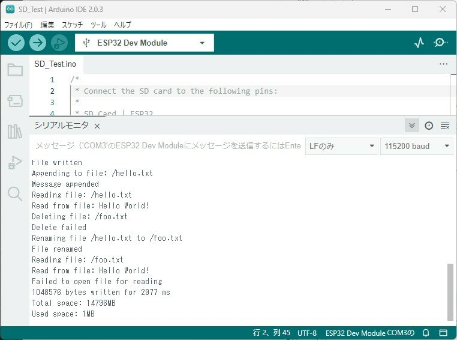

[おおたfab](https://ot-fb.com/event "おおたfab")さんでは電子工作初心者勉強会を定期的に開催しています。

今回はESP32でmicroSDを読み書きしてみます。これを利用して収集したデータをmicroSDに蓄積したり、あらかじめ作成したデータを読み込んで利用することもできるようになります。

### 材料

- [ブレッドボード 6穴版 \[112366\]](https://akizukidenshi.com/catalog/g/g112366/)

- [ESP32-DevKitC-32E ESP32-WROOM-32E開発ボード 4MB \[115673\]](https://akizukidenshi.com/catalog/g/g115673/)

- microSDカードスロット変換基板

- microSDカード

- [ブレッドボード用ワイヤー \[105159\]](https://akizukidenshi.com/catalog/g/g105159/)

- [USBケーブル \[109313\]](https://akizukidenshi.com/catalog/g/g109313/)

- [Arduino IDE ESP32がインストールされたPC](https://kanpapa.com/2022/12/esp32-otafab-study-arduino.html "ESP32のArduino開発環境をつくりました（おおたfab 電子工作初心者勉強会）")

### microSDカードスロットの接続

ESP32-DEVKITCとmicroSDカードスロット変換基板の接続は以下のようにしました。microSDカードスロット基板は各社でピン名称が異なるようですので注意してください。

[SparkFun マイクロSDカードスロット・ピッチ変換基板](https://www.switch-science.com/products/36)を使う場合は以下のように接続します。

| **MicroSD Breakout** | **ESP32-DEVKITC** |
| --- | --- |
| 1 CS | 4 (DigitalOut cs) |
| 2 DI | 23 (SPI mosi) |
| 3 VCC | +3.3V |
| 4 SCK | 18 (SPI sclk) |
| 5 GND | GND |
| 6 DO | 19 (SPI miso) |
| 7 CD | 未使用 |

[SparkFun マイクロSDカードスロット・ピッチ変換基板](https://www.switch-science.com/products/36)を使った接続例です。


秋月電子の[マイクロSDカードスロットDIP化キット \[105488\]](https://akizukidenshi.com/catalog/g/g105488/)を使う場合は以下のように接続します。

| **MicroSD DIP化キット** | **ESP32-DEVKITC** |
| --- | --- |
| 1 DAT2 | 未使用 |
| 2 CD/DAT3 | 4 (DigitalOut cs) |
| 3 CMD | 23 (SPI mosi) |
| 4 VDD | +3.3V |
| 5 CLK | 18 (SPI sclk) |
| 6 VSS | GND |
| 7 DAT0 | 19 (SPI miso) |
| 8 DAT1 | 未使用 |
| 9 SWB | 未使用 |
| 10 SWA | 未使用 |

### サンプルプログラムの書き込み

Arduino IDEでmicroSD用のサンプルプログラムがSD\_Test.inoが用意されているのでこれを使います。プログラムは以下の場所にあります。

ファイル→スケッチ例→ESP32 Dev Module用のスケッチ例→SD→SD\_Test.ino

以下の手順で確認します。

1. [SD\_Test.ino](https://github.com/espressif/arduino-esp32/blob/master/libraries/SD/examples/SD_Test/SD_Test.ino "SD_Test.ino")を開いたらそのままコンパイルしてESP32 DevKit-Cに書き込みます。

3. microSDカードをセットしてリセットボタンを押し、シリアルモニタの表示を確認します。通信速度は115200baudにしてください。

5. microSDカードが読めない場合はCard Mount FailedあるいはNo SD card attachedと表示されます。microSDカードに問題がないようであれば、配線が正しいかを確認してください。

7. 正常にmicroSDカードが使えれば、まずSD Card Type: でカードの種類が表示されます。

9. そのあとmicroSDカードの容量が表示され、ディレクトリとファイルの作成、読み書き、削除の操作が行われます。

シリアルモニタの表示例は以下のようになります。

```
SD Card Type: SDHC
SD Card Size: 14804MB
Listing directory: /
  DIR : System Volume Information
Creating Dir: /mydir
Dir created
Listing directory: /
  DIR : System Volume Information
  DIR : mydirRemoving Dir: /mydir
Dir removed
Listing directory: /
  DIR : System Volume Information
Listing directory: /System Volume Information
  FILE: WPSettings.dat  SIZE: 12
  FILE: IndexerVolumeGuid  SIZE: 76
Writing file: /hello.txt
File written
Appending to file: /hello.txt
Message appended
Reading file: /hello.txt
Read from file: Hello World!
Deleting file: /foo.txt
Delete failed
Renaming file /hello.txt to /foo.txt
File renamed
Reading file: /foo.txt
Read from file: Hello World!
Failed to open file for reading
1048576 bytes written for 2977 ms
Total space: 14796MB
Used space: 1MB
```



詳細はプログラムを参照してください。

### まとめ

microSDのライブラリを使うことで簡単なプログラムでmicroSDカードの読み書きを行うことができました。サンプルプログラムの[SD\_Test.ino](https://github.com/espressif/arduino-esp32/blob/master/libraries/SD/examples/SD_Test/SD_Test.ino "SD_Test.ino")には基本的なmicroSDカードに対する操作が含まれていますので参考になると思います。
