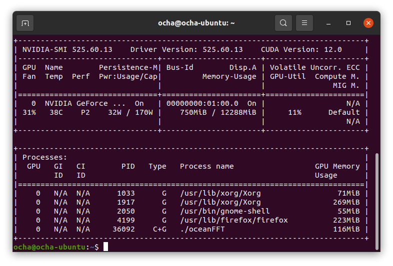
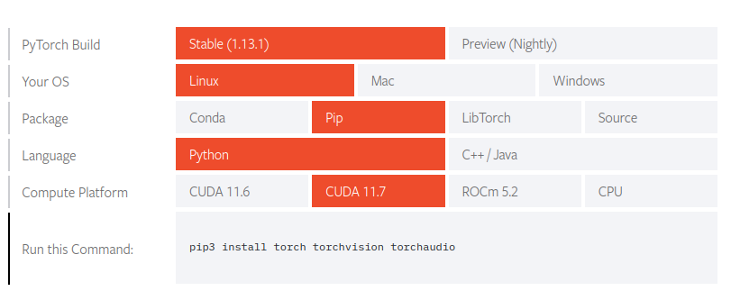
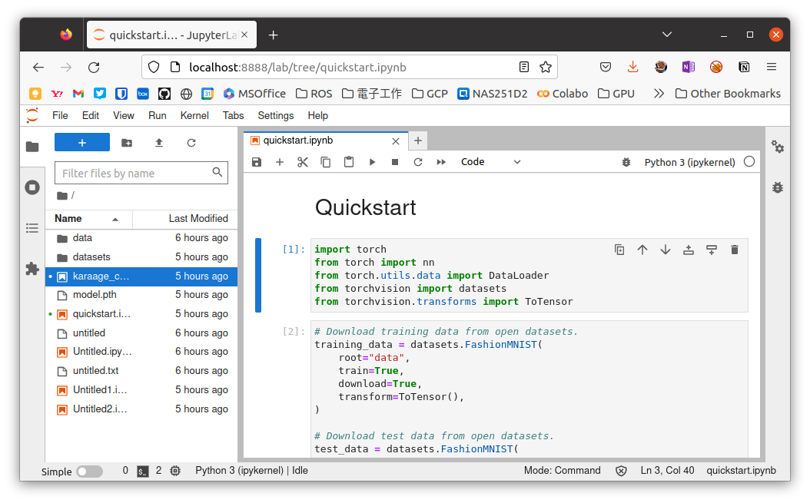

[GPU搭載のLinuxマシン](https://kanpapa.com/2023/01/linux-gpu-pc-assembled.html "久しぶりにLinux専用PCを組み立ててハマりました")を組み立てましたが、これに機械学習の環境を構築してみました。

今回は以下のものをUbuntu 20.04.5 LTSにインストールしています。

- [CUDA 12](https://developer.nvidia.com/cuda-toolkit "CUDA Toolkit")
- [PyTorch](https://pytorch.org/ "PyTorch") (Stable 1.13.1)
- [JupyterLab](https://jupyter.org/ "JupyterLab")

### CUDAのインストール

CUDAはDownloadのページにあった[最新版のCUDA 12をインストール](https://developer.nvidia.com/cuda-downloads "CUDA Toolkit 12.0 Downloads")してしまいました。インストールは公式ページの通りに行いました。

Download Installer for Linux Ubuntu 20.04 x86\_64

`$ wget https://developer.download.nvidia.com/compute/cuda/repos/ubuntu2004/x86_64/cuda-ubuntu2004.pin   $` `sudo mv cuda-ubuntu2004.pin /etc/apt/preferences.d/cuda-repository-pin-600   $` `wget https://developer.download.nvidia.com/compute/cuda/12.0.0/local_installers/cuda-repo-ubuntu2004-12-0-local_12.0.0-525.60.13-1_amd64.deb   $` `sudo dpkg -i cuda-repo-ubuntu2004-12-0-local_12.0.0-525.60.13-1_amd64.deb   $` `sudo cp /var/cuda-repo-ubuntu2004-12-0-local/cuda-*-keyring.gpg /usr/share/keyrings/   $` `sudo apt-get update   $` `sudo apt-get -y install cuda      `実はCUDA 12は最近リリースされたばかりで、本来なら実績のあるCUDA 11系にすべきでしたがあとの祭りです。

### CUDAの動作確認

せっかくなのでCUDA 12でサンプルプログラムを動かしてみます。

githubからクローンしたサンプルプログラムをコンパイルします。

```
$ cd ~$ git clone https://github.com/NVIDIA/cuda-samples.git$ cd cuda-samples$ make（延々と続きます）Finished building CUDA samples$ 
```

Finished Building CUDA samplesと表示されればコンパイル完了です。

生成された実行形式のバイナリはbinの中にあります。ここではoceanFFTを実行してみます。

```
$ bin/x86_64/linux/release/oceanFFTNOTE: The CUDA Samples are not meant for performance measurements. Results may vary when GPU Boost is enabled.[CUDA FFT Ocean Simulation]Left mouse button          - rotateMiddle mouse button        - panRight mouse button         - zoom'w' key                    - toggle wireframe[CUDA FFT Ocean Simulation] GPU Device 0: "Ampere" with compute capability 8.6
```

Jetson Nanoでみたことがあるシミュレーション結果が表示されました。CUDA 12自体は動いているようです。


この状態でnvidia-smiコマンドを入力するとoceanFFTのプロセスでGPUが使われていることが確認できました。



### PyTorchのインストール

PyTorchのドキュメントには最近リリースされたCUDA 12については情報がなかったのですが、ダメもとでインストールしてみました。

こちらも公式サイトの[Start Locally](https://pytorch.org/get-started/locally/ "Start Locally")の通りにしています。CUDA 12は無いのでCUDA 11.7のインストール手順に従いました。



インストールのコマンドは以下の通りです。

```
$ pip3 install torch torchvision torchaudio
```

インストールが終わったので動作確認です。

```
$ python3Python 3.8.10 (default, Nov 14 2022, 12:59:47) [GCC 9.4.0] on linuxType "help", "copyright", "credits" or "license" for more information.>>> import torch>>> x = torch.rand(5, 3)>>> print(x)tensor([[0.3478, 0.8823, 0.9931],        [0.4515, 0.8548, 0.2911],        [0.4186, 0.1085, 0.1599],        [0.2597, 0.7190, 0.8341],        [0.7016, 0.6272, 0.5869]])>>>
```

なにやら動いているようです。

肝心なGPUは動いているのでしょうか。以下のコマンドで確認します。

```
>>> import torch>>> torch.cuda.is_available()True
```

一応動いているように見えます。

### JupyterLabのインストール

使い勝手がよくなるようにJupyterLabをインストールします。うまくいけばGoogle Colaboと同様の環境ができあがります。

```
$ pip install jupyterlab
```

以下のコマンドで起動します。

```
$ jupyter lab
```

うまく起動できたようなので、[PytorchのチュートリアルのQuickStart](https://pytorch.org/tutorials/beginner/basics/quickstart_tutorial.html "quickstart_tutorial")にしたがって動作確認をすすめました。



なんとデータセットの読み込みからモデルの構築、最適化、モデルの保存まで一通り問題なく動いてしまいました。


### まとめ

今のところ、Google Colaboと同等に動いているように見えます。とはいえCUDA 12はPyTorchで正式サポートとはなっていないので何が起こるかわかりません。あくまでも実験的な記録として扱ってください。まだ機械学習は初心者なのでこの環境でチュートリアルを進めてみたいと思います。
