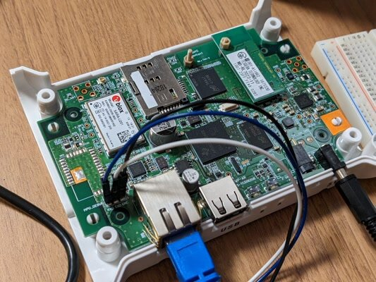
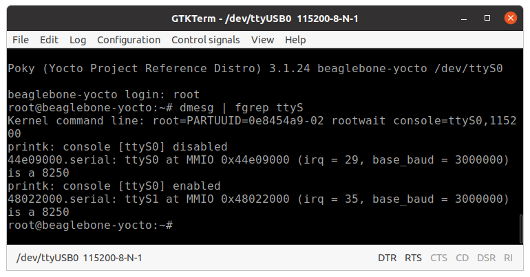
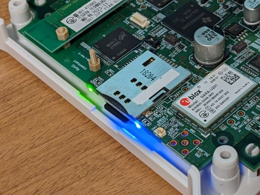

前回はYocto Projectを利用して[最低限の機能をもつLinuxカーネルをビルドして、秋月SoC基板で起動する](https://kanpapa.com/2023/03/aesoc-yocto-dunfell.html "秋月電子のSoC基板でyocto-linuxを動かしてみました（その１ 環境構築編）")ところまで行いました。今回はカーネルをカスタマイズして必要なデバイスを使えるようにします。



このSoC基板にはWi-SUNのモジュールが搭載されています。Twitterでは以下のような情報がありました。

- Wi-SUNはUART1（/dev/ttyS1）につながっている。
- Wi-SUNを使うためにはGPIO53をHighにする必要がある。
- GPIO66〜GPIO69は青色LEDが接続されている。(Lowで点灯）
- カスタマイズが必要と思われるデバイスツリーの情報はビルド後に build/tmp/work-shared/beaglebone-yocto/kernel-source/arch/arm/boot/dts/am335x-bone-common.dtsi に置かれている。

現在のカーネルでは/dev/ttyS0しかありませんので、Wi-SUNと通信ができるように/dev/ttyS1のデバイスが使えるようにカスタマイズする必要があります。am335x-bone-common.dtsiを確認したところ、uart0の定義しかありません。ここにuart1を追加すれば/dev/ttyS1が使えるようになると思われます。またGPIO53は初期値をHighになるようにしておきたいところです。

ビルドの途中でファイルにパッチをあててからビルドを継続する必要がありますが、調べたところ以下のdegi-keyさんのページが参考になりそうでした。

- [Intro to Embedded Linux Part 4 - Create Custom Layer and Image in Yocto](https://www.digikey.jp/en/maker/projects/intro-to-embedded-linux-part-4-create-custom-layer-and-image-in-yocto/aac0ab17e0c64ae482675abea00b328d "Intro to Embedded Linux Part 4 - Create Custom Layer and Image in Yocto")
- [Intro to Embedded Linux Part 5 - How to Enable I2C in the Yocto Project](https://www.digikey.jp/en/maker/projects/intro-to-embedded-linux-part-5-how-to-enable-i2c-in-the-yocto-project/6843bbf9a83c4c96888fccada1e7aedf "Intro to Embedded Linux Part 5 - How to Enable I2C in the Yocto Project")

この手順を参考にしながらカスタムレイヤーを作ってみます。開発環境は前回使用したYocto Project dunfell 3.1.23をそのまま使っています。

<!--more-->

### カスタムレイヤーを追加する

まずは環境設定をします。

```
$ cd ~/yocto/poky
$ source oe-init-build-env
```

次にカスタムレイヤーの雛形を作成します。カスタムレイヤーの名前はmeta-customとしました。

```
$ cd ~/yocto/poky
$ bitbake-layers create-layer meta-custom
```

これで、ディレクトリpokyの中にmeta-customというディレクトリができます。これがカスタムレイヤーの雛形になります。

次にcore-image-minimalのレシピをカスタムレイヤーにコピーします。

```
$ cd meta-custom
$ mkdir -p recipes-core/images
$ cp ../meta/recipes-core/images/core-image-minimal.bb recipes-core/images/custom-image.bb
```

このレシピはcore-image-minimal.bbは、bitbake core-image-minimal で実行されるものです。これをベースにcustom\-imageのレシピを作成します。エディタで内容を修正します。

```
$ vi recipes-core/images/custom-image.bb
```

修正後のcustom-image.bbは以下のようになります。今回はSUMMARYの行だけ少し手を入れ、他の行は変更していません。ROOTFSのサイズもここで変更できそうですね。

```
SUMMARY = "My custom Linux image for Akizuki AM3352 SoC board."IMAGE_INSTALL = "packagegroup-core-boot ${CORE_IMAGE_EXTRA_INSTALL}"IMAGE_LINGUAS = " "LICENSE = "MIT"inherit core-imageIMAGE_ROOTFS_SIZE ?= "8192"IMAGE_ROOTFS_EXTRA_SPACE_append = "${@bb.utils.contains("DISTRO_FEATURES",  \"systemd", " + 4096", "" ,d)}"
```

次にこのカスタムレイヤーを認識するようにbblayers.confを修正してパスを追加します。

```
$ cd ../build/$ vi conf/bblayers.conf
```

修正後のbblayers.confは以下のようになります。"/home/ユーザ名/yocto/poky/meta-custom \\"の行を追加しただけです。

```
# POKY_BBLAYERS_CONF_VERSION is increased each time build/conf/bblayers.conf
# changes incompatibly
POKY_BBLAYERS_CONF_VERSION = "2"
BBPATH = "${TOPDIR}"
BBFILES ?= ""
BBLAYERS ?= " \
/home/ユーザ名/yocto/poky/meta \
/home/ユーザ名/yocto/poky/meta-poky \
/home/ユーザ名/yocto/poky/meta-yocto-bsp \
/home/ユーザ名/yocto/poky/meta-custom \
"
```

### パッチファイルを作成する

SoCの固有情報が書かれているオリジナルのdtsiファイルをカスタマイズするためのパッチファイルを作成します。作業用にオリジナルのdtsiファイルをホームディレクトリにコピーします。

```
$ cd ~/yocto/poky/build/tmp/work-shared/beaglebone-yocto/kernel-source/arch/arm/boot/dts$ cp am335x-bone-common.dtsi ~/am335x-bone-common.dtsi.orig
```

ホームディレクトリにコピーしたオリジナルファイルをさらにコピーして修正します。

```
$ cd $ cp am335x-bone-common.dtsi.orig am335x-bone-common.dtsi$ vi am335x-bone-common.dtsi
```

修正したdtsiファイルは長くなるので[github](https://github.com/kanpapa/ae-am335x-wisun-3g-board/blob/main/dts/am335x-bone-common.dtsi "am335x-bone-common.dtsi")にいれておきました。なお、すでにdtsファイルを作成されていたかたもいましたのでこちらの情報も参考にさせていただきました。

- [秋月謎SoC基板付きケースの購入～解析とLinux(buildroot,Debian)を動かす](https://honeylab.hatenablog.jp/entry/2023/03/23/152732 "秋月謎SoC基板付きケースの購入～解析とLinux(buildroot,Debian)を動かす") （[honeylab's blog](https://honeylab.hatenablog.jp/))

次にパッチファイルを作成します。

```
$ git diff --no-index am335x-bone-common.dtsi.orig am335x-bone-common.dtsi \> 0001-add-uart1-dtsi.patch
```

作成したパッチファイルのファイル名の部分を修正します。

```
$ vi 0001-add-uart1-dtsi.patch
```

修正前

```
--- a/am335x-bone-common.dtsi.orig
+++ b/am335x-bone-common.dtsi
```

修正後

```
--- a/arch/arm/boot/dts/am335x-bone-common.dtsi
+++ b/arch/arm/boot/dts/am335x-bone-common.dtsi
```

作成したパッチファイルは[github](https://github.com/kanpapa/ae-am335x-wisun-3g-board/blob/main/yocto/poky/meta-custom/recipes-kernel/linux/linux-yocto/0001-add-uart1-dtsi.patch "0001-add-uart1-dtsi.patch")に置いておきました。

### パッチを適用するレシピを作成する

先ほど作成したパッチファイルをレシピに組み込みます。

```
$ cd ~/yocto/poky/meta-custom
$ mkdir -p recipes-kernel/linux-yocto
$ cd recipes-kernel/linux-yocto
$ vi linux-yocto_%.bbappend
```

linux-yokuto\_%.bbappendファイルには以下の内容を書き込みます。

```
FILESEXTRAPATHS_prepend := "${THISDIR}/linux-yocto:"
SRC_URI += "file://0001-add-uart1-dtsi.patch"
```

このlinux-yoctoのディレクトリに作成したパッチファイルをコピーします。

```
$ cp ~/0001-add-uart1-dtsi.patch ~/yocto/poky/meta-custom/recipes-kernel/linux/linux-yocto
```

これでレシピの準備ができました。

### カスタムカーネルのビルド

カーネルをビルドします。新しく作成したcustom-imageのレシピを使います。

$ cd ~/yocto/poky/build/  
$ `bitbake` custom-image

ビルドが成功すれば、~/yocto/poky/build/tmp/deploy/images/beaglebone-yocto/custom-image-beaglebone-yocto.wicが生成されます。このwicファイルをmicroSDへの書き込む方法は前回の[秋月電子のSoC基板でyocto-linuxを動かしてみました（その１ 環境構築編）](https://kanpapa.com/2023/03/aesoc-yocto-dunfell.html "秋月電子のSoC基板でyocto-linuxを動かしてみました（その１ 環境構築編）")の手順と同じです。

### 動作確認

/dev/ttyS1ができているかをdmesgで確認します。



ttyS1の表示がありますので、パッチは問題なくあたっているようです。

また、以下のソースファイルも確認してみましたが、正常にパッチが行われていました。

~/yocto/poky/build/tmp/work-shared/beaglebone-yocto/kernel-source/arch/arm/boot/dts/am335x-bone-common.dtsi

GPIO53を操作してHighにして試してみます。

```
$ echo 53 > /sys/class/gpio/export
$ echo out > /sys/class/gpio/gpio53/direction
$ echo 1 > /sys/class/gpio/gpio53/value
$ microcom -s 115200 /dev/ttyS1
```

この状態で試したらWi-SUNからエコーバックが返ってきました。コマンドを入力したところ以下のような結果が返ってきました。

```
SKSREG S1
ESREG 100723FFFEA802B7
OK
```

ただしWi-SUNから全く反応がないこともあります。まだ何かカスタマイズが足りないのかもしれません。

ちなみに以下のようにコマンドを入力すると、青色LEDが光ります。

```
$ echo 66 > /sys/class/gpio/export
$ echo out > /sys/class/gpio/gpio66/direction
$ echo 0 > /sys/class/gpio/gpio66/value
```



LEDを消灯する場合はHighにすれば消えます。

```
$ echo 1 > /sys/class/gpio/gpio66/value
```

### まとめ

Yoctoやdtsは初心者のためカスタマイズが不十分なところがあるかもしれません。Wi-SUNとも通信できたりできなかったりで不安定です。

今回作成したカスタムレイヤーはgithubに置いておきましたので、何かヒントがあればお知らせください。

- [https://github.com/kanpapa/ae-am335x-wisun-3g-board](https://github.com/kanpapa/ae-am335x-wisun-3g-board "ae-am335x-wisun-3g-board")

次はsshdやnginxなど必要となりそうなアプリケーションを組み込んでみたいと思います。
