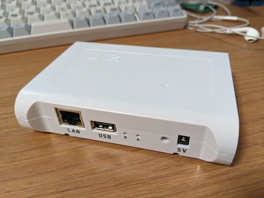
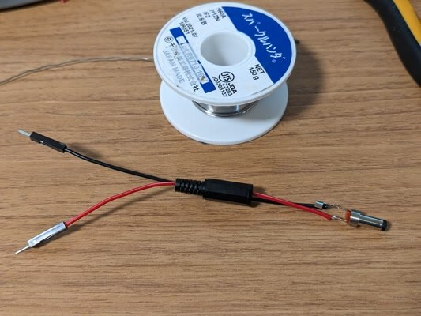
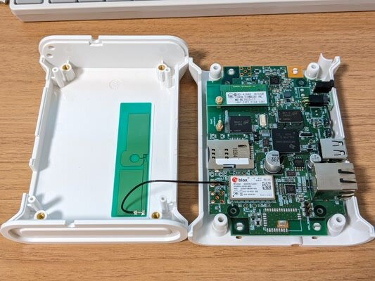
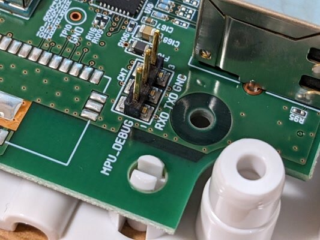
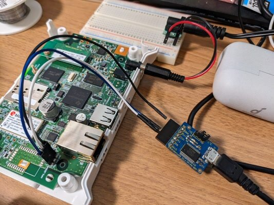
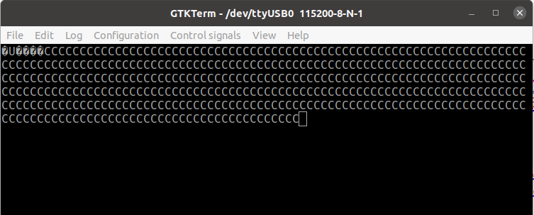
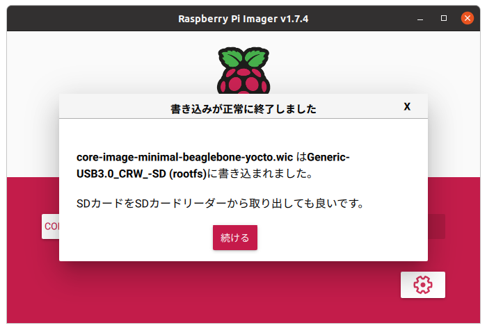

秋月電子で「部品取りに！無線モジュール付きSoc基板＋白色プラスチックケース」が格安で売られているということでいろいろ試してみました。（すでに完売の模様）



この基板で使われているSoCは[AM3352](https://www.ti.com/product/ja-jp/AM3352 " AM3352 Sitara プロセッサ: Arm Cortex-A8、1Gb イーサネット・ディスプレイ、CAN")です。これと同じシリーズのSoCを使っている[beaglebone](https://beagleboard.org/black "BeagleBone Black")のイメージを使えば、debianベースでの利用はすぐできました。以下のページの通りに作業をすればdebianがeMMCにインストールされ、スイッチONでdebianが起動します。

- [BeagleBone Blackのシステムを復旧しよう](https://www.marutsu.co.jp/select/list/detail.php?id=235 "BeagleBone Blackのシステムを復旧しよう") （マルツさんの記事）

<!--more-->

でもせっかくなのでこの基板用にカスタマイズしたLinuxを載せたいものです。調べたところ、[Yocto Project](https://www.yoctoproject.org/ "yocto project")という組み込みLinuxのプロジェクトを利用すると、汎用性が高くなりそうです。組み込みLinuxといえば以前[MC68EZ328というCPUをつかった基板でμClinuxを動かした](https://kanpapa.com/2021/09/mc68ez328-sbc-rev03-prod.html "MC68EZ328 SBC Rev.0.3基板を製作しました")ことを思い出します。

Yoctoは全く使ったことはないのですが、試行錯誤の結果、Yocto バージョン3系のdunfell 3.1.23で試したところ比較的簡単にkernelが動きましたのでまとめておきます。なお、Yocto バージョン4系になるとdtsiファイルにパッチを当ててデバイスツリーを作り直さないといけません。このあたりは実験中なので後ほどまとめたいと思います。

### Yocto Projectとは

Yocto Project（YP）は、組み込み用Linuxディストリビューションの一種ではなく、ハードウェアアーキテクチャに依存せずに、開発者がカスタムLinuxベースのシステムを作成するためのオープンソースのコラボレーションプロジェクトです。

Yocto Projectの説明や基本的な手順はYocto Projectの公式ページにあります。

- [Yocto Project](https://www.yoctoproject.org/ "Yocto project")
- [Yocto Project Quick Build](https://docs.yoctoproject.org/current/brief-yoctoprojectqs/index.html "Yocto Project Quick Build")

手持ちのハードウェアに対応した自分だけのカスタムLinuxを作ることができるものと思えば良いでしょう。

### 秋月SoC基板を動かすための準備

まずは電源ケーブルを作りました。プラグサイズは[Φ4.0×1.7mm](https://akizukidenshi.com/catalog/g/gC-15725/ "極性統一ＤＣプラグ　電圧区分２　ＭＰ－２０２")で、電源電圧は5Vです。



次にケースを開けます。3Gのアンテナへのケーブルがありますので切らないように注意してください。



シリアル接続のピンはすぐわかります。



私の場合はここにUSBシリアル基板(3.3V)を接続しました。



PCのターミナルソフト（私はUbuntuなのでGTKTermを使っています）で、115200bpsで接続します。SoC基板に電源を投入するとCの文字が連続して表示されます。



これはシリアルブートのためのXMODEMプロトコルが見えているのですが、ここまで動けばSoC基板は正常に動作し、シリアルコンソールの接続ができています。

### Yoctoでビルド環境を作成する

[Yocto Project Quick Build](https://docs.yoctoproject.org/current/brief-yoctoprojectqs/index.html "Yocto Project Quick Build")に従って、ビルド環境の構築をしていきます。今回の開発環境はUbuntu 20.04 LTSを使っています。

まずはYoctoの動作に必要なパッケージをインストールします。

```
$ sudo apt install gawk wget git diffstat unzip texinfo gcc build-essential chrpath \socat cpio python3 python3-pip python3-pexpect xz-utils debianutils iputils-ping python3-git \python3-jinja2 libegl1-mesa libsdl1.2-dev pylint3 xterm python3-subunit mesa-common-dev zstd liblz4-tool
```

次にgithubからcloneしますが、このときは以下のようにdunfellのブランチを指定するようにします。

```
$ cd
$ mkdir yocto
$ cd yocto
$ git clone -b dunfell git://git.yoctoproject.org/poky.git
```

cloneが終わったら、以下のコマンドを入力します。これで開発環境ができました。buildというディレクトリの中に移動していると思います。ここにビルドで必要な設定や生成されたファイルが置かれていきます。

```
$ cd poky
$ source oe-init-build-env
```

buildディレクトリのconf/local.confに以下の行がありますので、この行の頭にあるコメント(#)を外して保存します。beagleboneはリファレンスボードのため修正箇所はこれだけです。

```
MACHINE ?= "beaglebone-yocto"
```

buildディレクトリで以下のコマンドを入力してビルドします。

```
$ bitbake core-image-minimal
```

ビルドにはかなりの時間がかかります。私のPCでは40分ぐらいかかりました。

ビルドが完了すると以下のファイルができます。（シンボリックリンクになっていますので実体は別ファイルです）

build/tmp/deploy/images/beaglebone-yocto/core-image-minimal-beaglebone-yocto.wic

このファイルをRaspberry Pi imagerのカスタムOSで読み込んで、microSDカードに書き込めば秋月SoC基板でブートできるmicroSDカードができます。



### microSDカードからbootする

イメージを書き込んだmicroSDカードを秋月SoC基板にセットして、電源を投入するとyocto-linuxが起動します。


ログインはrootです。パスワードはありません。

組み込み用のLinuxなのでリソースが最小限になるように非常にコンパクトにできています。逆に最小限の構成でビルドをしているので、必要なコマンドやパッケージが入っていないこともあります。このままの環境ですと、sshdも無く/dev/ttyS1も使えない状態です。そのため、Yoctoをつかって自分好みに必要なコマンドやパッケージを追加してカスタマイズしたものでビルドすることで解決します。

### 電力メーターにしてみたい

秋月SoC基板にはスマートメーター（家庭の電力計）と通信ができるモジュール基板が搭載されています。


- [HEMS コントローラ用920MHz無線Wi-SUNモジュール](https://akizukidenshi.com/catalog/g/gM-17450/ "ＨＥＭＳ用　Ｗｉ－ＳＵＮモジュール　Ｒｏｕｔｅ－Ｂ／ＨＡＮ　デュアル対応")

これを使うと自宅の電力量が読めるようになるはずです。私もこのSoC基板を知るまではそのようなサービスがあることも知りませんでした。

早速「[電力メーター情報発信サービス（Bルートサービス）](https://www.tepco.co.jp/pg/consignment/liberalization/smartmeter-broute.html "電力メーター情報発信サービス（Bルートサービス）")」の申し込みを行いました。今日時点ではまだ接続に必要な情報は届いていませんが、届いたらこの秋月SoC基板で接続して電力量のデータを取り込んでみたいと思います。そのためにはもう少しyoctoを使い込んで、必要なパッケージを組み込んだり、デバイスツリーなどを見直す必要があります。そういう経験をするには秋月SoC基板は良い教材だと思います。

[秋月電子のSoC基板でyocto-linuxを動かしてみました（その２ カスタムカーネル編）](https://kanpapa.com/2023/03/aesoc-yocto-custom-kernel.html "秋月電子のSoC基板でyocto-linuxを動かしてみました（その２ カスタムカーネル編）")に続く
