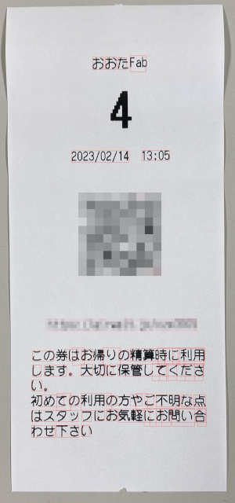
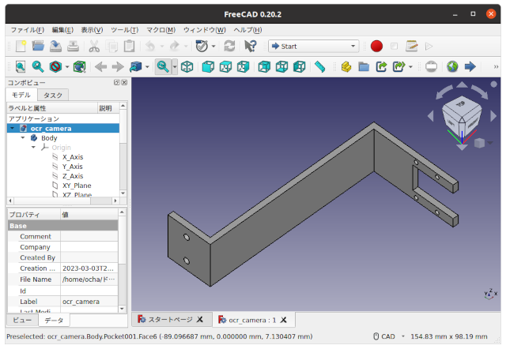
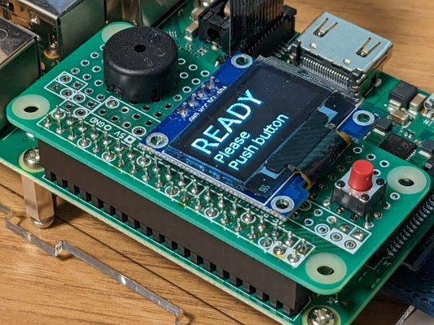

いつも利用している[おおたfab](https://ot-fb.com/ "おおたfab")さんから、こんなものができないかという相談がありました。

おおたfabの利用受付時にレシートが発行されるのですが、そこに書かれている入館時刻から利用時間が手軽に確認できないかということでした。レシートにはQRコードが書かれているのですが、そこには時刻の情報は含まれていません。そのためレシートに書かれている日時の文字を直接読み取る必要があります。最近買った[Raspberry Pi カメラモジュール V3](https://www.switch-science.com/products/8700 "Raspberry Pi カメラモジュール V3")を活用してみます。

### OCRの性能を確認する

Raspberry Piで文字を読み取るOCRの事例がいくつか公開されていますので、それを参考にして読み取りプログラムをPythonで書いて読み取ってみました。

レシートの画像をOCRのプログラムに通したところ、文字が赤い枠に囲まれて認識できていることがわかります。

日時の部分も問題なく読み取れそうです。

### 読み取り機をデザインする

当初はRaspberry Pi 4で実験していましたが、Raspberry Pi 3でも問題なく動作するので、Raspberry Pi 3に実装するようにデザインしてみます。

最初はこんなデザインを考えていましたが、レシートを手持ちでカメラにかざすとピントがうまく合いませんでした。

そのためこのようなデザインで進めることにしました。

カメラとレシートの間は最低でも10cmの距離が必要なので、カメラを固定するための部品を3Dプリンタで作成します。今回は最近使っているFreeCADで3Dデータを作成しました。

3Dプリンタで出力したカメラ固定部です。まだサポートが着いたままですが。

Raspberry Pi 3とのカメラ部の固定は余っているアクリル板に穴を開けてネジ止めすることにしました。

### 読み取り機を動かしてみる

完成した読み取り機で実際に読み込んでみます。

起動するとREADY画面になります。

この状態でタクトスイッチを押すと、ピッという音がなりレシートの簡易画像が表示されます。

しばらくするとレシート上の日時の文字列を読み込んで現在時刻での経過時間が表示されます。

動画もアップしておきました。

### まとめ

レシートの角度や明るさ、折れ曲がりなどで、100%読み込めるわけではありませんが、まあまあの精度だと思います。

今回作成したプログラムやFreeCADのデータはGithubに入れておきました。参考にしてください。

- [https://github.com/kanpapa/ocr\_receipt](https://github.com/kanpapa/ocr_receipt "ocr_receipt")
