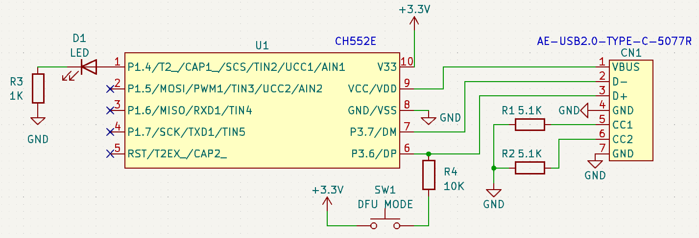

秋月電子さんで[CH552E \[I-18002\]](https://akizukidenshi.com/ "マイクロコントローラ　ＣＨ５５２Ｅ")の取り扱いが始まったので試しに動かしてみました。

「[CH55xでどうでしょう](https://shop.rutles.net/?pid=173172319 "CH55xでどうでしょう")」という書籍も持っていて機会があれば使ってみたいと思っていたところです。

### ブレッドボードで組んでみる

[ピッチ変換基板 \[P-06863\]](https://akizukidenshi.com/ "ＭＳＯＰ（１０ピン　０．５ｍｍピッチ）－ＤＩＰ化変換基板　金フラッシュ　（５枚入）")にCH552Eをハンダ付けして、ブレッドボードで動かしてみます。PCとの接続には[USB-CコネクタDIP化キット \[K-15426\]](https://akizukidenshi.com/ "ＵＳＢｔｙｐｅ－ＣコネクタＤＩＰ化キット（シンプル版エコノミータイプ）")を使いました。

USB-Cの仕様については以下の記事を参考にしています。この記事でデバイス側のCC1, CC2は5.1KΩでGNDに接続する必要があることがわかりました。

- [はじめてのUSB \[USB Type-C™ 及び Power Delivery規格入門\]](https://www.marubun.co.jp/technicalsquare/10483/ "はじめてのUSB [USB Type-C™ 及び Power Delivery規格入門]") （丸文株式会社）

回路図は非常にシンプルです。CH552Eの中で5V入力から3.3Vの生成もしてくれます。P1.4には動作確認用にLEDを接続しました。

回路図を元に完成したブレッドボードです。

### CH552Eに書き込めない

次にArduino IDEに[ch55xduino](https://github.com/DeqingSun/ch55xduino "ch55xduino")をインストールしました。README.mdにあるようにDFUモードになるようにプッシュスイッチを押しながらPCをUSB-Cコネクタで接続して、blinkスケッチを書き込もうとしましたが、どうしてもCH552Eを認識してくれません。

回路もシンプルですし、CH552Eのハンダ付けも何度も見直し問題ありません。

Twitterで状況をつぶやいたところ、電源ラインにパスコンを入れるといいかもというアドバイスをいただきました。

### パスコン追加で問題解決

早速0.1μFのパスコンを電源ラインにいれたところ、何もなかったかのようにあっさりとCH552Eに書き込めました。LEDを接続してLチカが動作することも確認できました。

電源ラインにパスコンを入れた修正版の回路図です。

### まとめ

[ch55xduino](https://github.com/DeqingSun/ch55xduino "ch55xduino")にはさまざまなスケッチ例が入っていて、シンプルな機能が手軽に使えそうです。もう少しブレッドボード上でいろいろ試してみようと思います。

パスコンの重要性を再認識させてくれた出来事でした。
