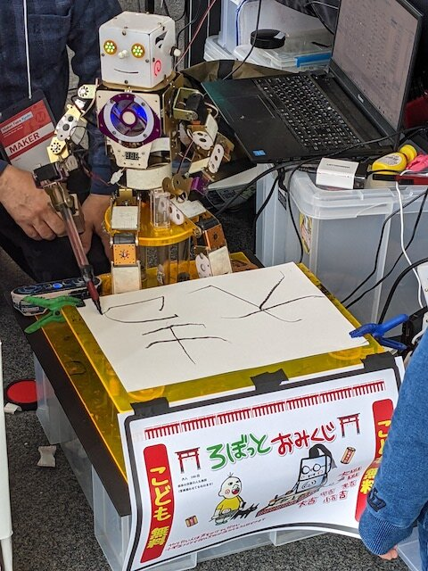
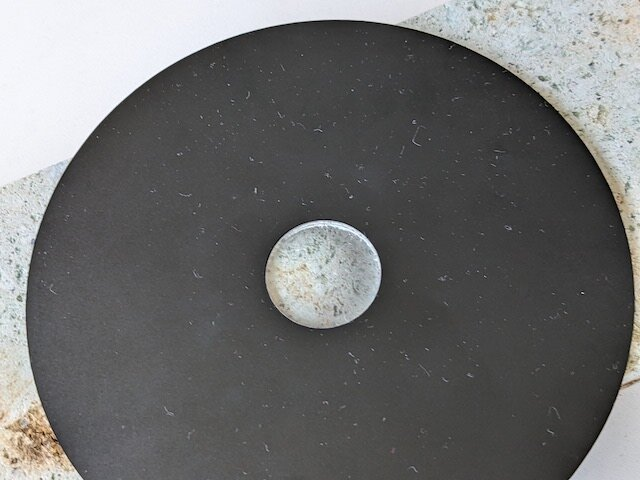
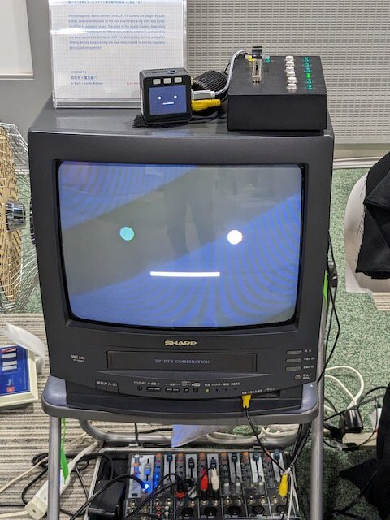
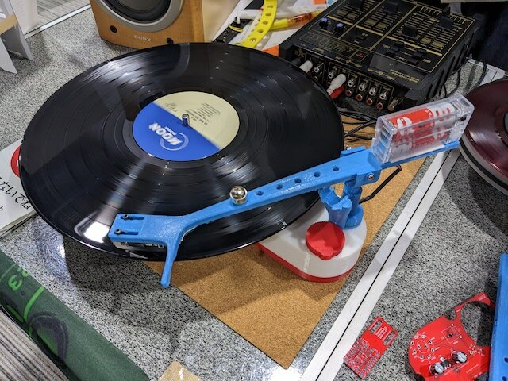
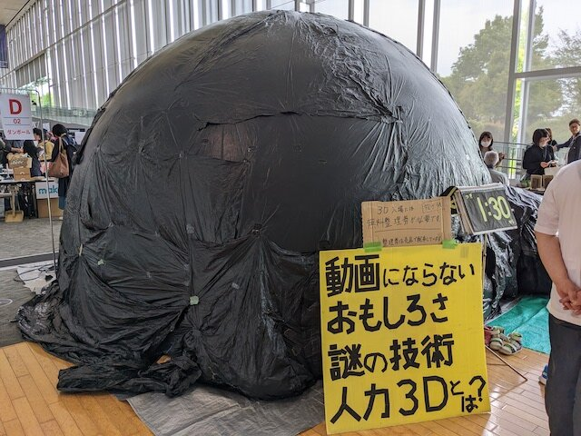
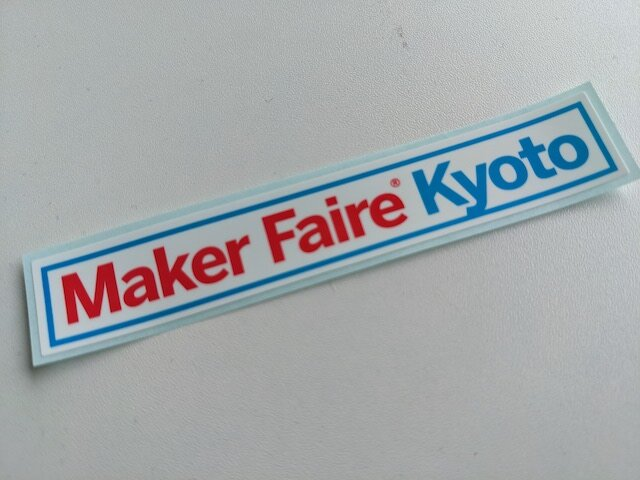

Maker Faire Kyoto 2023が開催されました。最初は見学を見送る予定でしたが、初日の様子をSNSで見て、やはり行ってみることにしました。2019年に開催された時にも見学をしています。

たくさんの出展者のほんの一部にはなりますが、私が気になったものを紹介してみます。リアルタイムではTwitterにも投稿しています。

まず見えてくるのはMaker Faire Kyotoのバスです。前回同様に置かれていました。

ろぼっとおみくじのコーナーでは大吉がでていました。

これは特殊なガラスを石の表面にあててみることで、惑星ぽく見えるものです。微妙に影ができるようにガラスに色付けされていました。写真ではわかりにくいかもですが、実際に触ってみないと体験できないものです。

着物を着た鶏が寝ていました。少し緊張していたようです。

ハンドルを回すことで編み物ができるものです。動きがとてもユニークです。針を上げ下げする構造もよくできています。

非接触で指の動きを検知して画面がスクロールするものです。いろいろな製品に応用ができそうに思いました。

巨大なスタックちゃん(?)もありました。画面が大きいと迫力がありますね。

3Dプリンタでレコードプレイヤーを作られていました。久しぶりにレコードに針を置くときのブチッという音を聞くことができました。

3Dドームの中からは賑やかな歓声が聞こえてきて盛り上がっていました。

会場の外では手作りバイクもデモンストレーション走行をしていました

会場の様子です。大盛況でした。

帰りにアンケートに回答してステッカーをいただきました。

このあと大阪・日本橋でんでんタウンに寄り道して帰路につきました。この日だけで20000歩も歩いたのでよい気分転換にもなりました。

また次回も来れたら来たいですね。
