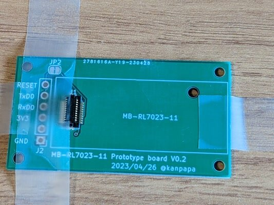
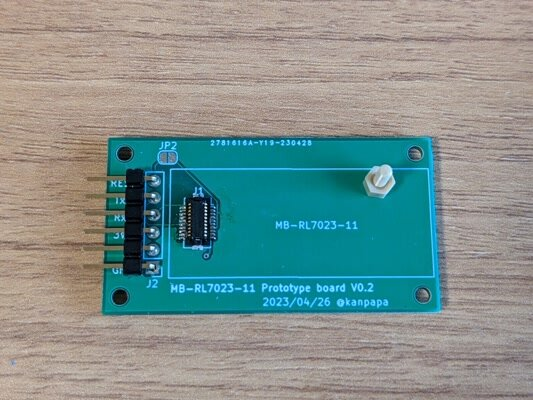
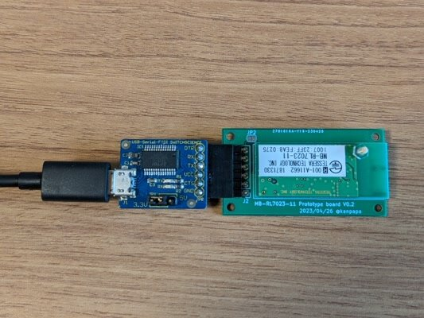

[秋月のWi-SUNモジュール付きSoC基板](https://kanpapa.com/2023/03/aesoc-yocto-dunfell.html "秋月電子のSoC基板でyocto-linuxを動かしてみました（その１ 環境構築編）")を私は２台買いました。１台はそのままの状態で[Linuxを載せてMackerelで瞬間電力量を表示](https://kanpapa.com/2023/04/aesoc-yocto-broute-mackerel.html "秋月電子のSoC基板で瞬時電力値のグラフが表示できるようにしてみました")して運用しています。もう１台はまだ手付かずでしたが、SoC基板に実装されている[Wi-SUNモジュール MB-RL7023-11/DSS \[M-17450\]](https://akizukidenshi.com/ "ＨＥＭＳ用　Ｗｉ－ＳＵＮモジュール　Ｒｏｕｔｅ－Ｂ／ＨＡＮ　デュアル対応")を取り外し、それを活用できないかと考えています。

そのためにはWi-SUNモジュールを手軽に使えるようにブレークアウト基板を作ることにしました。

### Wi-SUNブレークアウト基板の設計と発注

KiCADで設計した基板の3Dイメージです。

Wi-SUNモジュールから引き出せるシリアル信号を、手持ちの[USBシリアル変換基板](https://www.switch-science.com/products/1032 "FTDI USBシリアル変換アダプター（5V/3.3V切り替え機能付き） ")にそのまま接続できるようにしました。このUSBシリアル変換基板で使用されているFT223RLのLDOの出力電流は最大50mAですので、Wi-SUNモジュールの送信時の消費電流約43mAはぎりぎりカバーできそうです。

KiCADでガーバーデータを作成し、JLCPCBさんに発注しました。

KiCADデータはGitHubにまとめておきました。こちらは実際に製作した基板をさらに改良しv0.3としています。

- [https://github.com/kanpapa/wisun\_prototype\_pcb](https://github.com/kanpapa/wisun_prototype_pcb "wisun_prototype_pcb")

### Wi-SUNブレークアウト基板の組み立て

JLCPCBさんに発注した基板が到着しました。

早速購入しておいたコネクタをハンダ付けします。コネクタは[ヒロセ電機 DF12(3.0)-20DS-0.5V(86)](https://www.hirose.com/ja/product/p/CL0537-0603-3-86 "ヒロセ電機 DF12(3.0)-20DS-0.5V(86)") です。私の場合は[マルツオンライン](https://www.marutsu.co.jp/pc/i/2706559/ "ヒロセ電機 基板接続用ソケット 20 極 0.5mm 2 列 表面実装【DF12(3.0)-20DS-0.5V(86)】")さんから購入しました。

このコネクタは熱に弱いようではんだ付けの難易度が高く、最初に製作した基板はコネクタが少し曲がってしまいました。

こうなってしまうとWi-SUNモジュールのネジ穴が合わなくなります。このまま使うことも可能ですが、コネクタが外れたり、接触不良となる可能性もあるのでやはりネジ止めしたいところです。

### Wi-SUNブレークアウト基板の実装に再挑戦

やむなくもう１枚を使って、基板とコネクタをメンディングテープでしっかり固定し、もう一度慎重にはんだ付けを行います。

Wi-SUNモジュールを固定するネジは秋月のWi-SUNモジュール付きSoC基板で使用していない部分から移設しました。

USBシリアル変換基板を接続するとこのようになります。今回はなんとかネジ穴を合わせることができました。

### Wi-SUNブレークアウト基板の動作確認

USBシリアル変換基板にPCを接続し、シリアルターミナルで115200bpsで通信したところ問題なく応答が返って来ました。

### Wi-SUNブレークアウト基板の応用例

これでPC上のプログラムでWi-SUNモジュールの制御を行い、瞬間電力量などが取得できるようになります。

また、他のマイコンのUARTに接続して制御もできます。すでに[他社のWi-SUNモジュールを取り付けられるM5StackのHAT](https://kitto-yakudatsu.booth.pm/items/1650727 "M5StickC用「Wi-SUN HAT」キット（※Wi-SUNモジュール別売り）")も販売されているようで、M5StackのUIを使った電力計も作れると思われます。

また、[Raspberry Pi Picoに実装できるブレークアウト基板](https://akkiesoft.hatenablog.jp/entry/20230426/1682512301 "秋月の謎SoC基板付きケースに入ってたWi-SUNモジュールをRaspberry Pi Picoで使う基板の製作")もあるようですので、こちらを使うともっと手軽で便利かもしれません。
