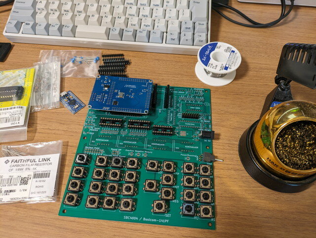

いつもお世話になっている[オレンジピコショップ](https://store.shopping.yahoo.co.jp/orangepicoshop/ "オレンジピコショップ")さんのサイトで気になるものを見つけてしまいました。

- [SBC4004/Busicom-141PF専用プリント基板](https://store.shopping.yahoo.co.jp/orangepicoshop/pico-a-044.html "SBC4004/Busicom-141PF専用プリント基板")

最初の1チップマイクロプロセッサ4004の機能をFPGAで実装して、当時の電卓Busicom-141PFを再現しようというものです。

作者のページを拝見すると、「4004プロセッサ50周年」ということで気合が入っています。

- [4004マイクロプロセッサ 50周年　～　インテル4004とBusicom 141-PF](https://jr2xzy.blogspot.com/2021/11/4004-504004busicom-141-pf.html "4004マイクロプロセッサ 50周年　～　インテル4004とBusicom 141-PF") 　(JR2XZYブログ）

基板は大型でサイズは168.9mm×149.9mmです。キー配置も独特で7セグメントLEDがずらりと並びこれまでに無いものです。

FPGAを使っていることもありパーツ数もそれほど多くないので、製作してみようと決めました。またFPGAを使っているので4004以外の実験やFPGAの学習にも応用できるかもしれません。

### 専用基板の入手

到着した基板はなかなかの大きさで、最近は10cm×10cm以下の基板しか触ってこなかったので、その迫力に感動です。

FPGAではなく実物の4004を使うこともでき、サーマルプリンタも接続できる設計になっていますが、当然4004は持っていないので、今回は最小構成で製作することにしました。サーマルプリンタは機会があれば後付けしたいと思います。

<!--more-->

### パーツの入手

今回そろえたパーツは以下の通りです。購入先など参考にしてください。

| **リファレンス** | **仕様** | **2023年6月時点の入手先例** | **価格** | **購入先** |
| --- | --- | --- | --- | --- |
| FPGA | Cyclone II EP2C5T144 Mini Board |   [fpga cyslonell ep2c5t144学習ボード開発ボード](https://www.aliexpress.com/item/4000468037228.html)   | ¥3,353 | Aliexpress |
| Arduino | Arduino Pro Micro（3.3V版） | [マイクロ USB ATmega32U4 プロマイクロ 3.3V 8 Mhz ボードモジュール Ar](https://www.aliexpress.com/item/32827452509.html) | ¥763 | Aliexpress |
| DS1 - DS4 | KEM3461ASR 4桁 7セグメントLED 0.36インチ 赤色 カソードコモン(互換品) | [★0.36★4桁7セグLED表示器（赤色） \[3641\]\[選択: 3641AS\]](https://www.aitendo.com/product/19531) | ¥88 x 4 | Aitendo |
| J1 - J4 | 2x14 ピンソケット | [ピンソケット　２×１４　（２８Ｐ） \[FH-2x14SG\] \[C-03951\]](https://akizukidenshi.com/catalog/g/gC-03951/ "ピンソケット　２×１４　（２８Ｐ） [FH-2x14SG] [C-03951]") | ¥40 x 4 | 秋月電子 |
| J5, J6 | 1x12 ピンソケット | [ピンソケット（メス）　１×１２（１２Ｐ） \[FH-1x12SG/RH\] \[C-10101\]](https://akizukidenshi.com/catalog/g/gC-10101/ "ピンソケット（メス）　１×１２（１２Ｐ） [FH-1x12SG/RH] [C-10101]") | ¥45 x 2 | 秋月電子 |
| SW1- SW30 | 12mm角型 透明キャップ付き タクトSW | [★12x12★タクトスイッチ（20個入） \[TS12X12N\]](https://www.aitendo.com/product/9609) | ¥110 x 2 | Aitendo |
|  |  | [★10x10★タクトスイッチキャップ（20個入） \[PLSA14CP-10\]](https://www.aitendo.com/product/9530 "★10x10★タクトスイッチキャップ（20個入） [PLSA14CP-10]") | ¥110 x 2 | Aitendo |
|  |  | [★10x10★タクトスイッチ透明カバー（20個入） \[CV10A\]](https://www.aitendo.com/product/6594) | ¥110 x 2 | Aitendo |
| SW31 - SW33 | 6mm タクトSW |  |  | 手持ち |
| SW34 | NKKスイッチズ A-18AH ON-OFF-ON トグルSW |   [【A-18AH】基本レバー形トグルスイッチ(ON)-OFF-(ON)](https://www.marutsu.co.jp/pc/i/5449/) 幅9.8mmピッチ2.54mmの基板取り付け形   |  | 日米商事   マルツ |
| U6 | AMS1117CD-3.3(互換品) | [★BELLING★LDOレギュレータ（6個入） \[BL1117-XXCY\]\[出力電圧: 3.3V\]](https://www.aitendo.com/product/18011) TO-252-2L | ¥100 | Aitendo |
| U10, U11 | 74ACT573 LED表示ラッチ/セグメントドライバ |  | ¥267 x 2 | 若松通商　 |
| U12 | 東芝 TBD62083APG LED桁ドライバ | [8chシンクタイプDMOSトランジスタアレイ TBD62083APG \[I-10669\]](https://akizukidenshi.com/catalog/g/gI-10669/ "8chシンクタイプDMOSトランジスタアレイ TBD62083APG") | ¥100 | 手持ち |
| D13 | 3mm赤色LED OSR5JA3Z74A(互換品) |  |  | 手持ち |
| D14 | 3mm黄緑色LED OSG8HA3Z74A(互換品) |  |  | 手持ち |
| D15 | 3mm白色LED OSW4YK3Z72A(互換品) |  |  | 手持ち |
| D17 | 3mm黄色LED OSY5JA3Z74A(互換品) |  |  | 手持ち |
| J9 | 2x8 ピンヘッダ、ショートジャンパ |  |  | 手持ち |
| J10 | 2x3 ピンヘッダ、ショートジャンパ |  |  | 手持ち |
| J12 | 2.1mm type Jack\_DC |  |  | 手持ち |
| C1 | 16V, 33u タンタル | 電解コンで代用　2.54mm |  | 手持ち |
| C2 - C5, C7 - C1 | 50V 0.1u積層セラミック | 2.54mm |  | 手持ち |
| R1 - R4 | 1K 1/8W | 1/6Wで代用 |  | 手持ち |
| R32, R33 | 1K 1/8W | 1/6Wで代用 |  | 手持ち |
| R5 - R20 | 100 1/8W | 1/6Wで代用 |  | 手持ち |
| J11 | 2x5 ピンヘッダ L型 | [L​型​ ​ピ​ン​ヘ​ッ​ダ​ ​2​列​×​0​5​P​ ​2​.​5​4​m​m​ピ​ッ​チ​　​L​2​5​4​0​-​2​×​5](https://www.sengoku.co.jp/mod/sgk_cart/detail.php?code=EEHD-4YN5) | ¥53 | 千石電商 |
| J13 | 2x8 ピンヘッダ | [2​.​5​4​m​m​ピ​ッ​チ​ ​ス​ト​レ​ー​ト​ ​ピ​ン​ヘ​ッ​ダ​ ​2​列​×​0​8​P​　​S​2​5​4​0​-​2​x​0​8](https://www.sengoku.co.jp/mod/sgk_cart/detail.php?code=EEHD-58E8) | ¥32 | 千石電商 |
| ICソケット | DIP-18 | 1個 |  | 手持ち |
| ICソケット | DIP-20 | 2個 |  | 手持ち |

Cyclone II EP2C5T144 Mini BoardやArduino Pro Micro（3.3V版）は国内で流通しているものもあるのですが、特に急いでいなかったので、AliExpressで安価なものを購入しました。

すこし時間がかかりましたが、これでパーツの準備はできました。

[SBC4004を組み立ててみました（２）組み立て編](https://kanpapa.com/2023/07/sbc4004-part2.html "SBC4004を組み立ててみました（２）組み立て編")に続きます。
