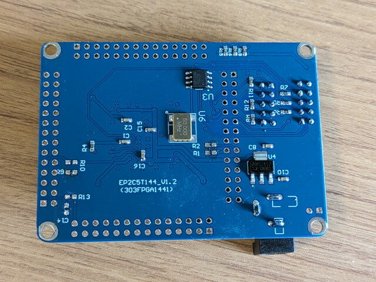
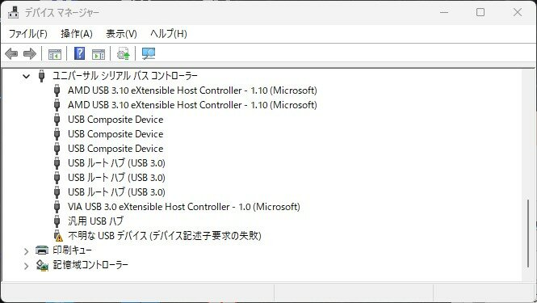
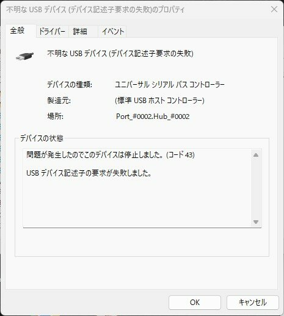
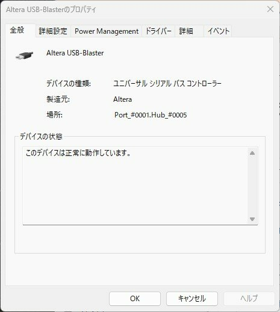
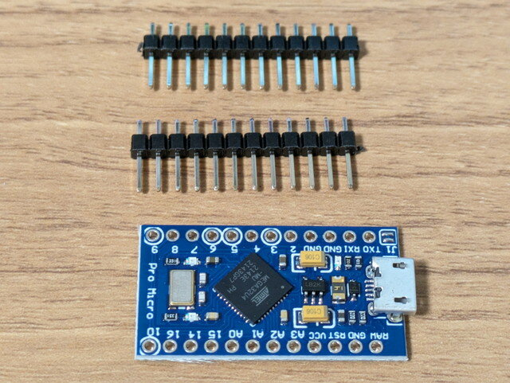
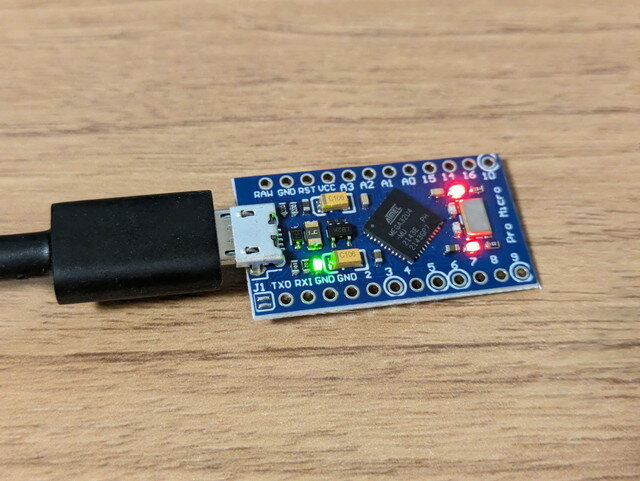
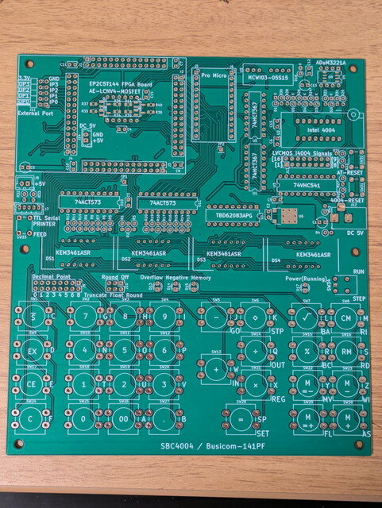
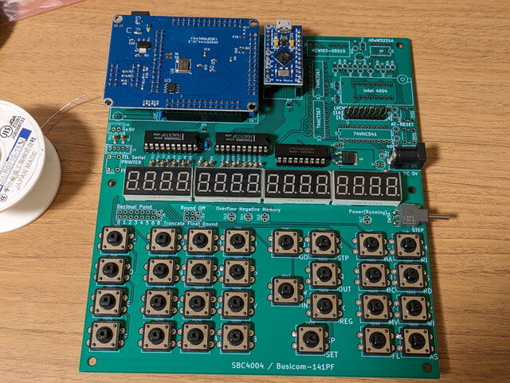

前回は[SBC4004の製作に必要なパーツを揃えました](https://kanpapa.com/2023/07/sbc4004-part1.html "SBC4004を組み立ててみました（１）準備編")。今回はSBC4004の組み立てを進めます。

組み立て方法は作者のサイトに詳しく説明されています。

- [4004マイクロプロセッサ 50周年　～　SBC4004/Busicom-141PFの製作手順(1)](https://jr2xzy.blogspot.com/2021/12/4004-50sbc4004busicom-141pf1.html "4004マイクロプロセッサ 50周年　～　SBC4004/Busicom-141PFの製作手順(1)") (JR2XZYブログ）

この通りに組み立てれば問題ないのですが、私が少しハマったところをまとめます。

SBC4004はFPGAとArduinoを使用していますので、まずはこれらにファームウェアを書き込む必要があります。

### FPGAボードの準備

最初にFPGAボードの改造を行います。

<!--more-->

裏面にある指定されたチップ抵抗とチップコンデンサをはんだごてで温めて外します。

無事R1、R2、R9、R10、R13、C14を取り外しました。

FPGAにファームウェアを書き込むために専用の書き込み機USB Blasterが必要になります。こちらはAmazonで安価な互換品を購入しました。

- [KOZEEY 【ノーブランド品】USB　ブラスター　ケーブル　CPLD　FPGA　JTAG　プログラマ　アルテラ](https://www.amazon.co.jp/gp/product/B008D8QSMU/ "KOZEEY 【ノーブランド品】USB　ブラスター　ケーブル　CPLD　FPGA　JTAG　プログラマ　アルテラ")

購入したUSB BlasterをWindowsPCに接続したのですが、なぜかデバイスとして認識されません。デバイスマネージャーで確認すると「不明なUSBデバイス（デバイス記述子要求の失敗）」となっています。

いろいろ試したところ、USB2.0接続だと「Altera USB-Blaster」と認識することを発見しました。

私が購入したものはUSB3.0と相性が良くなかったようです。そのためPC本体のUSB3.0端子にUSB2.0ハブを接続して、そこにUSB Blasterを接続した状態でQuartus Programmerを使ってFPGAにバイナリファイルを書き込みました。

無事FPGAに書き込みが完了したようです。

### Arduino Pro Microの準備

購入したArduino Pro Micro互換機です。

こちらはArduino IDEを使って準備されているスケッチを書き込めば完了です。

### パーツの取り付け

専用基板にパーツをはんだ付けをしていきます。

細かい手順は作者のサイトに書かれているのでその通りに進めれば問題なくできます。FPGAボードやArduino Pro Microを取り付けるコツも書かれていますので参考になります。

はんだ付けがほぼ完了した基板になります。

まだキートップをつけていませんが、これは最後に行うことにします。

[SBC4004を組み立ててみました（３）動作確認編](https://kanpapa.com/2023/07/sbc4004-part3.html "SBC4004を組み立ててみました（３）動作確認編")に続きます。
