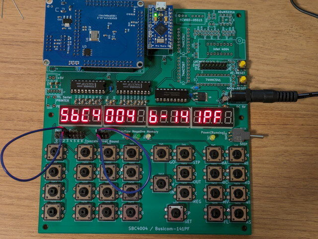
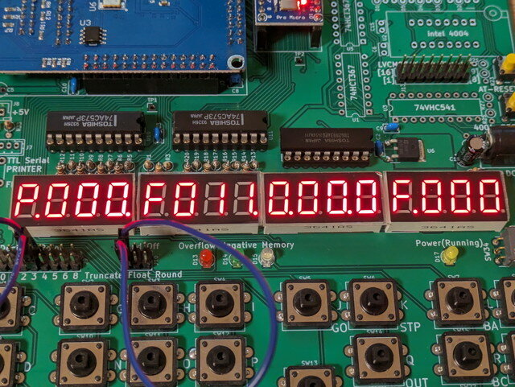
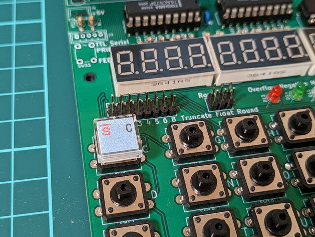
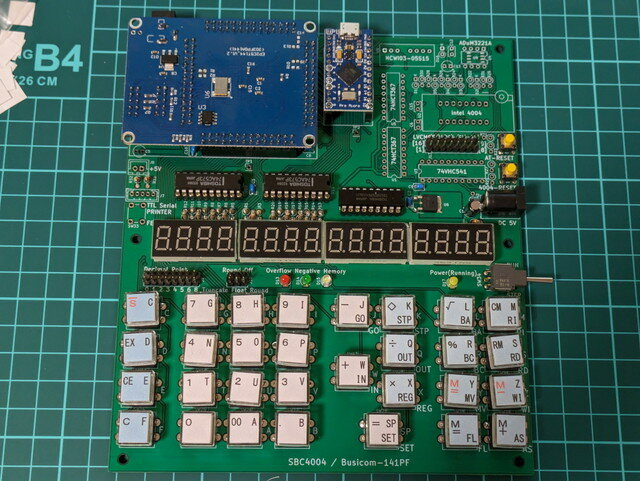

前回は[SBC4004を組み立てました](https://kanpapa.com/2023/07/sbc4004-part2.html "SBC4004を組み立ててみました（２）組み立て編")。今回はSBC4004の動作確認を進めます。

動作確認の方法は作者のサイトに詳しく説明されていますので、こちらを見ながら進めました。

- [4004マイクロプロセッサ 50周年　～　SBC4004/Busicom-141PFの製作手順(1)](https://jr2xzy.blogspot.com/2021/12/4004-50sbc4004busicom-141pf1.html "4004マイクロプロセッサ 50周年　～　SBC4004/Busicom-141PFの製作手順(1)")　(JR2XZYブログ)

モニタプログラムのコマンドや電卓プログラムの詳細については以下のページを参照しました。

- [4004マイクロプロセッサ 50周年　～　SBC4004/Busicom-141PFの詳細](https://jr2xzy.blogspot.com/2021/11/4004-50sbc4004busicom-141pf_15.html "4004マイクロプロセッサ 50周年　～　SBC4004/Busicom-141PFの詳細")　(JR2XZYブログ)

### 電源を入れる

ICの向きに誤りがないか、取り付けていない部品が無いかなどを確認して電源をいれます。

5VスイッチングACアダプタをSBC4004のDCジャックに接続すると、7セグメントLEDに「SbC4004 b-141PF」と表示されました。正常に動作しているようです。

<!--more-->

暫くすると7セグメントLEDに「P.000.F011.0.00.0F.000」と表示されます。プログラムカウンタが000の状態で停止した状態になっているようです。

7セグメントLEDにはプログラムカウンタの値や次に実行する命令やその他の情報が表示されています。

### モニタの動作を確認する

SBC4004のArduino Pro MicroとPCををUSBケーブルで接続し、シリアルターミナルを立ち上げます。通信速度は9600bpsです。

Enterを入力するとモニタの起動メッセージが表示されます。ここでモニタのコマンドが動作することを確認します。

ここではDumpコマンド、Unassembleコマンドを使ってみました。

### 電卓プログラムを実行する

ここまで動けば問題はなさそうですので、タクトスイッチのキー配置図をみてGOのスイッチを押すと電卓のプログラムが動きます。7セグメントLEDには通常の電卓と同様に「0」と表示されます。

この状態で２÷３を計算してみます。

計算結果は正しいようです。

次に√3を計算してみました。

正しく計算されているようです。

### キートップを取り付ける

本体の動作は問題なさそうなので使い勝手が良くなるようにキートップを取り付けます。キートップラベルのPDFが作者のページにありますので、それを印刷してカッターナイフで切り取りました。

一度キートップを取り付けてしまうと修正が難しいので、キーラベルを間違えないように慎重にタクトスイッチに取り付けていきます。

すべてのタクトスイッチにキートップを取り付けました。

これで計算がしやすくなりました。

### まとめ

今回はSBC4004を製作して、電卓プログラムが動くところまでを行いました。作者のページをみていただければわかりますが、かなり深いところまで4004の機能を試すことができるようになっています。電卓プログラムを動かしつつ、モニタプログラムで状況を確認できたり、アセンブラ・逆アセンブラなども含まれていて、レジスタ表示、ステップ実行などのデバック環境もできています。また、31ページにもわたるFPGAの内部回路図などをみても膨大な作業をされて4004を実装されているのがわかります。

SBC4004のすべての機能を使いこなすのは難しいかもしれませんが、4004プロセッサの動作が実際に体験できるのは素晴らしいです。作者のJR2XZY氏に感謝いたします。
