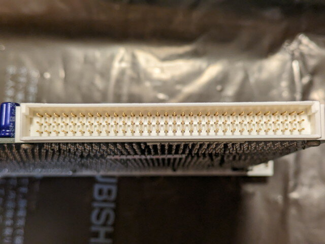

オークションで気になる商品を見つけてしまいました。68000 CPUが搭載されたデジタル社のDVME-CPU2 VMEボードです。やや古いボードのためか他に入札もなく、安価で落札できました。これはやはり実際に動かしてみたいです。

### DVME-CPU2ボードの外観

到着したDVME-CPU2ボードです。カッコいいです。

<!--more-->

### CPUボードの仕様

産業用ということもあり作りがしっかりしています。ボードの外観から確認できたのは以下の仕様です。

| 名称 | DVME-CPU2 D9139D-10 |
| --- | --- |
| CPU | HD68HC000P10 |
| サイズ | VME 6U 223x160 (mm) |
| 製造元 | Digital |
| RAM | SRAM HM62256LP-10 256KBit × 4 |
| ROM | EPROM D27512J-2 512Kbit x 2 |
| Serial I/O | 63B50P(ACIA:Asynchronous Communications Interface Adapter) x 2 |
| Timer I/O | 63B40P(PTM: Programmble Timer Module) |
| Real-time Clock | RICOH RP5C15 Paralle bus 12/24時間時計 |
| VME-bus interface (P1) | DIN41612 96pin コネクタ |
| Battery | リチウム電池 3.6V ER6C(AA) 1800mAh |

このスペックで心当たりがあるのは以前オークションで入手したMIC68KというSBCです。

- [MIC68Kワンボードコンピュータで遊んでみた（１）調査編](https://kanpapa.com/2017/10/mic68k-Investigation.html "MIC68Kワンボードコンピュータで遊んでみた（１）調査編")
- [MIC68Kワンボードコンピュータで遊んでみた（２）解析編](https://kanpapa.com/2017/10/mic68k-schematic.html "MIC68Kワンボードコンピュータで遊んでみた（２）解析編")
- [MIC68Kワンボードコンピュータで遊んでみた（３）Hello World編](https://kanpapa.com/2017/10/mic68k-helloworld.html "MIC68Kワンボードコンピュータで遊んでみた（３）Hello World編")
- [MIC68Kワンボードコンピュータで遊んでみた（４）モニタ実装編](https://kanpapa.com/2017/10/mic68k-monitor.html "MIC68Kワンボードコンピュータで遊んでみた（４）モニタ実装編")

ほぼ似たような構成ですので、このときのノウハウが使えそうです。

また、今回のVMEボードにはROMがついていますので、過去に動作していたプログラムの情報からメモリマップなどは容易にわかりそうです。

### 初めてのVMEバス

実はVMEバスを使うのは今回が初めてです。使われているDIN41612 96pinコネクタもじっくりみたのは初めてです。

電源はVMEバスから供給されますので、まずはこのコネクタを手配することにします。合わせて、VMEバスについて解説している記事を探してみたいと思います。

次回、[VMEバス基板設計編](https://kanpapa.com/2023/08/68000-vme-board2.html "68000 VMEボードで遊んでみました（２）VMEバス基板設計編")に続きます。
