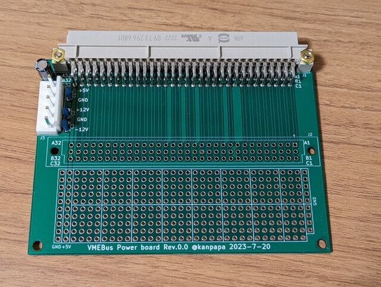
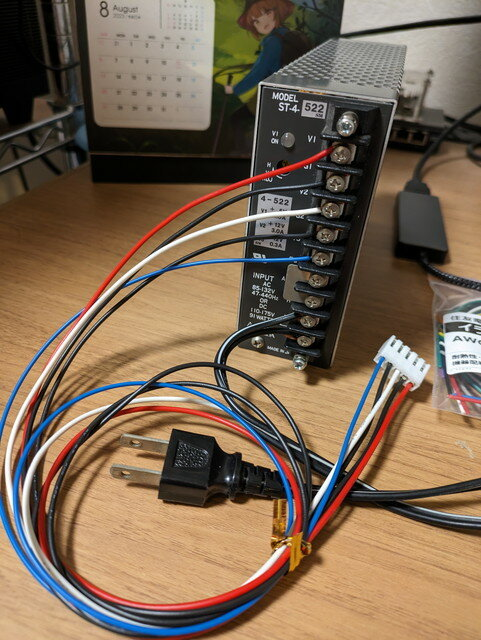
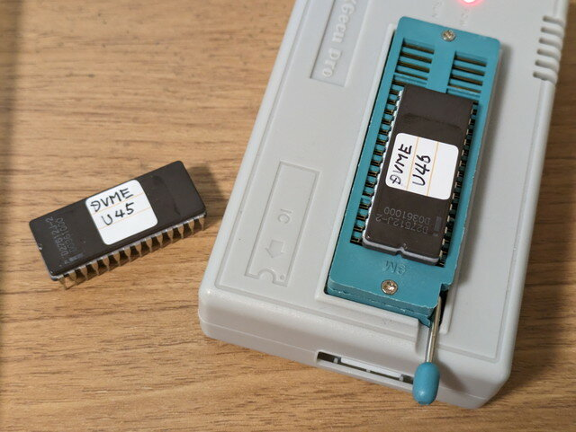
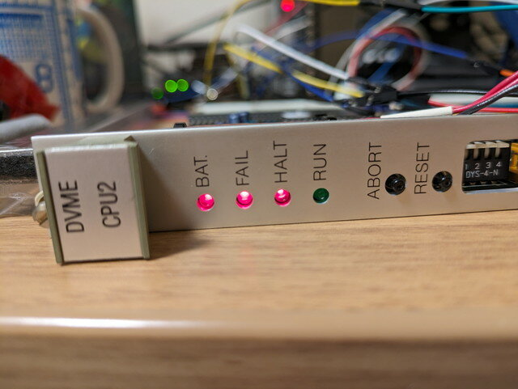

前回の[VMEバス基板設計編](https://kanpapa.com/2023/08/68000-vme-board2.html "68000 VMEボードで遊んでみました（２）VMEバス基板設計編")で設計したVMEバス電源供給基板を製作して、入手した68000 CPU VMEボードに電源を投入してみます。

### VMEバス電源供給基板の製作

到着した専用基板にコネクタを半田付けし完成しました。

<!--more-->

VMEボードとの接続も問題なさそうです。

シンプルではありますが、何か簡単な回路も組めるようにユニバーサルエリアも作っておきました。

### 電源の準備

VMEバスの電源容量を調べてみました。VMEバスの規定では以下のようになっていました。

| 種類 | 許容変動値 | 10Mhz以下のリプル/ノイズ(peek-to-peek) | 備考 |
| --- | --- | --- | --- |
| +5V | +0.25V/-0.125V | 50mA |  |
| +12V | +0.60V/-0.36V | 50mA |  |
| \-12V | +0.60V/-0.36V | 50mA | RS-232Cなどで使用 |
| +5V STDBY | +0.25V/-0.125V | 50mA | 電源オフ時にバッテリーから供給される。メモリやカレンダーの維持に利用される。 |

最大電流の規定はRev.Bではスロットあたりの最大電流が＋5V 3A, 他は1Aと規定されていたようです。ただし、VMEボードの高機能化によりこの範囲では収まらなくなったため、Rev.Cではこの規定は廃止されました。

今回はCPUボードが１枚だけですし、ほぼCMOSデバイスが使われているため、そこまで容量は必要ないと思いますが、+5V以外に±12Vが必要となるので、専用の電源を準備しました。

**ネミック・ラムダ ST-4-522**

- +5V 4.0A
- +12V 3.0A
- \-12V 0.3A

昔のマイコンボードではこのような電源がよく使われていたものです。

### ROMのバックアップ

念のため電源を投入する前にROMのバックアップを行っておきます。どこに取り付けてあったかの目印を付けたうえで、VMEボードから慎重にROMを取り外してROMライターでバックアップします。

このROMのプログラムの内容である程度このVMEボードの使い方がわかるはずですので、貴重な情報になります。

### VMEボードに電源を投入

電源供給基板をVMEボードに接続して電源を投入します。

このVMEボードはジャンク品で動作保証はないものですのでこの瞬間が一番怖いです。

今回は特に焦げるような匂いもなく電源も供給できているようです。すかさずチップの表面を触って特に発熱しているものが無いか確認します。CPUやROM/RAM、PALなどもほんのりと温かくなっている状態で問題なさそうです。

この状態で使える唯一の出力装置であるLEDを確認します。

赤いランプが並んでいます。RUNが消灯しているので動作は停止しているようです。

### トラブルシューティングの開始

LEDの状態をみるかぎりCPUボードはHALTの状態です。これをどこまで動かすことができるかチャレンジしてみます。

RS232Cポートはあるので、うまくいけばモニタプログラムを動かして様々なプログラムを動かしてみたいものです。

次回は[ROMを解析してメモリマップを調査](https://kanpapa.com/2023/08/68000-vme-board4.html "68000 VMEボードで遊んでみました（4）メモリマップ調査編")してみます。
