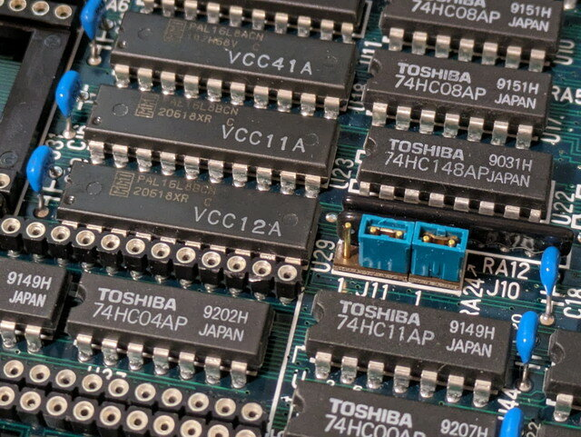
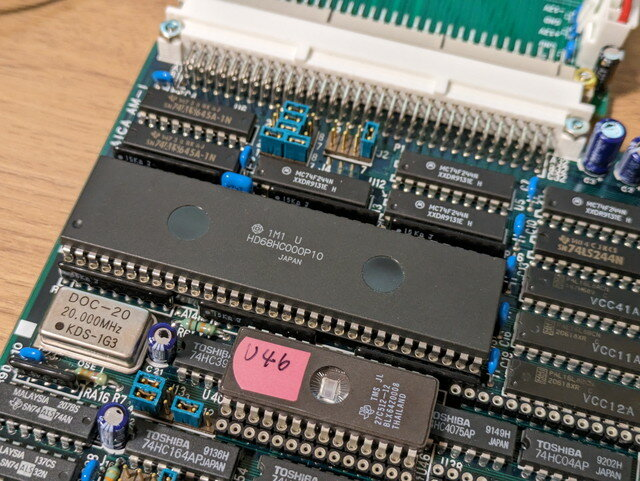
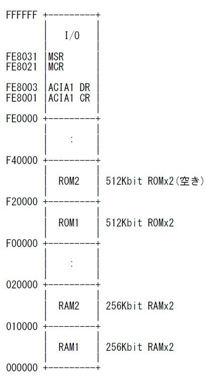
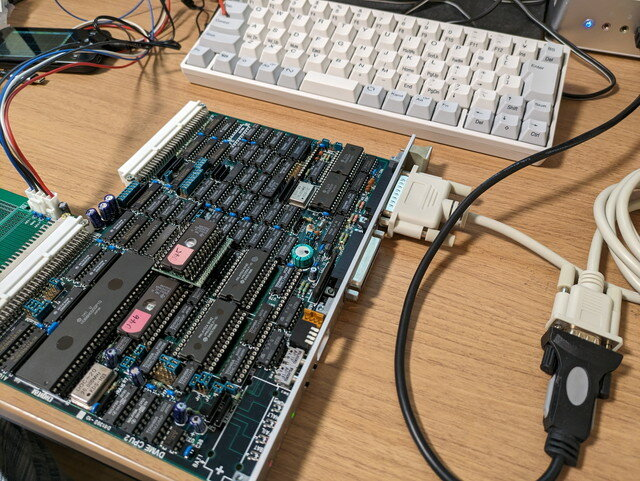
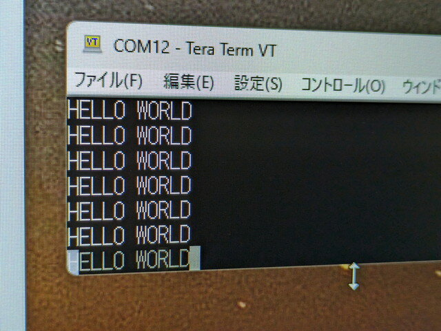
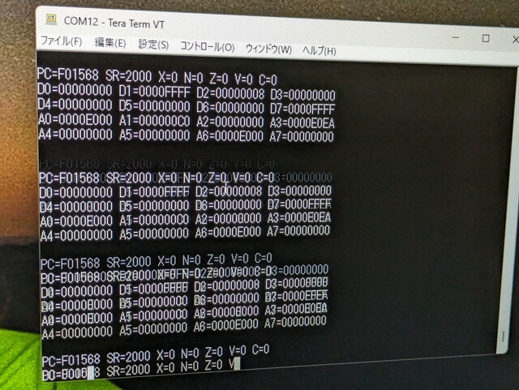
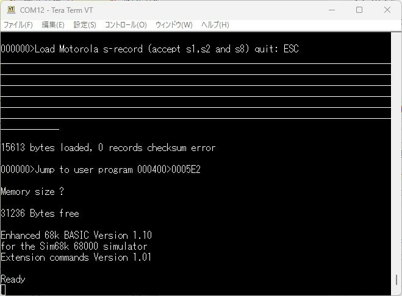
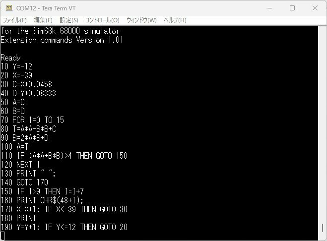

[前回までの調査でアドレスデコーダーのPALでRAMのCS信号が生成されていることが確認できました。](https://kanpapa.com/2023/09/68000-vme-board6.html "68000 VMEボードで遊んでみました（6）アドレスデコーダ解析編")このCS信号がRAMまで到達していない原因を調べ、RAMを使えるようにします。

### アドレスデコーダのCS信号を追う

電源を切断してもRAMのCS信号がHIGHのままであることに着目し、バッテリーバックアップされているICを中心に調査しました。その結果U86の74HC139にRAM1、RAM2のCSが接続されていることが確認できました。こうなるとアドレスデコーダのPALの出力がこのU86に接続されているはずなのですが、テスタで確認できません。目視でパターンを追ってみると、途中に抵抗が接続されていることがわかりました。これでテスタで導通が確認できなかったわけです。さらにその先はJ11ジャンパーピンに接続されていましたが、なぜかアドレスデコーダのPALから切り離されていました。

J11のジャンパー接続を1-2から2-3に変更することで、アドレスデコーダの信号がU86 74HC139に接続され、RAM1, RAM2のCSが正常な状態になるはずです。

ジャンパ設定を変更した状態で、mbedからアドレス信号を入力し、想定したアドレスのアクセスでRAMのCSがLOWになることが確認できました。

リセット直後を拡大してみると４サイクル以降のアクセスでRAMのCSがLOWになっています。

ここまで確認できたところでCPUとRAMを再びボードに取り付けました。

### メモリマップが確定

ここまでの調査結果でメモリマップも確定です。

### シリアル接続の確認

実際にプログラムを動かして、シリアルポートに出力できるかを確認します。USBシリアルにDSUB25Pのシリアルストレートケーブルを介してVMEボードのポートAに接続します。最初はクロスケーブルかなと思ったのですが、ストレートケーブルで接続できました。

ROMは以前作成したHELLO WORLDをACIAに送信するプログラムにしています。電源を投入したところHELLO WORLDがシリアルターミナルに表示されました。

### zBugモニタを実装する

RAMとシリアルポートが使えるようになったので、以前[MIC68Kでも使用したzBugモニタ](https://kanpapa.com/2017/10/mic68k-monitor.html "MIC68Kワンボードコンピュータで遊んでみた（４）モニタ実装編")をこのDVME CPU2ボードに実装します。メモリマップに合わせてROMの開始アドレスとACIAのアドレスだけを変更してアセンブルし、ROMに焼いて電源を投入したところ、TRAP発生時の画面が表示されました。モニタ自体は起動していますが、途中でTRAPが発生しループ状態になっているようです。

これまでの実験で電源投入時にはINT6の信号が発生している状態であることがわかっていますので、これでTRAPが発生したと思われます。モニタプログラムで割り込み有効としているSRレジスタの設定を割り込み禁止にしたところ、モニタのコマンド待ち状態になりました。

一通りのモニタコマンドを確認しましたが問題なく動作しているようです。割り込みが常にかかっている問題は今後このモニタを使って調査していきます。

### EhBASICを動かしてみる

モニタを実装したことでこのVMEボードの制御ができるようになりました。モトローラSレコードも読み込めますので、大きなプログラムをロードし、実行することもできます。ここでは[Lee DavisonさんのEhBASIC](https://philpem.me.uk/leeedavison/68k/ehbasic/index.html "68k based projects. By Lee Davison.")を動かしてみます。

EhBASICは68000用に記述されたBASICで、Easy68Kでアセンブルできます。コンソールの入出力の部分をこのVMEボード用に書き換えたものを作成しました。

Easy68Kで生成されたSレコードはzBugモニタで読み込むことができました。モニタでEhBASICのコールドスタートアドレスから実行したところ、EhBASICが起動しました。

ここまで動けばいつものASCIIART.BASを動かしてみます。

プログラムをアップロードし、LISTで確認後、RUNします。

問題なくいつもの画面になりました。処理時間は1分31秒10でした。HD68HC000P10 (10MHz CLK)ですので、まあまあの値かなと思います。

### まとめ

このVMEボードの資料が全く無く、多数のジャンパーピンとそのままでは動かない付属ROMの内容にやや振り回されて、かなり遠回りをしましたが、無事68000 VME CPUボードが動作することが確認できました。まだRTCやPTM、割り込みなど調査が未着手のところもありますが、モニタを使えば調査が非常に楽になります。残りの調査はゆっくり行うことにしますが、できればCP/M68KやOS-9/68KといったOSを載せてみたいところです。

これまでの基板データやプログラムのソースはGitHub.comに置いておきました。もし同様なVMEボードを入手できた際には参考にしてください。

- [https://github.com/kanpapa/VMEbus](https://github.com/kanpapa/VMEbus "VMEbus")
