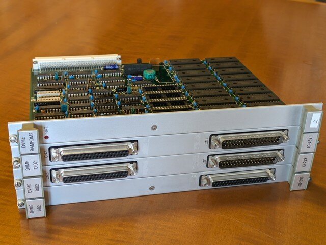
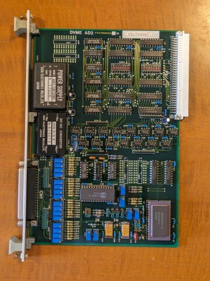
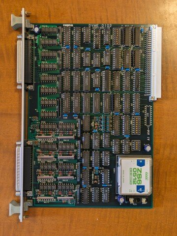
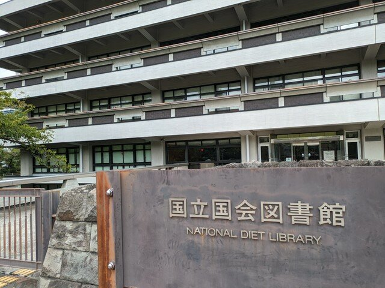
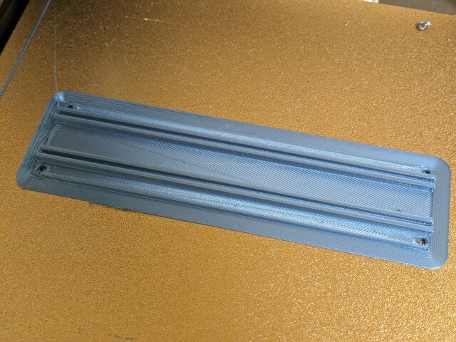
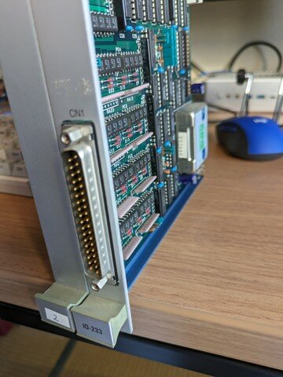
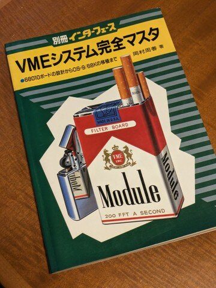

68000 CPU VMEボード単体での動作は確認できましたが、CPUだけでは少し物足りないと思っていたところで、拡張VMEボードがオークションに出品されていました。前回同様に格安の価格で落札することができました。

### 入手した拡張VMEボードの仕様

到着した拡張VMEボードです。４枚ありますが、３種類だけで、DIO2ボードが2枚あります。

<!--more-->

DVME AD2です。

DVME DIO2です。これは２枚あります。

DVME ROMRAM2です。RAMはソケット無しで直付けです。

これらの各基板のパーツを確認しました。

| **型番** | **機能** | **構成** |
| --- | --- | --- |
| DVME AD2 AD-216 | A/D変換ボード | Analog Devices社製ADADC80 12ビットA/Dコンバータ搭載 |
| DVME DIO2 IO-233 | デジタルIOボード | フォトカプラ(PC-817 4個入)が16個並んでいるので64チャンネル？ |
| DVME RAMROM2 | メモリボード | 28P ROMソケット×4個、62256 S-RAM×16個、バッテリーバックアップ機能付（バッテリーは無し） |

デジタルIOボードは何かの制御に使えるかもです。メモリボードも512KByteという広大なメモリ空間が追加できます。

### バックプレーンボードとラックの検討

これらを利用しようとした場合、VMEバスのバックプレーンボードやラックが必要になります。そのあたりの仕様をまず調査することにします。

[インターフェース　1987年2月号　VMEバス・システム完全マスタ](https://www.cqpub.co.jp/interface/contents/1987/198702.htm "インターフェース　1987年2月号　VMEバス・システム完全マスタ")を読むために国会図書館に出かけました。

このインターフェースの号にはVMEシステムに関する十分な情報が掲載されていました。まずはバックプレーンやラックに関連する情報が載っているページをコピーしてもらいました。

簡単にまとめると以下のように厳密に定義されているようです。

| **ラックの内寸** |   縦245.35mm、奥行175.24mm   |
| --- | --- |
| **カードの間隔** | 0.8インチ |
| **カードガイドの溝の深さ** | 2.0mm以下 |
| **カードガイドの溝から溝まで** | 233.4mm |

### カードガイドの試作

これらの寸法に従って、簡易的なカードガイドを設計して手持ちの3Dプリンタで出力してみました。カードとカードの間隔は0.8インチです。

出力中の様子です。

完成した簡易的なカードガイドです。

完成したカードガイドにVMEボードを取り付けてみました。

基板の部品に干渉することもなく、フロントパネルも隙間がない状態でしたのでカードガイドは3Dプリンタで製作できそうです。

### ラックの設計

このカードガイドを固定するラックが必要となりますが、ここはまだ考え中です。100円ショップやDIYショップとかで適当なサイズのしっかりした枠があればそれに合わせることを考えています。

### バックプレーンの設計

バックプレーンの基板についてもこれから設計ですが、デイジーチェーンやバス両端でのターミネーション(+5V-330Ω-BUS-470Ω-GND)が必要となります。これまでに製作した電源供給基板のパターンをベースに４個ぐらいコネクタが実装できるようなものを考えています。手持ちの電源は5V 4Aですので実際には2枚ぐらいしか動かせないかもしれませんが、その場合はPC用のATX電源を流用することも考えます。

### バイブルが入手できました

国会図書館でコピーした資料を基に設計を進めてきましたが、ようやく別冊インターフェースVMEシステム完全マスタを入手することができました。

これで一通りの情報が揃いました。ソフトウェアの移植についての情報もありますので、これからさらに調べてみたいと思います。
