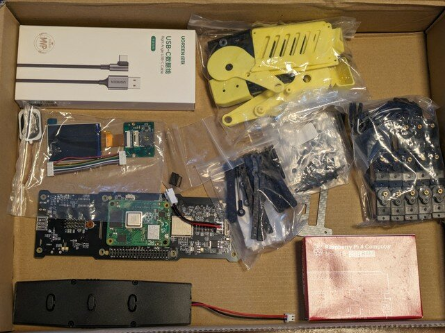
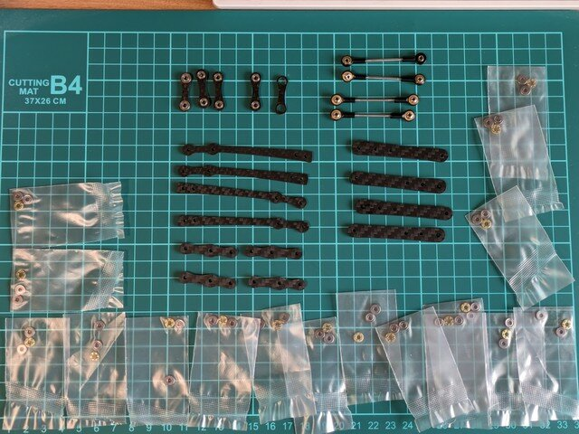
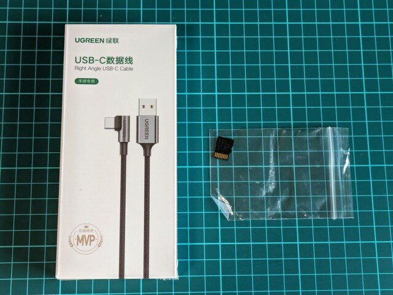

クラウドファンディングで申し込んでおいた [Mini Pupper 2](https://www.kickstarter.com/projects/336477435/mini-pupper-2-open-source-ros2-robot-kit-for-dreamers?lang=ja "Mini Pupper 2: Open-Source, ROS2 Robot Kit for Dreamers")が到着しました。以前から[Mini Pupper](https://www.makuake.com/project/mini_pupper "初心者もプロも楽しめる！自作できるロボット犬『Mini Pupperミニぷぱ』")には興味があったのですが、ROS2対応版のMini Pupper 2を待っていたところです。

実はクラウドファンディングではMini Pupper 2 Proを申し込んだのですが、こちら製品化に時間がかかっているので、Mini Pupper 2への変更をお勧めされ、途中でMini Pupper 2に変更したものです。

### パーツの確認

到着したMini Pupper 2の段ボール箱を開けるとたくさんのパーツが入っていました。

これらのパーツを確認していきます。

<!--more-->

これらはボディのパーツでしょうか。

こちらはフレームと専用基板（裏側にRaspberry Pi CM4が取り付けられています）、表示基板、バッテリー、スピーカーです。

サーボモーターです。

こちらは足の部分のパーツでしょうか。

USBケーブルとmicroSDカードまでついていました。

一通りのパーツは揃っているように見えました。（が、これが間違いであることに組み立て中に気づきます。）

### 工具の準備

組み立て前に工具を準備しましょう。ネジの種類から以下の３つを用意しました。

- T6トルクスドライバー
- 4mmミニスパナ
- 精密ドライバー（＋）

### ドキュメント

Mini Pupper 2の組み立て動画がYouTubeで公開されていますので、これを見ながら組み立てました。

- [Mini Pupper 2 Assemble Step by Step](https://www.youtube.com/watch?v=ZfJUBo4a09A "Mini Pupper 2 Assemble Step by Step")

あとはMini Pupperのマニュアルも参考になります。足の機構はほぼ同じですので参考にすると良いです。

- [Mini Pupper User Manual](https://minipupperdocs.readthedocs.io/en/latest/index.html "Mini Pupper User Manual")

もちろんGitHubのリポジトリもあります。様々なリソースが管理されています。

- [Mini Pupper - ROS, OpenCV, Open-source, Pi Robot Dog](https://github.com/mangdangroboticsclub "Mini Pupper - ROS, OpenCV, Open-source, Pi Robot Dog")

これで準備は完了です。[早速組み立ててみます。](https://kanpapa.com/2023/10/mini-pupper-2-part2.html "Mini Pupper 2 を組み立ててみました (2) 組み立て編")
