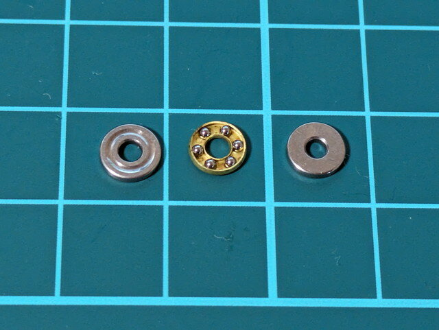
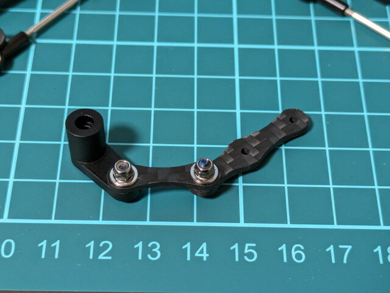
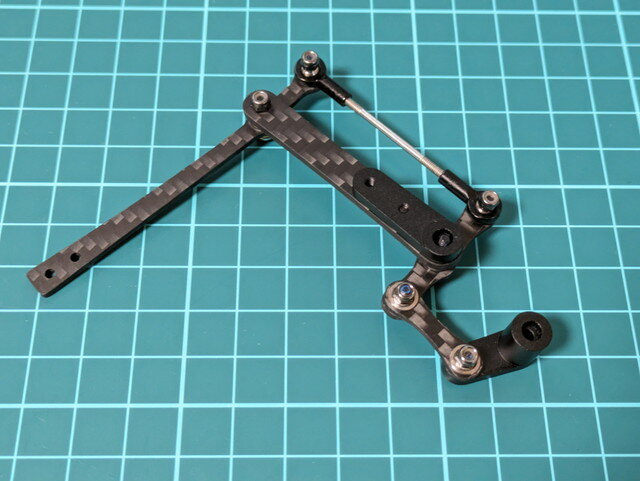
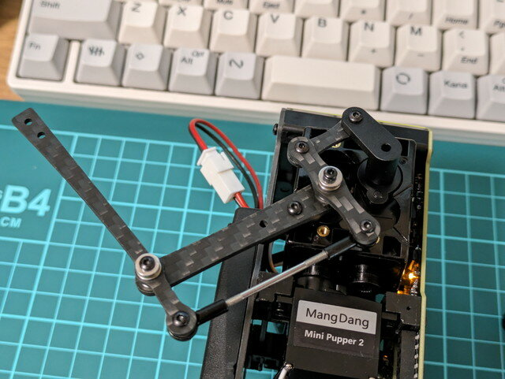

[Mini Pupper 2の胴体ができました](https://kanpapa.com/2023/10/mini-pupper-2-4-body-assembly.html "Mini Pupper 2 を組み立ててみました (4) ボディの組み立て")ので、脚を組み立てて取り付けていきます。

脚一組の材料です。

袋に入っているのはボールベアリング一式です。これを可動部に取り付ける必要があるようです。細かいパーツです。

一脚分のパーツを配置してみました。構造はやや複雑です。この脚の構造はノウハウが詰まっているように思います。

左右では脚のパーツの向きが正反対になるようにします。

これで脚の組み立てイメージがわかりましたので、ネジ止めしていきます。

脚のパーツを組み立てていきます。ネジ止めの時はボールベアリングの向きに注意が必要です。

この２つのパーツを組み合わせると、脚が完成します。これをあと3脚組み立てます。

4脚分完成しました。

脚をボディに取り付けていきます。

左前脚を取り付けます。

すべての脚の取り付けが完了しました。

このあと脚の位置の調整を行います。
