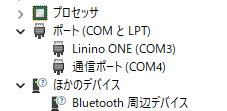
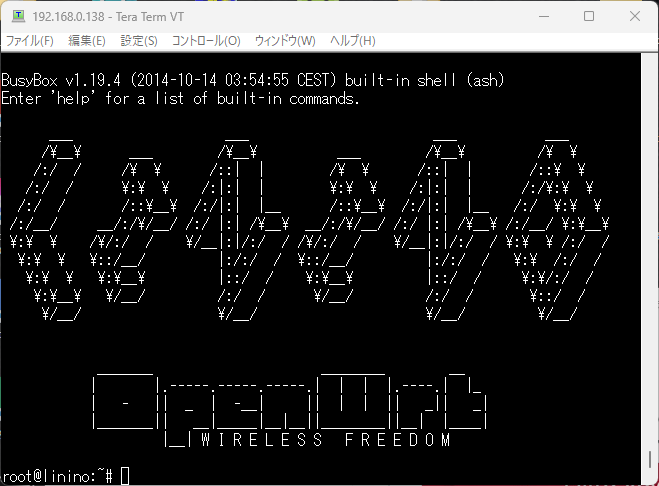

[秋月電子](https://akizukidenshi.com/)の2階で気になるものがありました。「Linino わんわんハントセット」です。

このパッケージですが、Linino ONEというArduino Yun Mini互換ボードと、10/100Mbps Ethernetに接続するためのdogRJ45とUSBホストとminiSDカードスロットがあるdogUSBのセット商品で、価格は2,000円です。

## パッケージの中身

包装紙を取ると箱が2つありました。商品名の「わんわん」はONE-ONEなのだなと気づきました。

1つはLinino ONE本体、もう１つの箱はdogRJ45とdogUSBです。

箱をあけると本体以外に簡単な説明書とステッカーが入っていました。箱や説明書は日本語で書かれており、接続方法やパスワード、ピン配置などが書かれています。もちろん技適番号もありますので安心して使用できます。

残念ながらすでにLinino.orgは閉鎖されているようでマニュアルに書かれているURLには接続できません。このためLinuxのアップデートはできないようです。

## Linino ONEを動かしてみる

インターネットで検索したところ参考となりそうなドキュメントが見つかりました。これに沿って動作確認をしてみます。

[Linino Oneをはじめよう！ #Arduino - Qiita](https://qiita.com/okhiroyuki/items/9c024c6db93a639ee788)

まずはWindows11のUSBに接続して電源を投入してみます。上記のドキュメントにはWindowsの場合はドライバが必要とありましたが、私の環境ではすんなりとUSBシリアルとして認識されました。

この状態でArduino IDEでボードをArduino Yun Miniとして設定し、Blink.inoを書き込んでみたところ問題なくLチカができました。

https://youtu.be/g6MN5KmdjnI

## Linino ONEのWiFiに接続する

SSIDがLinino-B4218AXXXXXから始まるWiFi APにPCを接続し、ブラウザでhttp://192.168.240.1に接続するとこのような画面が表示されました。

説明書に書かれているパスワードを入力し、ログインが成功すると、WiFiの情報や有線LAN、Linuxカーネル情報、メモリ使用状況が表示されます。設定画面でWiFi APの設定ができるので、自宅のWiFi APのSSIDとパスワードを設定して再起動すると接続されます。

## Linuxにログインする

割り振られたIPアドレスにsshしたらLinuxにログインできました。どのような機能が実装されているか、これから探検してみようと思います。

## REST APIが使えない問題

REST APIを使おうといろいろ試してみたのですが、No such file or directoryと表示されて、うまく動きません。

スイッチサイエンスのWebページによるとOSのアップデートが必要のようです。

https://trac.switch-science.com/wiki/linino\_one\_restapi

残念ですが、REST APIの使用はあきらめました。

## まとめ

ArduinoとLinuxを連携したアプリケーションが作れると期待していたのですが、すでにサポートも終了しており残念ながら活用するのは難しそうです。でもArduinoとしては使えるので、いろいろ実験してみようと思います。

また、付属のdogRJ45を使ってtftpbootでNetBSDを起動されたかたもいるようです。

[NetBSD/evbmips on Linino ONE and USB Serial 2015 - Speaker Deck](https://speakerdeck.com/adukot/evbmips-on-linino-one-and-usb-serial-2015?slide=8)

このLinino ONEに関する情報はインターネットにたくさんありそうなので、いろんな事例を探してみます。
