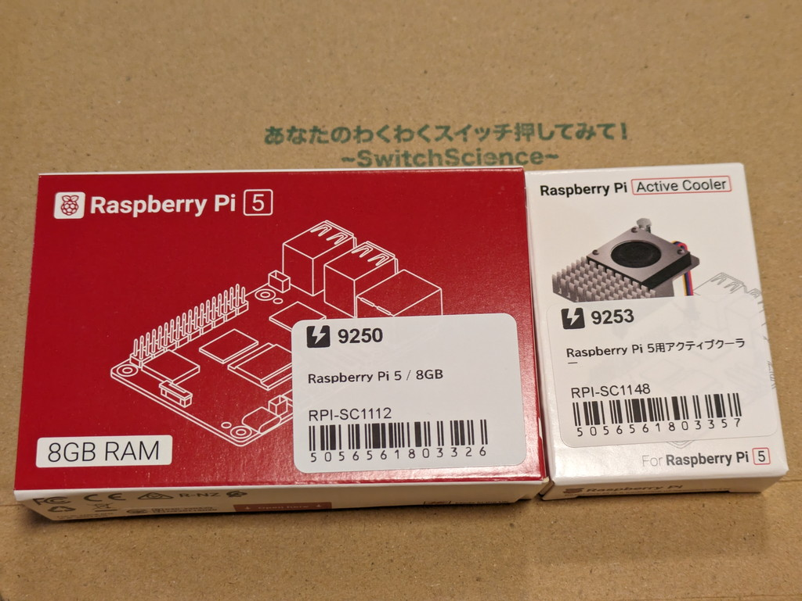
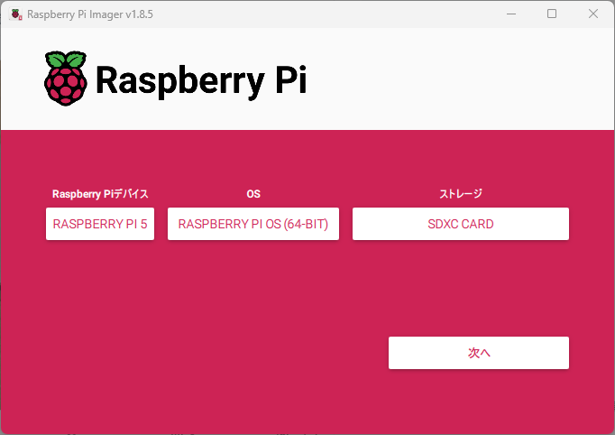
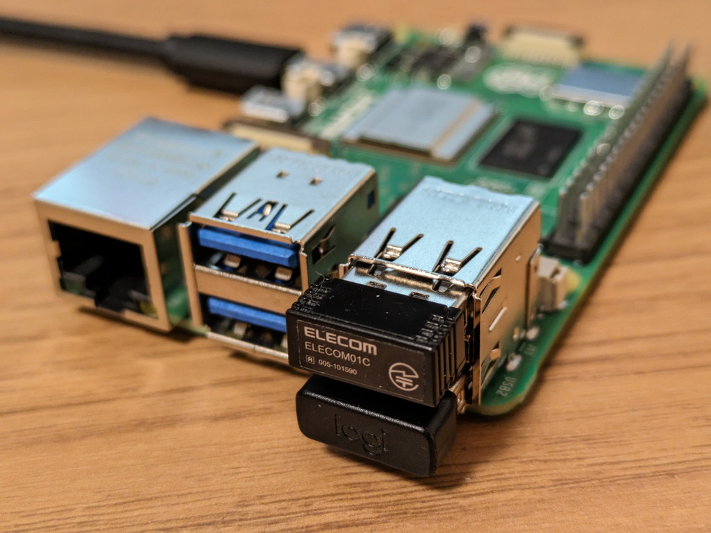
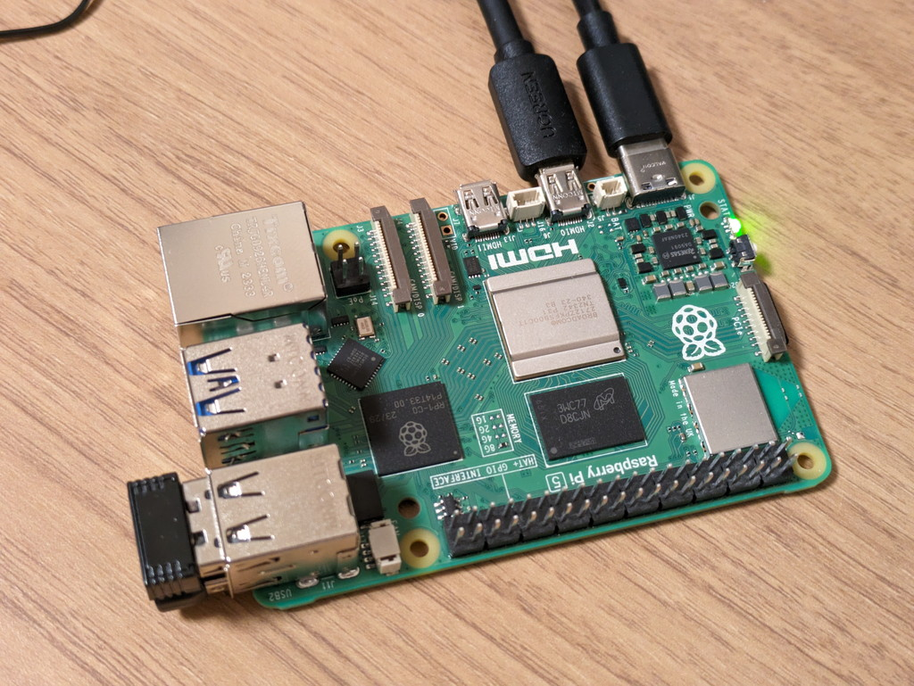
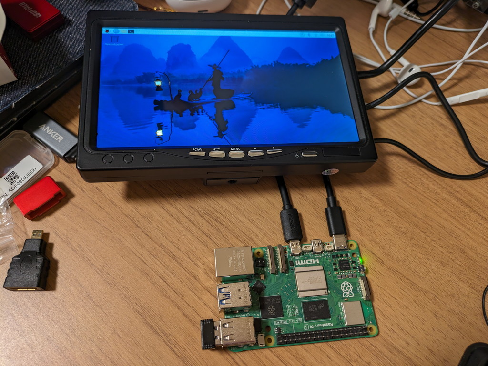
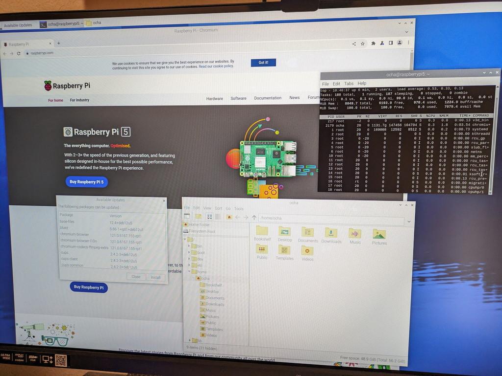
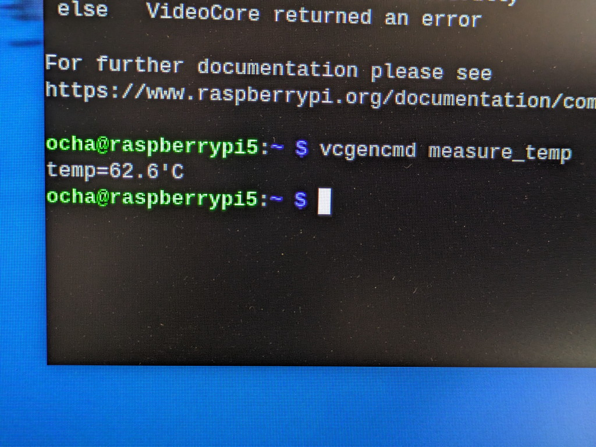

Raspberry Pi 5 の販売が開始されたので早速スイッチサイエンスさんで購入しました。8GBモデルで純正のアクティブクーラーも同時に購入です。ケースは必要になったら購入で良いかなと思いました。

## Rappberry Pi 5が到着

Raspberry Pi 5とアクティブクーラーが到着しました。

Raspberry Pi 5の外箱には技適マークが貼ってあります。この箱は捨てられませんね。

アクティブクーラーは思っていたよりもコンパクトでした。すぐ本体に取り付けるのではなく、クーラー無しの状態でどのぐらい使えるのかを試そうと思います。

## Raspberry Pi 5を開封

箱を開封しました。見慣れているRaspberry Pi 4と同じ大きさです。

箱の中身です。これもRaspberry Pi 4と同じような内容です。

こちらはアクティブクーラーです。

アクティブクーラーの裏面には熱伝導シートが貼ってあり、保護紙をはがせばそのまま本体に取り付けができるようになっていました。これは便利ですね。

## 起動の準備

まずはmicroSDカードを用意します。Raspberry Pi ImagerでRaspberry Pi 5用のRaspberry Pi OS 64ビット版を選択して書き込みます。オプションメニューでWiFi設定やsshの起動も設定しておきました。

デスクトップ環境として利用するためにはUSBキーボードとUSBマウスが必要ですが、私はいつも使っているUSB無線キーボードとUSB無線マウスを接続しました。もちろん、MicroHDMIも接続しました。

電源は手持ちの秋月電子さんの5.1V 3.8A USB-C端子用の電源アダプタを使います。

## 初めての電源投入

周辺機器の接続ができたところで電源を投入します。STAT LEDがちかちか点滅し起動が始まったようです。

いつもであればHDMIのモニタに起動画面が表示されるのですが、PCで使っている34インチHDMIモニタでは画面が表示されませんでした。もしかすると相性の問題かなと手持ちの7インチ小型HDMIモニタに接続したところ無事表示されました。

あとでPCの34インチHDMIモニタの電源を入れなおしたところ、問題なく画面が表示されました。私のHDMIモニタの問題だったようです。

## Raspberry Pi 5の使用感

一般的な使いかたとしてブラウザを立ち上げたり、ターミナルやファイルマネージャーとか使ってみましたが、いずれもスムーズに動きます。明らかにRaspberry Pi 4よりは高速です。これであれば作業も捗ると思います。

画面右上にOSのアップデートの警告が表示されたのでOSのアップデートを行ってみました。この作業で少し負荷がかかるはずなので、気になる本体の温度を確認してみます。

## 気になる発熱は？

Raspberry Pi 5本体の温度を確認してみます。SoCチップは指でちょんと触るぐらいであれば問題無い感じです。手をかざすと少し熱気を感じます。

正確な温度を知るために vcgencmd measure\_temp コマンドを入力してみると、62.6℃でした。少し熱くなっているようですが、まだ動作に支障はなさそうです。

3A電源で通常の使い方であれば、55〜60℃程度で収まりそうでした。ブラウザでYoutubeを見たりすると65℃近辺まで上昇するようなので注意が必要です。

## まとめ

今回はRaspberry Pi 5の第一印象をまとめてみました。まだ3A電源の利用ですし、負荷をかけている状態ではありませんが、デスクトップ環境においてはキビキビと動作し、想像していたよりは発熱しないような印象です。

このRaspberry Pi 5は実験用として使う予定なので、もう少しアクティブクーラーなしの状態でどこまで使えるか試してみたいと思います。
