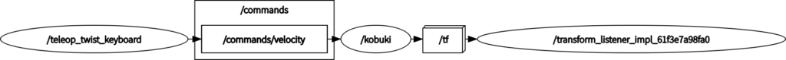
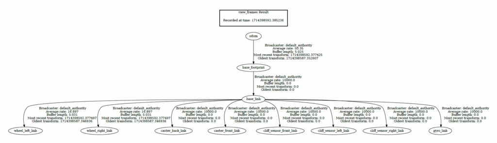

[前回](https://kanpapa.com/2024/04/turtlebot2-kobuki-3-ros2.html)はkobukiのファームウェアをアップデートしたあとにROS2 Humble環境でkobukiをコントロールできることを確認できました。今回はROS2の可視化ツールであるRviz2でkobukiの情報を可視化してみます。

## Rviz2でkobukiの情報を可視化してみる

kobuki\_nodeとteleop\_twist\_keyboardを動かしている状態でRviz2を起動してみました。

```
$ ros2 launch kobuki_node kobuki_node-launch.py
$ ros2 run teleop_twist_keyboard teleop_twist_keyboard --ros-args --remap cmd_vel:=commands/velocity
$ rviz2
```


Rviz2でTF（transform）を表示すると2つの座標が見えています。最初はodomとbase\_footprintは同じ座標のため重なって表示されていますが、車輪を接地しない状態でキーボードで前後に動かすと、odomの座標とbase\_footprintの座標の位置関係が変化します。

https://youtu.be/V3W6gjqEXoU

これはモーターの車軸に取り付けられているエンコーダが計測した車輪の回転方向と回転角度から割り出したロボットの座標がRviz2に表示されています。ただし、左右に回転した場合は何も変化がありません。これは座標自体には変化はなく、車輪を浮かせているため向きの情報が反映されないためでしょう。

この状態でノードとトピックの情報をrqt\_graphコマンドで可視化してみます。

```
$ rqt_graph
```



teleop\_twist\_keyboardノードから発行された/commands/velocityトピックを/kobukiノードが受信してモーターを動かし、TFの情報をRviz2が受信して表示していることがわかります。

さらにTFの状態を見てみます。

```
$ ros2 run tf2_tools view_frames
```


Rviz2に表示されているodomとbase\_footprintが表示されました。

## kobukiの詳細な情報を可視化してみる

この時点では車輪の位置などもっと細かなTFが流れてきていないようです。

確認したところkobuki\_descriptionでこの辺りの情報を流しているようでしたので、新たにターミナルを開いてノードを起動してみました。

```
$ ros2 launch kobuki_description robot_description.launch.py
```

この状態でRviz2を確認すると、kobukiの各パーツの位置情報と3Dモデルも表示され、よりリアルになりました。


kobukiを持ち上げて左右に動かしてみるとRviz2の画面でも左右に動きます。これはkobukiに搭載されているIMUの情報が反映されているようです。

https://youtu.be/b5qIkW5XWak

この状態でノードとトピックの情報をrqtで可視化してみます。


新たにrobot\_state\_publisherノードとjoint\_state\_publisherノードが追加され、tfが追加配信されているのがわかります。

tfの状態をみるとbase\_footprintからbase\_linkにリンクが追加され、さらにkobukiの各パーツにリンクされていることがわかります。



- base\_link：ロボットの位置
- wheel\_left\_link, wheel\_right\_link,：左右の車輪の位置
- cliff\_sensor\_front\_link, cliff\_sensor\_left\_link, cliff\_sensor\_right\_link：落下防止センサーの位置
- gyro\_link：IMUセンサーの位置
- caster\_back\_link, caster\_front\_link：前後に取り付けられているキャスターの位置

Rviz2でkobukiをひっくり返して裏から見ながらTF→Framesのチェックボックスをつけたり外したりすると、それぞれの座標が確認しやすいです。


## まとめ

Rviz2やrqtといった可視化ツールでkobukiの状態が可視化できていることを確認しました。現在はデスクトップPCをケーブルで接続して実験を行っているので、実際に走行させることができません。そこで手持ちのUbuntu tabletやRaspberry Pi 4などkobukiに搭載できる小型PCに接続して、WiFi経由でデスクトップPCから制御できるようにしてみます。
