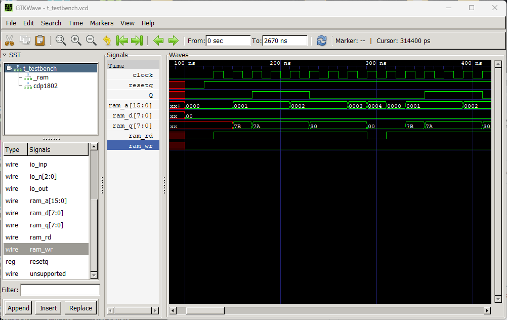

久しぶりに[verilogを書いてFPGAを使ってみました](https://kanpapa.com/2024/03/tang-nano-9k-gowin-eda-linux1.html)が、ふとCPUをFPGAで動かしてみたくなりました。とはいえ大規模なCPUではなく学習用の簡単なものがないかなとgithubを探してみたところ、verilog1802という[COSMAC CDP1802 CPU](https://kanpapa.com/cosmac/cosmac-cpu)を見つけました。これを動かしてみようと思います。

## verilog1802のソースを眺めてみる

COSMAC CDP1802 CPUのverilogのソースコードは176行しかありません。もともとシンプルなアーキテクチャですので、ソースにおいても非常にシンプルな構造に見えます。

https://github.com/jamesbowman/verilog1802/blob/master/cdp1802.v

COSMAC CDP1802 CPUのアーキテクチャを知っているかたであればよい教材になると思いました。

## Icarus Verilogのインストール

FPGAで動作させる前に、このverilog1802が動くかどうかをシミュレーションで確認してみることにしました。シミュレータはWeb検索してみたところ、Icarus Verilogが良さそうなのでこれを使ってみました。今回はWindows11の環境で試してみます。

https://bleyer.org/icarus

公式サイトから iverilog-v12-20220611-x64\_setup \[18.2MB\] をダウンロードしてインストールしました。

## テストベンチを書いてみる

テストするCOSMACのプログラムは以下の通りです。4バイトしかありませんが、Q出力にパルス信号を出力することができます。

```
0000 7B       START SEQ
0001 7A             REQ
0002 30 00          BR START
```

このコードを動作させるためのテストベンチを書きました。RAM領域にCOSMACの4バイトのプログラムを書き込んでおき、RESET信号を出力したあとに、CPUクロックを255個与えるものになっています。ソースコードはforkしたiverilog-testブランチに置いておきました。

https://github.com/kanpapa/verilog1802/blob/iverilog-test/t\_testbench.v

## シミュレーターの実行

verilog1802のリポジトリにあるcdp1802.vとram.vをそのまま使い、先ほど作成したテストベンチをt\_testbench.vとしています。コマンドプロンプトを立ち上げて以下のように入力します。

```
C:\Users\ocha\verilog1802>iverilog -o testbench cdp1802.v ram.v t_testbench.v

C:\Users\ocha\verilog1802>vvp testbench
VCD info: dumpfile t_testbench.vcd opened for output.

C:\Users\ocha\verilog1802>gtkwave t_testbench.vcd

GTKWave Analyzer v3.3.100 (w)1999-2019 BSI

[0] start time.
[2670000] end time.
```

iverilog-testブランチにこのバッチファイルも置いておきました。

https://github.com/kanpapa/verilog1802/blob/iverilog-test/iverilog-run.bat

正常に実行されると別ウィンドウでGTKWaveが立ち上がり、確認したい信号を選ぶことで信号の状態が確認できます。今回は、clock, resetq, Q, ramのアドレスバスとデータバスとr/wを確認してみました。



ram\_aはRAMのアドレスバスです。0000番地から0004番地を順番に読み込んでいます。ram\_qはRAMに書き込んだ４バイトのプログラムがみえます。これを解釈してQに１，０の繰り返し出力ができています。基本的なSEQ、REQ、BRのみの確認にはなりますが、他の命令も同様に動くものと思われます。

## まとめ

シミュレーションを行うことでVerilogの動作検証ができることがわかりました。またシンプルなCOSMAC CPUもシミュレーションで動作状態を確認することができました。次回は実際にFPGAに書き込んでCPUとして動かしてみたいと思います。
