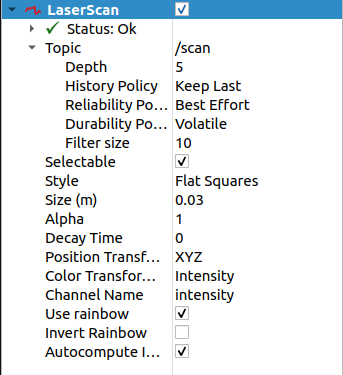
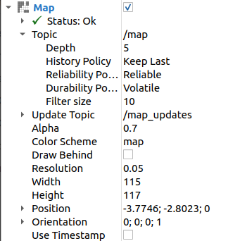
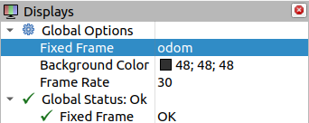
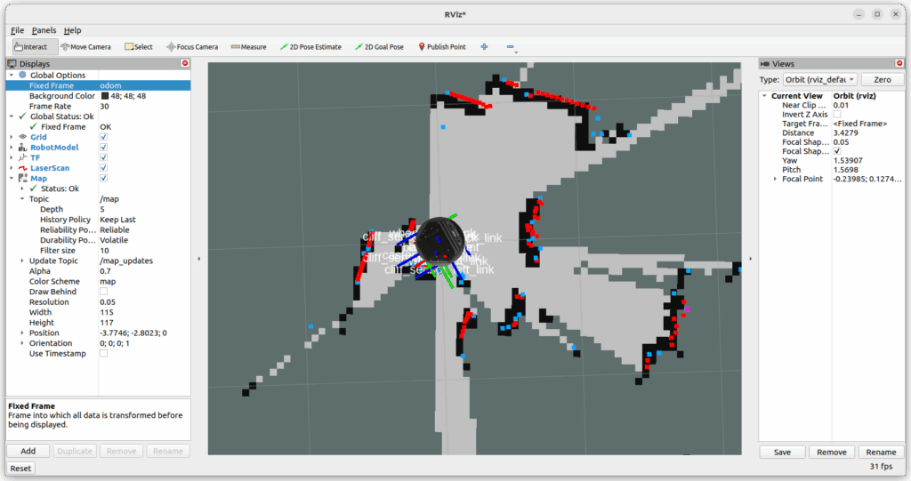

前回はkobukiの状態をRviz2で可視化しましたが、LiDARを接続してSLAMを行ってみます。これにより自己位置推定と環境地図の作成ができ、自動運転に必要な情報を生成することができます。

## kobukiにLiDARを搭載する

これまでルンバで使用していたLiDARを使います。ルンバにLiDARを搭載するためのフレームを製作しましたが、それがそのまま使えました。


## LiDARドライバの設定

今回使用するLiDARはYDLIDAR X2です。公式サイトにあるROS2ドライバをインストールします。

### LiDAR SDKのインストール

ROS2ドライバを動作させるにはYDLIDAR-SDKが必要になります。以下のGithubにあります。

https://github.com/YDLIDAR/YDLidar-SDK

手順に従ってインストールを行います。

```
$ sudo apt install cmake pkg-config
$ cd ~
$ git clone https://github.com/YDLIDAR/YDLidar-SDK.git
$ cd YDLidar-SDK
$ mkdir build
$ cd build
$ cmake ..
$ make
$ sudo make install
```

### LiDAR ROS2ドライバのインストール

YDLIDAR X2のROS2ドライバは以下のGithubにあります。

https://github.com/YDLIDAR/ydlidar\_ros2\_driver/tree/humble

手順に従ってインストールを行います。

```
$ cd ~/kobuki_ws/src
$ git clone -b humble https://github.com/YDLIDAR/ydlidar_ros2_driver.git
$ colcon build --symlink-install
$ source ./install/setup.bash
$ chmod 0777 src/ydlidar_ros2_driver/startup/*
$ sudo sh src/ydlidar_ros2_driver/startup/initenv.sh
```

この状態でLiDARをUSBに接続し、/dev/ydlidar のシンボリックリンクができていることを確認します。

```
$ ls -l /dev/ydlidar
lrwxrwxrwx 1 root root 7  5月  1 09:20 /dev/ydlidar -> ttyUSB1
```

### パラメタの修正

ROS2ドライバのパラメタをYDLiDAR X2用に修正します。また、シリアルポートが /dev/ttyUSB0になっているので、/dev/ydlidarに書き換えます。

```
$ cd ~/kobuki_ws/
$ cd install/ydlidar_ros2_driver/share/ydlidar_ros2_driver/params
$ mv ydlidar.yaml ydlidar.org
$ cp X2.yaml ydlidar.yaml
$ vi ydlidar.yaml
```

ydlidarの変更点は以下の通りです。

```
*** X2.yaml	2024-04-30 10:45:54.964204580 +0900
--- ydlidar.yaml	2024-04-30 10:59:48.978874517 +0900
***************
*** 1,6 ****
  ydlidar_ros2_driver_node:
    ros__parameters:
!     port: /dev/ttyUSB0
      frame_id: laser_frame
      ignore_array: ""
      baudrate: 115200
--- 1,6 ----
  ydlidar_ros2_driver_node:
    ros__parameters:
!     port: /dev/ydlidar
      frame_id: laser_frame
      ignore_array: ""
      baudrate: 115200
```

### LiDARドライバの起動

LiDARのROS2ドライバを起動します。

```
$ ros2 launch ydlidar_ros2_driver ydlidar_launch.py
   :
[ydlidar_ros2_driver_node-1] [YDLIDAR] Successed to check the lidar, Elapsed time 305 ms
[ydlidar_ros2_driver_node-1] [2024-05-01 09:33:26][info] [YDLIDAR] Now lidar is scanning...
```

LiDARが高速回転になって、/scanトピックが流れ始めます。これがLiDARからの情報になります。

## Rviz2でLiDARの情報を確認する

Rviz2を起動します。

```
$ rviz2
```

FileメニューのOpen Configで、ドライバに含まれている以下のサンプルファイルを指定して開きます。

```
~/kobuki_ws/src/ydlidar_ros2_driver/config/ydlidar.rviz
```

Rviz2の画面に赤い点群が表示されます。これがLiDARが認識している物体の情報です。LiDARの周りにある物や部屋の壁が認識できています。手などでLiDARの周りを遮ると手の動きが確認できます。


これでLiDARが正常に動作していることが確認できました。

## SLAMの実行

kobukiのROS2ノードを起動します。ここではまとめて記載していますが、個々にターミナルを開いて実行します。

```
$ ros2 launch kobuki_node kobuki_node-launch.py
$ ros2 launch kobuki_description robot_description.launch.py
```

SLAMを起動します。

```
$ ros2 launch slam_toolbox online_async_launch.py
```

Rviz2を実行します。

```
$ rviz2
```

Rviz2の左側にあるDisplaysのメニューでAddをクリックし、By display typeからLaserScanを選んでOKをクリックします。追加されたLaserScanの項目で、Topicに/scanを設定、TopicのReliabilty PolicyをBest Effortにし、Size(m)を0.03にします。LaserScanの設定例を以下に示します。



さらに、DisplaysのメニューでAddをクリックし、By display typeからMapを選んでOKをクリックし、Topicに/mapを設定します。



最後にGlobal OptionsのFixed Frameをodomにします。



このように設定するとスキャンデータと地図が表示されます。ここでkobukiをある程度動かすと地図が生成されるのですが、まだ狭い範囲しか動かせないので残念ながらここまでです。



ここまでの状況からみて、SLAMは正常に行えているようです。

https://youtu.be/J0RSH-KoVfk

参考までにrqt\_graphの結果を示します。


## まとめ

LiDARを追加することで、SLAMによる地図の生成ができることが確認できました。実際に走行させると次々と地図ができていくのですが、まだバッテリーが到着していないのでここまでになります。バッテリーが届いてkobukiが自由に走行できるようになったらNavigation2での自律走行を試してみます。
