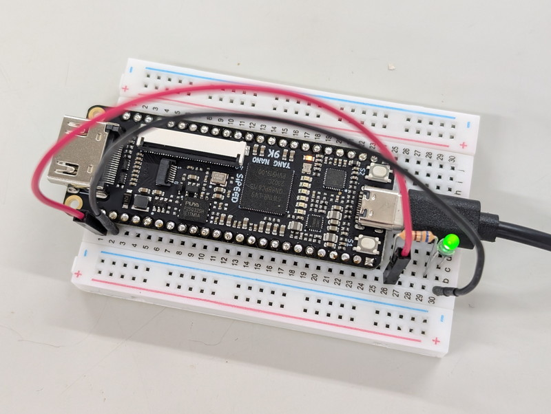
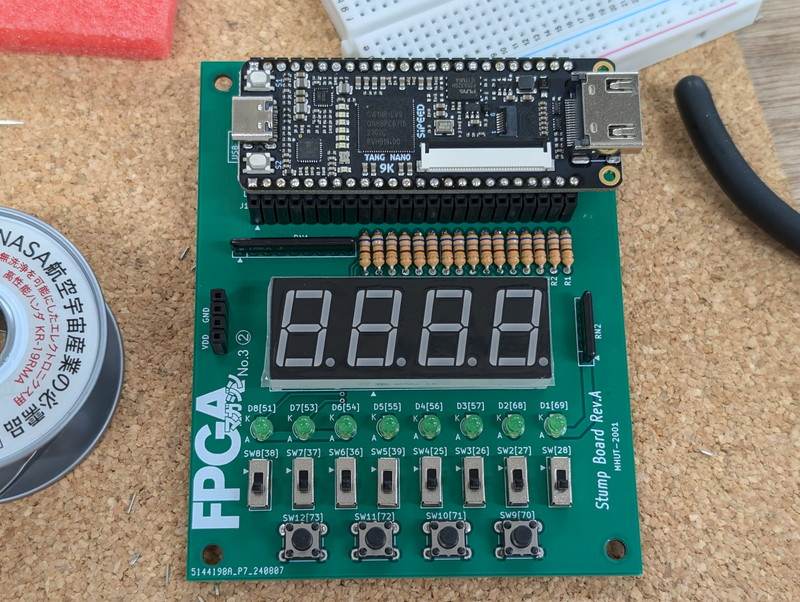
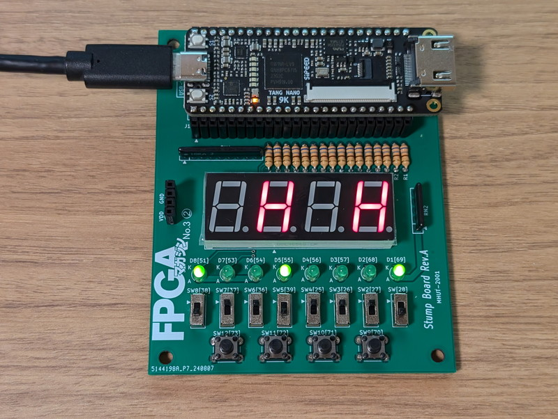

[Interface 2024年10月号](https://interface.cqpub.co.jp/magazine/202410/)付録の[FPGAマガジン 特別版No.3](https://fpga.tokyo/no3-2/)に掲載されていた[Tang Nano 9K用学習用基板](https://fpga.tokyo/mhut/)を組み立ててみました。

私自身FPGAの知識はまだまだで試行錯誤でSystemVerilogを書いている状態です。このような学習用基板があれば手軽に実験ができて理解が進むのではと考えました。ブレッドボードで製作することもできるのですが、読者向けに基板サービスがありましたので、そのサービスを利用させていただきました。

## 到着した学習用基板

返信用封筒と引換券を郵送後しばらくしたら基板が到着しました。FPGAマガジンのロゴも入っていました。基板の名称はStump Board Rev.A とのことです。


早速パーツ集めを開始です。LEDとタクトスイッチ、680Ω抵抗は手持ちのものが使えそうです。

## 基板の組み立て

[サポートページ](https://fpga.tokyo/mhut/)に詳しく説明がありますので、パーツ集めや組み立てで戸惑うことはないでしょう。私が揃えたパーツ一式です。


LEDを手持ちものにしましたので、製作の前にTang Nano 9KのVDDに680Ωの抵抗を介してLEDを接続し、LEDの明るさを確認しました。まれに眩しすぎることがあるので念のためです。今回はちょうど良い明るさで特に問題なさそうです。



準備したパーツを基板にハンダ付けしていきます。サポートページにも丁寧な解説があります。


完成した基板です。いい感じです。



## 動作確認

Tang Nano 9K 付属のUSB-A←→USB-CケーブルでPCに接続し、サポートページにあるサンプルプロジェクトをダウンロードして展開します。GOWIN IDEはすでにPCにインストール済でしたので、動作確認用のstumpディレクトリにあるプロジェクトファイルを開いて、Tang Nano 9Kに書き込んだところLEDと7セグメントLEDが無事点灯しました。


サポートページに従って正しい動作をしているか確認したところ、特に問題はありませんでした。

## サンプルプロジェクトを修正してみる

サンプルプロジェクトはLEDを点灯させるだけの簡単なものから、外部I/Oを使うもの、4bit CPUなどが用意されています。各プロジェクトのソースをいじって、意図した動きになるかを確かめることで理解が深まりそうです。

試しに一番簡単なサンプルプログラムをほんの少し変更してみました。もともとはスライドスイッチに対応するLEDが点灯・消灯するだけでしたが、7セグメントLEDの1桁目と3桁目の個々のセグメントも点灯させるようにsimple\_io8.svファイルを元に変更してみました。他にもsimple\_io8.cstファイルを元に変更しています。

```
module simple_io8_7seg (
    input        [7:0] ts,  // TSW[7:0] Pin: 38,37,36,39,25,26,27,28
    output logic [7:0] led, // LED[7:0] Pin: 51,53,54,55,56,57,68,69
    output logic [7:0] seg, // SEG a,b,c,d,e,f,g,dp (Positive Logic)     ←追加
    output logic [3:0] dig  // Digit select         (Negative Logic)　　 ←追加
) ;

    assign led = ts ;
    assign seg = ts ;         ←追加
    assign dig = 4'b1010 ;    ←追加

endmodule : simple_io8_7seg
```

実行中の様子です。意図した動きができました。



## まとめ

まだ簡単なものしか試せていませんが、しばらくはサンプルソースを眺めながら実際に手を動かしてステップアップしたいと考えています。

おまけ：少し古いDE0というFPGAボードとの記念写真です。


