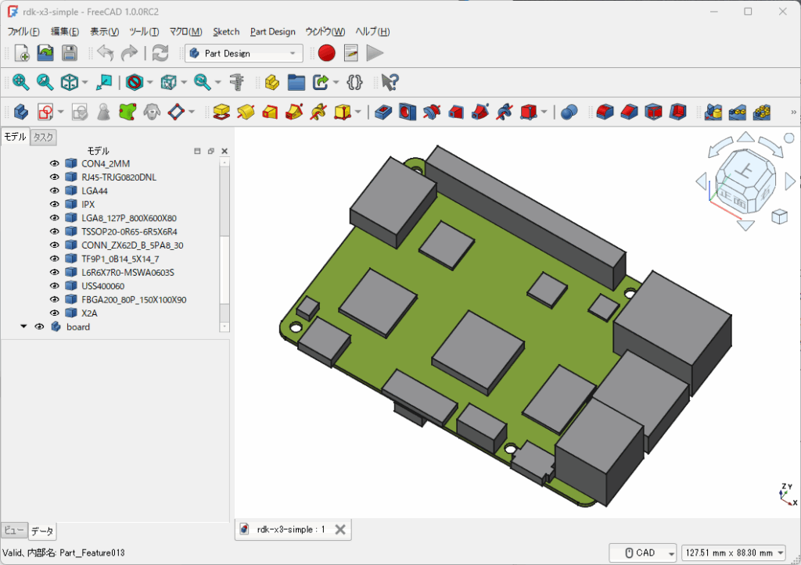
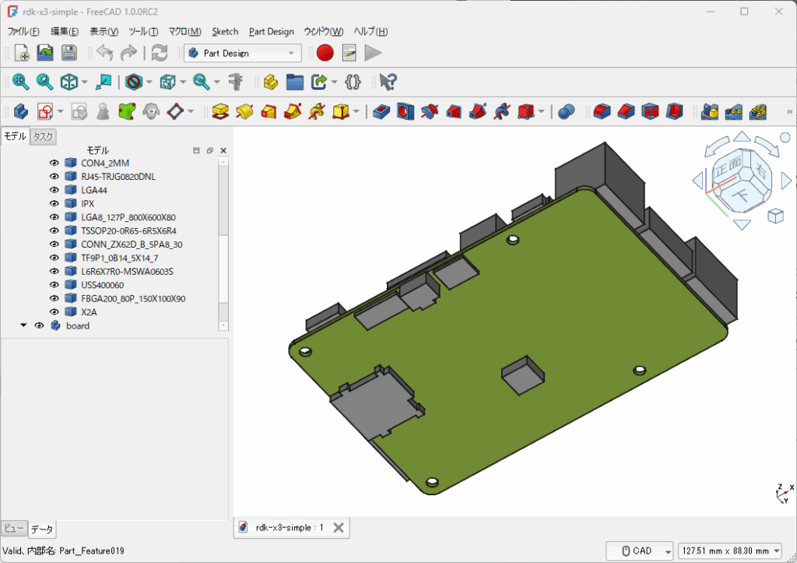
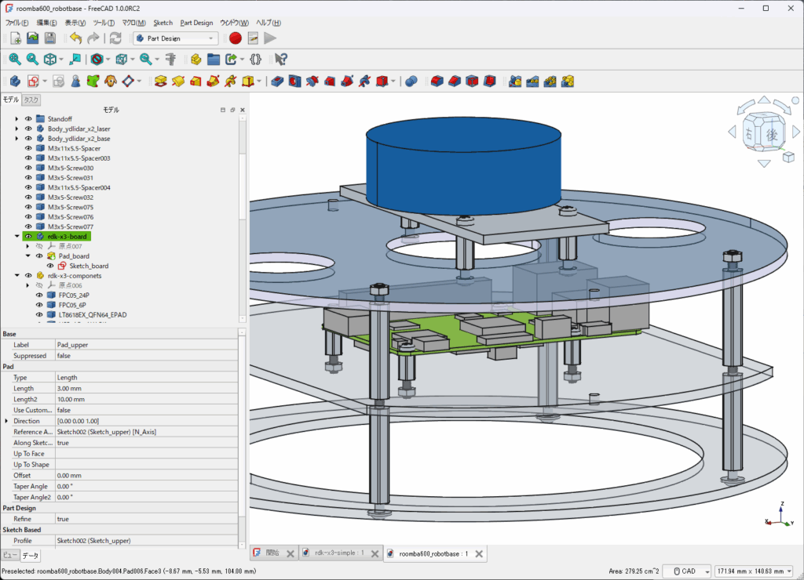

[ルンバロボット](https://kanpapa.com/2024/09/rdk-x3-roomba-controlled-ros2.html)のフレームを新たに[RDK X3](https://www.switch-science.com/products/9836)用に作り直そうと思い[FreeCAD](https://www.freecad.org/)を使った再設計を始めました。RDK X3の搭載イメージを確認するために、公式サイトで公開されている[RDK X3のStepファイル](https://d-robotics.github.io/rdk_doc/en/Quick_start/download/)をFreeCADにインポートしようとしたのですがうまく読み込めません。試しに[Autodesk FUSION](https://www.autodesk.com/jp/products/fusion-360/)では開けました。どうやら複雑なSTEPデータのため、FreeCADにとってはデータ処理が重いようです。ここではそこまで複雑な形状は不要なので、大まかな構造がわかるデータを作成してみました。

## RDK X3の3Dデータをシンプルにする

公式サイトのSTEPファイルをAutodesk FUSION（個人版）にインポートし、細かいパーツを削除したSTEPデータを作成し、それをFreeCADにインポートして調整しました。

FreeCADで作成中のRDK X3です。表面は大きなパーツ以外は削除しました。

裏面も同様です。

## ルンバロボットのフレームに搭載する

作成したRDK X3のデータで、実際にFreeCADでルンバロボットのフレームを設計している様子です。

このようにRDK X3の取り付け状態の確認であれば十分使えます。

## まとめ

今回作成したFreeCADデータとSTEPデータはGitHubに置きました。不正確なところがあるかもしれませんので、あくまでもイメージ確認用としてください。

https://github.com/kanpapa/rdk-x3

できれば、公式サイトで、このような軽量版のSTEPデータや、他のコンポーネント、例えばカメラモジュールとか、ケースなどのSTEPデータも提供いただけるとロボット設計時に助かるので今後に期待しています。
