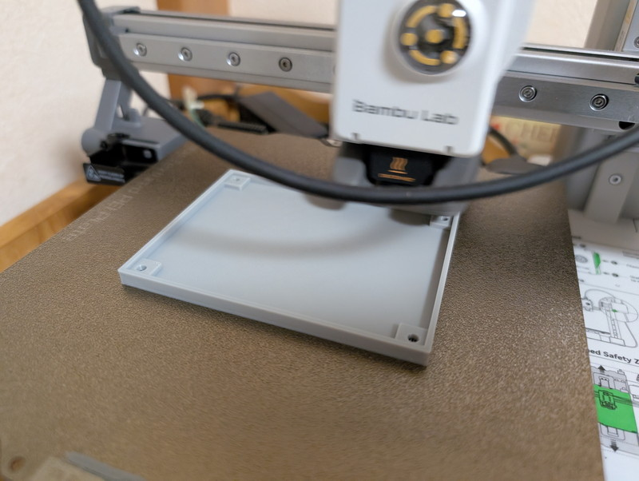
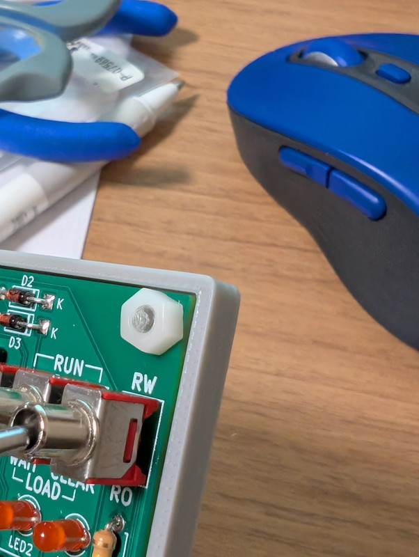

[COSMAC研究会](https://kanpapa.com/cosmac/)で[COSMAC TOY V2](https://kanpapa.com/cosmac/blog/2024/12/cosmac-toy-v2-rev02-dev1.html)を開発中ですが、トグルスイッチをパチパチする場合は基板を手に持って操作しています。こうすると基板の裏側に手の汚れが付いてサビを招いたり、部品の足で手に怪我をする可能性もあります。その点が気になっていたのですが、Xで以下の記事を見かけました。

https://twitter.com/n602\_NA/status/1873041289585016960

確かArduinoでも同じようなボトムカバーを販売しています。

https://www.switch-science.com/products/2305

COSMAC TOY V2の基板は、秋月電子B基板サイズに合わせてありますので、すでに公開されているB基板用のボトムカバーがあれば使えるなと探してみました。

## C基板用のボトムカバー

調べてみたところ、B基板用のものは見つからなかったのですが、C基板用のボトムカバーを見つけました。

http://powerele.sblo.jp/article/188062045.html

ありがたいことにFreeCADファイルが公開されていましたので、これを改変してB基板用のカバーを作ってみることにしました。

## B基板用ボトムカバーの設計

オリジナルのFreeCADデータで単純にサイズを調整するだけではなく、拘束を設定したり、角の面取りや実物を取り付けながら微調整を行いました。

３回目の出力でまあまあのものができました。これをRev.3として完成としました。

気になっていた角も面取りをしました。

COSMAC TOY V2にもこのカバーをとりつけて思いっきりパチパチできるようになりました。

## まとめ

先日導入したBambu Lab A1 miniのおかげでこのデータであれば30分程度で精度の良い出力ができます。これで繰り返して出力することが苦にならなくなりました。

なお、オリジナルであるC基板のFreeCADファイルのデータを改変利用の許可もいただきましたのでGitHubにてデータを公開いたしました。

https://github.com/kanpapa/Akizuki\_B\_Board\_BottomCover
