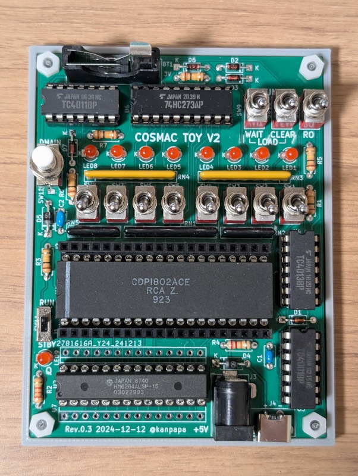

あけましておめでとうございます。  
去年は[ルンバで2024年の年越しカウントダウン](https://kanpapa.com/2024/01/roomba-newyear2024.html)をしてみましたが、今年は何をしようかなと考えていたところで、ちょうど[COSMAC研究会](https://kanpapa.github.io/cosmac-lab/)で開発中の[COSMAC TOY V2](https://github.com/kanpapa/cosmac_toy_v2)でPOV（Persistent Of Vision：目の残像現象を利用して文字を空間に表示するもの）が動きましたので、それを利用して新年のご挨拶とさせていただきます。

## COSMAC TOY V2とは

こちらがCOSMAC TOY V2です。トグルスイッチでプログラミングができるというものです。

表示I/OとしてLEDが８つありますので、これを使ってPOVを行うことができます。詳細なドキュメントはGitHubを参照ください。

https://github.com/kanpapa/cosmac\_toy\_v2/blob/main/programs/07\_pov1/README.md

## POVを動かしてみる

実際に動かしてみました。

https://youtu.be/\_eNI0xys2NE

心の目で見ていただければ、2025という文字が見えてくると思います。

では、2025年もよろしくお願いいたします。
