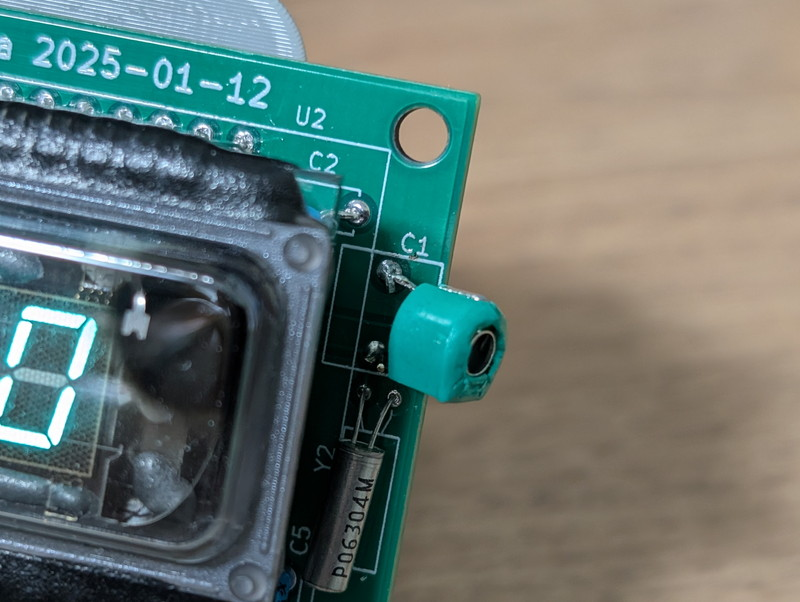
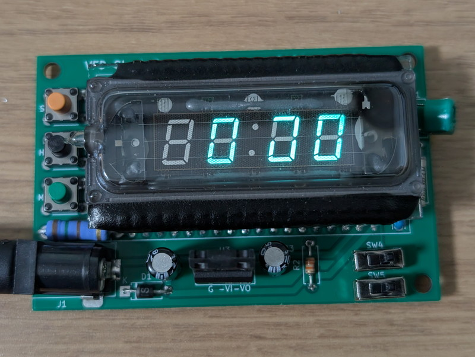
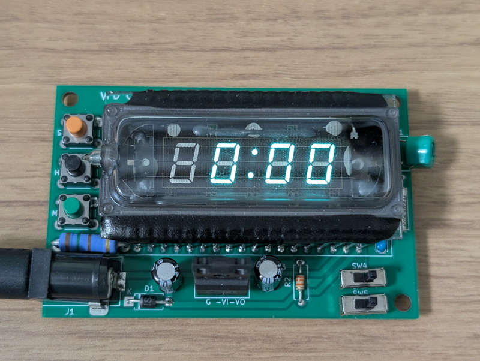
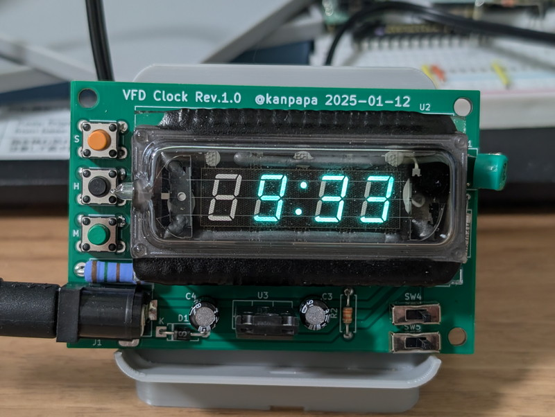

年末の大掃除をしていたときに、かなり昔にデジットさんで購入したVFD時計のパーツが出てきました。すっかり忘れておりました。パーツの内容は専用IC T3605、VFD、水晶発振子、簡単な説明書だけです。なお、現在は販売されていないようです。

この専用IC T3605Tのデータシートを探してみましたが見つかりませんでした。添付の説明書だけが頼りです。VFDの裏面がカッコいいですね。

## 製作事例を探してみる

古いものとは言えデジットさんで販売していたものですから、すでに製作事例がありそうです。Web検索をしたところ「[電気電子工作の部屋](https://cba.sakura.ne.jp/index.htm)」というサイトのMemorandumの小部屋にこのVFD時計の記事がありました。

- [昔のデジタル時計１　蛍光表示管式デジタル時計の製作](https://cba.sakura.ne.jp/sub04/jisaku40.htm)

こちらの記事では電源周りの見直しや水晶発振器の部分をトリマコンデンサに変更して微調整ができるなど改良されていましたので、動作実績のあるこちらの記事の回路図を参考にして製作することにしました。

必要なパーツを確認したところ、ほぼ手持ちのパーツで製作できそうなのですが、2W 150Ωはありませんでした。また、このVFD時計のICは42ピンでしたので、42ピンのICソケットも必要になります。これらは秋葉原で揃えることにします。

## 実装方法の検討

先ほどの記事ではAM/PM表示回路を実装したうえで、操作部を別基板として重ねることでコンパクトに実装されており素晴らしい出来です。

どのような実装にするかを検討するために、VFD時計の回路図を実際のピンに合わせて書き直してみました。専用ICとVFDのピンはほぼ対応しているように見えますが、微妙なところでずれていることがわかります。

今回は基本的な機能で良いのでAM/PMの表示回路は省略して標準DCジャックやスイッチなどを単純に並べて秋月電子のC基板に載せようとしましたが少し厳しいようです。そこで、C基板サイズになるようにKiCadで基板を設計し、JLCPCBに発注しました。

## 専用基板への実装

JLCPCBから到着した基板です。発注から約1週間で到着しました。基板の製作費用は送料込みで500円程度です。この速さと安さは本当にありがたいです。

早速基板にパーツを実装していきます。まず電源部だけをハンダ付けし、+12Vと+5Vが正しく供給されていることを確認したあとに、残りのパーツをハンダ付けしました。なお、VFDは今後取り外すこともなさそうなので基板に直接ハンダづけしました。

ただし、この基板には１点問題があってトリマコンデンサの取り付け穴が小さくて取り付けできず、止む無く横づけしています。

## 動作確認

電源をいれたところ、無事VFDが点灯しました。でも、本来なら「　０：００」と表示されるのが正しいのですが1カ所点灯しません。

回路図を間違えたかなとチェックをしたところ、一か所配線が漏れていました。KiCadで専用IC T3605のシンボルを作成したときにピン設定を間違えていたのが原因でした。ただし、修正は簡単でジャンパ線１本を配線するだけで解決し、無事「　０：００」と表示されました。

コロンが1秒ぐらいの間隔で点滅しているので動作はしているように思いますが、タクトスイッチを押して時刻を合わせ動作確認を行います。

丸1日動かしてみましたが、時刻の大きなずれも無いようです。このまま動かしてみますが不注意でショートしないように3Dプリンタで簡単なケースを作ってみようかなと思います。

## 終わりに

機能はシンプルですが、コンパクトなVFD時計ができました。この基板のKiCadデータは既知の不具合を修正したのちにGitHubで公開予定です。もし、このVFD時計のパーツを持っているかたがいればぜひ動かしてみてください。VFDの輝きはインテリアとして最高です。

追記：修正済のKiCadデータをGitHubに公開しました。

https://github.com/kanpapa/vfdclock-T3605
