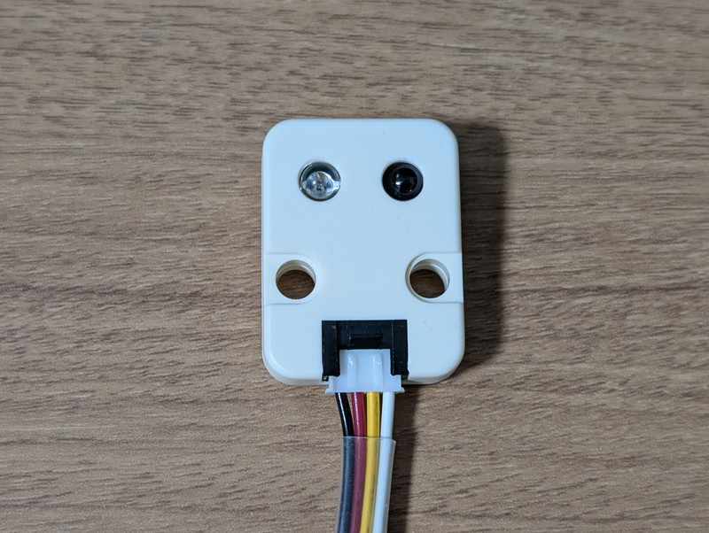
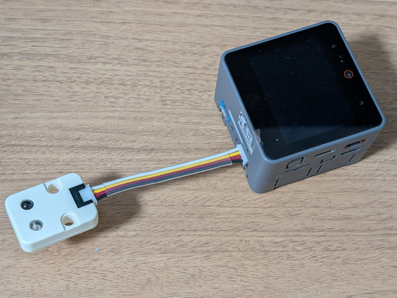
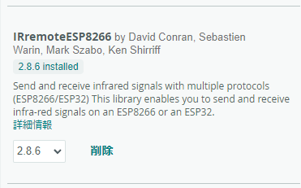

[M5Stack Module LLM](https://www.switch-science.com/products/10034)の簡単なアプリケーションとして音声制御赤外線リモコンを作ってみました。私が使っている[M5CoreS3 IoT開発キット](https://docs.m5stack.com/en/core/CoreS3)ではPORT.A/B/Cが装備されていて、各種[Groveモジュール](https://wiki.seeedstudio.com/Grove_System/)が接続できます。このPORTを使わない手はありません。今回はM5GOに付属していた[IRユニット(U002)](https://docs.m5stack.com/en/unit/ir)を活用してみます。


## 赤外線リモコンを作る

私の部屋の明かりはPanasonic製でリモコン制御ができます。まずはLLMを使わずにM5CoreS3だけでIRユニットを制御し赤外線リモコンとして動かしてみます。IRユニットには赤外線の送信部と受信部が組み込まれています。




これをM5CoreS3のPORT.Bに接続します。赤外線LEDが目的物に向くようにしてください。



このIRユニットを制御するためにArduinoで利用できるライブラリとして[IRremoteESP8266](https://github.com/crankyoldgit/IRremoteESP8266)がありますので、ライブラリマネージャーからインストールします。



サンプルプログラムにあるリモコン信号を受信してダンプしてくれるアプリケーションIRrecvDumpV2を動かしてリモコンの情報を確認します。IRユニットはM5CoreS3のPORT.Bに接続しますが、これに対応するGPIO番号にプログラムを書き換える必要があります。M5Core2ではこの値が異なるので以下にまとめておきます。

| Model | **kRecvPin** | **kIrLed** |
| --- | --- | --- |
| M5CoreS3 | 8 | 9 |
| M5Core2 | 36 | 26 |

M5CoreS3の場合はIRrecvDumpV2を以下のように書き換えます。

```
//#ifdef ARDUINO_ESP32C3_DEV
//const uint16_t kRecvPin = 10;  // 14 on a ESP32-C3 causes a boot loop.
//#else  // ARDUINO_ESP32C3_DEV
//const uint16_t kRecvPin = 14;
//#endif  // ARDUINO_ESP32C3_DEV
const uint16_t kRecvPin = 8;  // M5CoreS3
//const uint16_t kRecvPin = 36; // M5Core2
　　　：
　　　：
// This section of code runs only once at start-up.
void setup() {
//#if defined(ESP8266)
//  Serial.begin(kBaudRate, SERIAL_8N1, SERIAL_TX_ONLY);
//#else  // ESP8266
//  Serial.begin(kBaudRate, SERIAL_8N1);
//#endif  // ESP8266
  Serial.begin(kBaudRate);
```

これを動かして、リモコンを操作すると赤外線信号の情報がシリアルモニタに表示されます。これをメモしておきます。私の環境では以下のようになりました。

リモコンで消灯ボタンを押したとき

```
Timestamp : 000044.768
Library   : v2.8.6

Protocol  : PANASONIC
Code      : 0x344A90F464 (40 Bits)
uint16_t rawData[83] = {3548, 1690,  458, 436,  432, 408,  458, 1278,  460, 1278,  460, 408,  460, 1278,  458, 436,  432, 408,  460, 408,  458, 1280,  458, 408,  460, 408,  460, 1278,  458, 408,  460, 1278,  460, 408,  458, 1254,  482, 410,  458, 408,  458, 1278,  460, 434,  434, 408,  460, 408,  458, 434,  434, 1276,  460, 1278,  460, 1278,  460, 1280,  458, 408,  458, 1278,  458, 434,  432, 408,  460, 408,  458, 1280,  458, 1254,  484, 434,  432, 410,  456, 1280,  458, 408,  458, 410,  458};  // PANASONIC 344A90F464
uint32_t address = 0x34;
uint32_t command = 0x4A90F464;
uint64_t data = 0x344A90F464;
```

リモコンで点灯ボタンを押したとき

```
uint32_t command = 0x4A9034A4;
uint64_t data = 0x344A9034A4;

Timestamp : 000012.052
Library   : v2.8.6

Protocol  : PANASONIC
Code      : 0x344A9034A4 (40 Bits)
uint16_t rawData[83] = {3556, 1684,  486, 380,  486, 408,  460, 1252,  488, 1250,  488, 380,  484, 1254,  486, 382,  484, 384,  484, 382,  486, 1250,  488, 380,  486, 382,  484, 1252,  488, 406,  460, 1252,  488, 380,  484, 1252,  486, 380,  486, 382,  484, 1252,  486, 382,  486, 382,  484, 382,  484, 382,  484, 408,  460, 382,  486, 1252,  486, 1250,  488, 380,  486, 1252,  488, 382,  486, 380,  486, 1252,  486, 382,  484, 1252,  488, 406,  460, 382,  486, 1252,  488, 380,  486, 384,  484};  // PANASONIC 344A9034A4
uint32_t address = 0x34;
uint32_t command = 0x4A9034A4;
uint64_t data = 0x344A9034A4;
```

これらの情報を参考にして簡単な送信プログラムを作成し、明かりをON/OFFできるか試してみます。

```
#include 
#include 
#include 

const uint16_t kIrLed = 9;  // M5CoreS3 GPIO pin 9
//const uint16_t kIrLed = 26;  // M5Core2 GPIO pin 26
IRsend irsend(kIrLed);  // Set the GPIO to be used to sending the message.

void setup() {
  irsend.begin();

  irsend.sendPanasonic64(0x344A9034A4, 40);  // LIGHT ON

  //irsend.sendPanasonic64(0x344A90F464, 40);  // LIGHT OFF
}

void loop() {
}
```

うまく動作すればM5CoreS3から部屋の明かりを制御することができます。IRsendクラスの使い方は[IRremoteESP8266のドキュメント](https://crankyoldgit.github.io/IRremoteESP8266/doxygen/html/classIRsend.html)を参考にしてください。メーカーごとにメソッドや引数が異なるので注意してください。

## 音声認識と音声合成にリモコン機能を組み込む

Module LLMのサンプルプログラムとしてウェイクアップワードをトリガに音声認識を行うKWS(Key Word Spoting)\_ASR(Automated Speech Recognition)と音声合成を行うTTS(Text To Speech)が提供されています。


これを参考にしてリモコンプログラムを作成しました。ソースコードはGitHubにあげておきました。

https://github.com/kanpapa/M5Stack\_LLM/blob/main/Arduino/M5\_KWS\_ASR\_IR\_TTS/M5\_KWS\_ASR\_IR\_TTS.ino

## 音声認識リモコンを動かしてみる

残念ながら私の英語の発音ではうまく認識してくれないので、Google翻訳の発音機能を使用して動作させてみます。

仕様としては、最初にwake upキーワードのHELLOを認識し、その直後の音声で"good morning"でライトを点灯し、"good night"でライトを消灯するようにしています。

https://youtu.be/YJuOKk1zX-M

動画のようにうまく動作しました。もちろんローカルLLMで動作していますので、ネットワークに接続する必要もありません。

## まとめ

様々な機器をM5Stackに接続している場合に、Module LLMを応用することで面白い使い方ができそうです。今回はLLM(Large Language Model)による推論は使っていませんが、環境センサーで部屋の状況をモニタリングした結果をLLMに渡して最適な状態を推論し、適切なリモコンを動作させることで、AI制御で快適な部屋にできるかもしれません。

ただ私の英語はなかなか聞き取ってくれないので、日本語対応が進めばより使い勝手が良くなると思います。
