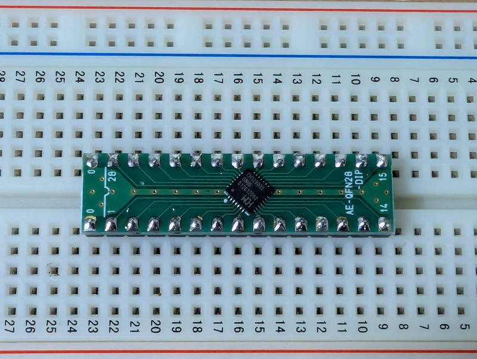
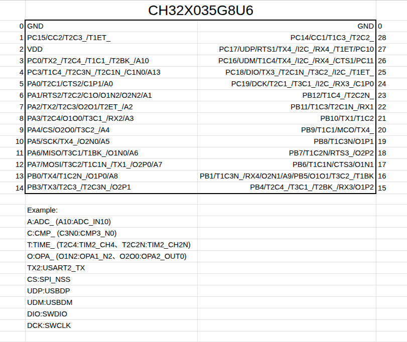
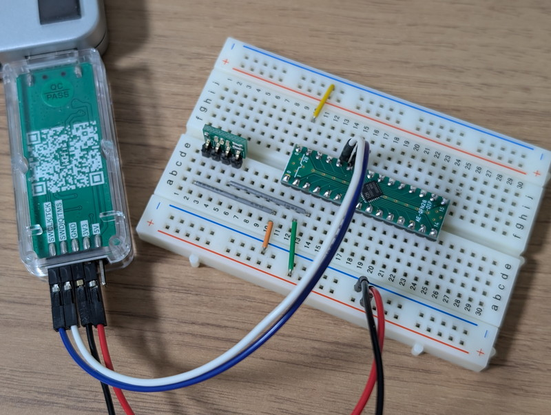
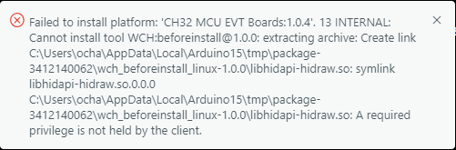
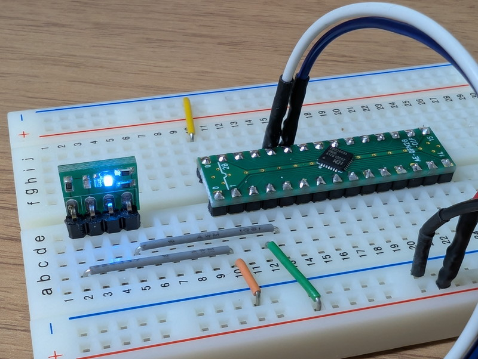

[秋月電子](https://akizukidenshi.com/)さんに気になる新商品がありました。 [32ビットRISC-Vマイコン CH32X035G8U6 ブレークアウトモジュールキット](https://akizukidenshi.com/catalog/g/g131018/) です。これはRISC-Vマイコン CH32X035G8U6をDIP変換基板に載せて扱いやすくしたものです。価格も290円でお手頃です。以前に[40円RISC-Vマイコン(CH32V003)をArduino IDEでLチカをしてみました](https://kanpapa.com/2023/06/blink-risc-v-ch32v003-arduino.html)の記事を書きましたが、これと同様にArduino IDEでお手軽に使えるのか試してみました。

なお、マイコンに書き込むためのツールも[WCH-LinkEエミュレータ](https://akizukidenshi.com/catalog/g/g118065/) も必要になります。


## ブレークアウトモジュールにピンヘッダをはんだ付け

まずは購入したブレークアウトモジュールにピンヘッダをはんだ付けします。これでブレッドボードで扱えるので回路の作成が容易になります。



## モジュールのピンの機能を把握する

秋月電子の販売ページにリンクされているデータシートから、ブレークアウトモジュールのピンの機能がすぐわかるようにEXCELでまとめました。



これを見ても多機能なマイコンだなぁとつくづく思います。

## ブレークアウトモジュールで簡単な回路を作ってみる

書き込みツールであるWCH-LinkEとブレークアウトモジュールは以下のように接続します。LチカをしたいのでPC0にLEDも接続します。電源はWCH-LinkEから3.3Vを供給します。


実際に配線するとこのようになります。



## WCH-LinkEのモード設定をする

CH32V003のときと同様に書き込みにはWCH-LinkEを使いますが、CH32X035に書き込みできるように設定が必要です。以下のサイトから最新のWCH-LinkUtility.ZIPをダウンロードします。

https://www.wch.cn/downloads/WCH-LinkUtility\_ZIP.html

WCH-LinkEをWindows PCにUSB接続したあとに、展開したフォルダの中にあるWCH-LinkUtility.exeを実行し、MCU CoreをRISC-Vに、SeriesをCH32X035に設定します。

次に画面の下のあたりにあるActive WCH-Link Mode: のGetボタンをクリックすると現在のWCH-LinkEのモードが表示されます。「WCH-LinkDAP-WINUSB」になっていた場合は、プルダウンメニューから「WCH-LinkRV」を選択してSetをボタンをクリックすると、WCH-LinkEのモードがRISC-V用に切り替わります。


この状態でQuery Chip Infoアイコンをクリックして、接続しているマイコンの情報が表示されれば正常に動作しています。これでターゲットとなるマイコンとWCH-LinkEの接続は完了です。

## Arduino IDEの環境設定

Arduino IDEでCH32X035を扱うには、ボードマネージャーでCH32X035ボードを組み込む必要がありますが、詳細は以下のGitHubで公開されています。

- [https://github.com/openwch/arduino\_core\_ch32](https://github.com/openwch/arduino_core_ch32)

READMEにあるようにArduino IDEの環境設定の追加のボードマネージャーのURLに以下のURLを追加します。

```
https://github.com/openwch/board_manager_files/raw/main/package_ch32v_index.json
```

あとはボードマネージャーでch32で検索してCH32X035 EVT Boardsを選択してインストールします。私は1.0.3がすでにインストール済みだったので、ボードとポート選択のメニューで、CH32X035を選択しようとしたのですが、「""のボードが見つかりませんでした」と表示されボードの設定ができませんでした。

そこで最新版の1.0.4をインストールしようとしたところ、エラーが発生しました。



どうやら現時点では1.0.4はLinux環境でないと動かないようです。やむなくUbuntuにインストールしているArduino IDEで環境設定を行い、無事インストールができました。


なお、Linux環境の場合はWCH-LinkEのUSBシリアルにユーザ権限で書き込めるように準備しておく必要があります。私の場合は /etc/udev/rules.d/99-wch-link.rules ファイルを作成し、以下の内容を書き込みました。

```
SUBSYSTEM=="usb", ATTRS{idVendor}=="1a86", ATTRS{idProduct}=="8010", MODE="0666", GROUP="dialout"
SUBSYSTEM=="usb", ATTRS{idVendor}=="1a86", ATTRS{idProduct}=="8012", MODE="0666", GROUP="dialout"
```

その後、この設定を反映するために以下のコマンドを入力しました。

```
sudo udevadm control --reload-rules
sudo udevadm trigger
sudo usermod -a -G dialout $USER
```

これでWCH-LinkEをUSBに接続する際に書き込み権限が自動的に設定されます。

## Lチカプログラムを書きこんでみる

サンプルプログラムのBlinkに少し手を加えて以下のスケッチを作成しました。

```
// the setup function runs once when you press reset or power the board
void setup() {
    // initialize digital pin LED_BUILTIN as an output.
    pinMode(PC0, OUTPUT);
}

// the loop function runs over and over again forever
void loop() {
    digitalWrite(PC0, HIGH);  // turn the LED on (HIGH is the voltage level)
    delay(1000);                      // wait for a second
    digitalWrite(PC0, LOW);   // turn the LED off by making the voltage LOW
    delay(1000);                      // wait for a second
}
```

いつも通りにチェックボタンで検証後、矢印ボタンでマイコンに書き込みます。


無事Lチカができました。



## まとめ

CH32X035G8U6もArduino IDEでLチカを行うことができました。今回はLinux版のArduino IDEでの動作確認はできましたが、Windows版はまだ未対応のようでした。まだCH32X035版の開発は進行中でSPIやI2C\_Masterのサポートも今後のリリースとなるようです。しかし、そのうち対応されると思われますので、高機能なマイコンをどこまでArduino IDEで使えるのか今後もウォッチしていきます。
