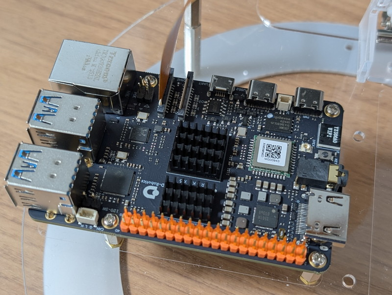

前回は[すでに用意されているロボット用のアプリケーションを使用してルンバを動かしてみました](https://kanpapa.com/2025/07/rdk-x5-8g-board1.html)。他にもロボットで使えそうなサンプルアプリケーションが用意されています。ここではロボットの目や声や思考を実現できそうなものを試してみます。

## カメラ画像認識

https://d-robotics.github.io/rdk\_doc/Robot\_development/quick\_demo/ai\_predict

MIPIカメラで読み込んだ画像に対して、人体検出、年齢認識、顔のキーポイント検出、手のキーポイント検出、手のジェスチャー認識を行った推論結果をWeb経由で表示してくれます。

実際に動作させたときの動画です。手のキーポイントを検出できています。

https://youtu.be/SXzSDR9AjCU

これによりロボットの目の役割が実現できそうです。

## テキスト読み上げ

https://d-robotics.github.io/rdk\_doc/Robot\_development/quick\_demo/hobot\_tts

テキストデータをトピックとして与えることでそれを読み上げてくれるサンプルプログラムです。実行したところ私の環境ではうまく動かずエラーとなってしまいます。

```
sunrise@ubuntu:~$ ros2 run hobot_tts hobot_tts --ros-args -p playback_device:="hw:0,0"
alsa_device_init, snd_pcm_open. handle((nil)), name(hw:0,0), direct(0), mode(0)
snd_pcm_open succeed. name(hw:0,0), handle(0xaaaadf8fe710)
Rate set to 16000Hz (requested 16000Hz)
Buffer size range from 32 to 131072
Period size range from 16 to 1024
Requested period size 512 frames
Periods = 4
was set period_size = 512
was set buffer_size = 2048
alsa_device_init. hwparams(0xaaaadf8fe9b0), swparams(0xaaaadf921260)
[INFO] [1752975114.221502963] [hobot_tts]: Sample rate: 16000
[INFO] [1752975114.221961710] [hobot_tts]: Bit depth: 16
[INFO] [1752975114.222034002] [hobot_tts]: Num of channels: 1
[INFO] [1752975114.222086168] [hobot_tts]: Max seconds of audio: 30
WARNING: Logging before InitGoogleLogging() is written to STDERR
E20250720 10:32:39.005266  5274 vits_model.cc:41] Can't find `n` in phone2id.
E20250720 10:32:39.005332  5274 vits_model.cc:41] Can't find `i3` in phone2id.
E20250720 10:32:39.005360  5274 vits_model.cc:41] Can't find `#1` in phone2id.
  :
E20250720 10:32:39.005530  5274 vits_model.cc:41] Can's find `#4` in phone2id.
[ERROR] [1752975159.005576131] [hobot_tts]: Synthesis failed with error code: 65541
E20250720 10:32:39.113389  5274 vits_model.cc:41] Can's find `R` in phone2id.
  :
```

RDK X5だけでなく、RDK X3でも同様の状態なので[issue](https://github.com/D-Robotics/hobot_tts/issues/2)をあげておきました。ロボットが応答を返すのに使いたい機能なのでぜひ動かしたいのですが、一旦issueの対応を見守ることにします。

## 大規模言語モデル

https://d-robotics.github.io/rdk\_doc/Robot\_development/quick\_demo/hobot\_llm

こちらは残念ながらサポートモデルがRDK X3のみとなっていて、RDK X5はサポートされていません。ダメもとで試したところ、以下のようなエラーになってしまいました。

```
The model's march is bernoulli2, please run on X/J3 board!
```

ただし、次の章にある大規模言語モデルの機能を発展させた視覚言語モデルがロボットでは有効だと思われます。

## 視覚言語モデル

https://d-robotics.github.io/rdk\_doc/Robot\_development/quick\_demo/hobot\_llamacpp

画像データを与えることで、その画像が何であるかを推論してくれます。デモプログラムを動かしたところパンダの画像に対してパンダの説明を返してくれました。


```
この写真はジャイアントパンダです。ジャイアントパンダは、主に中国の四川省、陝西省、甘粛省に生息する、丸顔の大型哺乳類です。写真のジャイアントパンダは地面に座っており、竹と竹の葉に囲まれており、周囲の環境はまるで自然の竹林のようです。白黒の体と丸顔はジャイアントパンダの特徴的な姿で、竹を食べることに集中しています。　　：
```

試しに[RDK X5の画像](https://kanpapa.com/wp-content/uploads/2025/07/rdk-x5-camera-connect1.jpg)を与えてみたところ、次のような答えが返ってきました。


```
これは電子機器の写真です。写真からわかるように、これは電子機器の筐体で、回路基板、コンデンサ、抵抗器など、様々な電子部品で覆われています。機器の上部には大きなディスプレイ画面があり、その下にはUSBポートやHDMIポートなどの複数の接続ポートとインターフェースがあります。機器の下部にも複数のスロットとインターフェースがあり、他の機器との接続やデータの転送に使用できます。機器全体の設計は比較的複雑で、部品が密集していることから、その複雑な構造と機能が見て取れます。
```

なかなか細かいところまで答えが返ってくるのでびっくりです。

## 放熱について

RDK X5でCPU/BPU/DDR/GPUの各温度を表示するにはhrut\_somstatusコマンドを使います。同時にクロック等も表示されます。

```
sunrise@ubuntu:~$ sudo hrut_somstatus
=====================1=====================
temperature-->
        DDR      : 59.5 (C)
        BPU      : 58.5 (C)
        CPU      : 58.5 (C)
cpu frequency-->
-e            min(M)    cur(M)  max(M)
-e      cpu0: 300       300     1500
-e      cpu1: 300       1200    1500
-e      cpu2: 300       1500    1500
-e      cpu3: 300       1500    1500
-e      cpu4: 300       1200    1500
-e      cpu5: 300       1200    1500
-e      cpu6: 300       1500    1500
-e      cpu7: 300       1500    1500
bpu status information---->
-e            min(M)    cur(M)  max(M)  ratio
-e      bpu0: 500       1000    1000    0
ddr frequency information---->
-e            min(M)    cur(M)  max(M)
-e      ddr:  266       4266    4266
GPU gc8000 frequency information---->
-e            min(M)    cur(M)  max(M)
-e      gc8000:  200    1000    1000
sunrise@ubuntu:~$
```

[ドキュメント](https://d-robotics.github.io/rdk_doc/System_configuration/frequency_management)によると動作温度95度を超えると自動的にスピードが落ちるようです。これまでの実験ではまだそこまでの温度には至っていませんが、気になったのでRaspberry Pi 4用のヒートシンクをつけてみました。



写真のようにほぼぴったりのサイズです。別途購入した[専用ケース](https://www.switch-science.com/products/10501)を使用すれば放熱も安心なのですが、今後のTurtlebot３への取り付けを考えると、なるべく基板のままで使用したいのです。

ヒートシンクをつけた状態で、手の動きを検知するプログラムを動かしたところ70度近辺で落ち着いているようです。これであればヒートシンクだけでTurtlebot3にも取り付けできそうです。

```
sunrise@ubuntu:~$ sudo hrut_somstatus
=====================1=====================
temperature-->
DDR      : 73.7 (C)
BPU      : 72.1 (C)
CPU      : 73.0 (C)
```

アプリケーションを終了すると徐々に低下していきます。

```
sunrise@ubuntu:~$ sudo hrut_somstatus
=====================1=====================
temperature-->
DDR      : 66.3 (C)
BPU      : 65.2 (C)
CPU      : 65.3 (C)
```

アイドルの時は60度近辺で落ち着くようです。

## まとめ

次回はRDK X5をTurtlebot3に取り付けて、[OriginBot](https://www.switch-science.com/products/10505) にどこまで近づけるかを試してみます。
