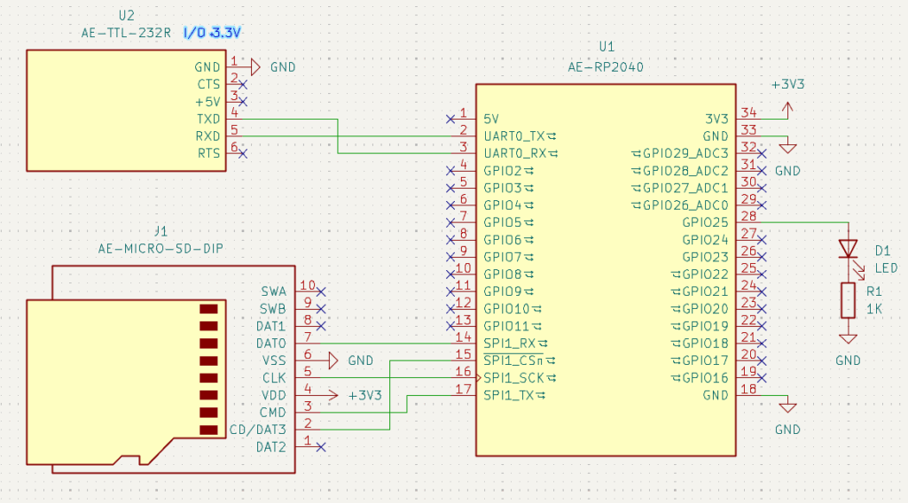
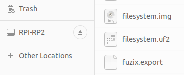
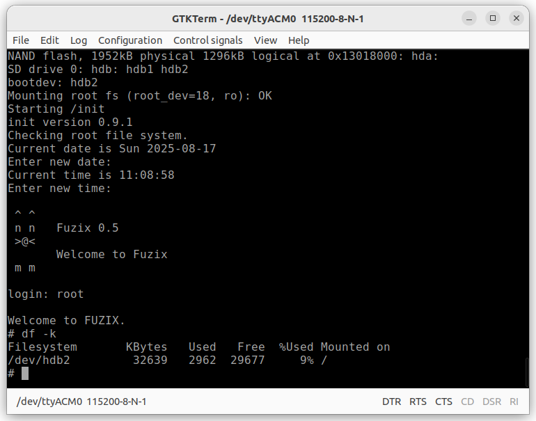
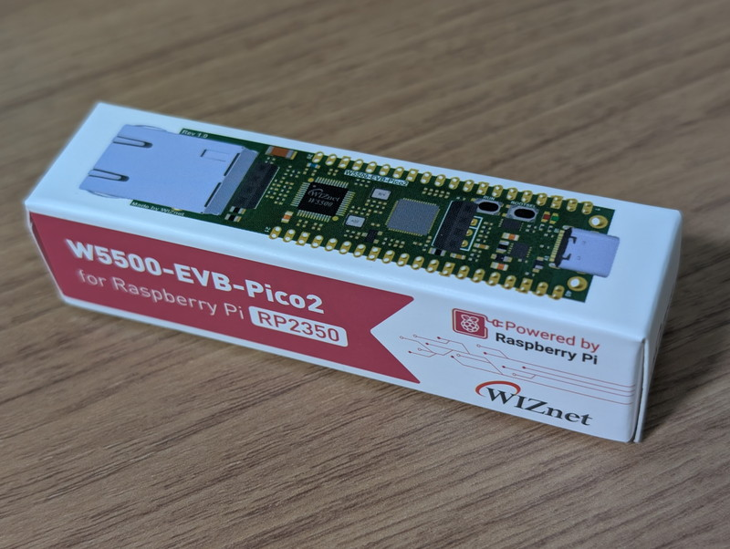

[前回の記事](https://kanpapa.com/2025/08/ae-rp2040-fuzix-04.html)でダウンロードしたビルド済FUZIX 0.4のファイルの日付は2021年2月18日と少し古いバージョンのようです。[FUZIXの公式サイト](https://fuzix.org/)にリンクされている[GitHub](https://github.com/EtchedPixels/FUZIX)を確認したところ、masterブランチにRaspberry Pi Picoのプラットフォームもマージされていて、開発中のバージョンは0.5になっているようです。この最新版をUbuntu 22.04上でビルドして秋月電子の[RP2040マイコンボードキット](https://akizukidenshi.com/catalog/g/g117542/)で動かしてみました。なお、Raspberry Pi Picoで動かす場合にも参考になると思います。

https://github.com/EtchedPixels/FUZIX

## ハードウェアの準備

[前回の記事](https://kanpapa.com/2025/08/ae-rp2040-fuzix-04.html)でFUZIX 0.4を動かしたハードウェアをそのまま使用します。microSDカードは8GBを使いました。




## 最新のFUZIXをビルドする

Raspberry Pi Pico用Fuzixのビルド手順は以下にあります。必要なユーティリティは[前回の記事](https://kanpapa.com/2025/08/ae-rp2040-fuzix-04.html)のLチカの実験でインストール済みの状態です。

https://github.com/EtchedPixels/FUZIX/blob/master/Kernel/platform/platform-rpipico/README.md

RP2040のビルドに必要なパッケージのインストールとFuzixのリポジトリをGitHubからクローンするところから行います。

```
$ cd
$ sudo apt update
$ sudo apt install byacc
$ git clone https://github.com/EtchedPixels/FUZIX.git
$ cd FUZIX
$ make TARGET=rpipico SUBTARGET=pico_w diskimage
　　　　:
arm-none-eabi-gcc -mcpu=Cortex-M0plus -ffunction-sections -fdata-sections -fno-strict-aliasing -fomit-frame-pointer -fno-builtin -Wall -g -Os -isystem /Library/include -Wno-int-conversion -Wno-implicit-int -Os   -c -o draw.o draw.c
In file included from draw.c:5:
/usr/include/newlib/termios.h:4:10: fatal error: sys/termios.h: No such file or directory
    4 | #include <sys/termios.h>
      |          ^~~~~~~~~~~~~~~
compilation terminated.
make[2]: *** [<builtin>: draw.o] Error 1
make[2]: Leaving directory '/home/ocha/FUZIX/Applications/games/2048'
make[1]: *** [Makefile:33: 2048] Error 2
make[1]: Leaving directory '/home/ocha/FUZIX/Applications'
make: *** [Makefile:140: apps] Error 2
$
```

### games/2048でエラー発生

残念ながらgames/2048のコンパイルでエラーになってしまいました。ヘッダの不整合のようなので少しいじれば直せるとは思うのですが、一旦このディレクトリのコンパイルを行わないようにFUZIX/Applications/Makefileを以下のように修正して再度makeを行いました。

（修正前）

```
#
APPS = util cmd sh games cave cpm v7games games cursesgames \
       as09 ld09 netd MWC flashrom ue cpmfs plato \
       emulators cpnet dw assembler CC cpp ar \
       2048
```

（修正後）

```
#
APPS = util cmd sh games cave cpm v7games games cursesgames \
       as09 ld09 netd MWC flashrom ue cpmfs plato \
       emulators cpnet dw assembler CC cpp ar
```

### Buildが成功

これでようやくBuildが通りました。FUZIX/Kernel/platform/platform-rpipicoにfilesystem.uf2にカーネルが含まれたファイルシステムが生成されています。FUZIX/Images/rpipicoのfilesys.imgは様々なアプリケーションが入っているファイルシステムになります。

```
$ cd ~/FUZIX/Kernel/platform/platform-rpipico
$ ls -l *.uf2 *.img
-rw------- 1 ocha ocha 1304064 Aug 24 16:12 filesystem.img
-rw-r--r-- 1 ocha ocha 3997696 Aug 24 16:12 filesystem.uf2
$ cd ~/FUZIX/Images/rpipico
$ ls -l
total 40960
-rw-rw-r-- 1 ocha ocha  8388608 Aug 28 17:27 filesys8.img
-rw-rw-r-- 1 ocha ocha 33553920 Aug 28 17:27 filesys.img
$ 
```

## microSDカードのパーティショニング

lsblkコマンドでmicroSDカードのデバイス名を確認します。この例ではsdaがmicroSDカードになります。ここを間違えるとUbuntuを壊してしまいますので十分注意してください。

```
$ lsblk
NAME        MAJ:MIN RM   SIZE RO TYPE MOUNTPOINTS
loop0         7:0    0     4K  1 loop /snap/bare/5
     :
loop26        7:26   0 246.3M  1 loop /snap/firefox/6700
sda           8:0    1   7.5G  0 disk 
├─sda1        8:1    1     2M  0 part 
└─sda2        8:2    1    32M  0 part 
nvme0n1     259:0    0 931.5G  0 disk 
├─nvme0n1p1 259:1    0   512M  0 part /boot/efi
└─nvme0n1p2 259:2    0   931G  0 part /var/snap/firefox/common/host-hunspell
                                      /
$
```

次にmicroSDにパーティションを作成します。sda1に2MBのswap用パーティション、sda2に32MBのファイルシステム用のパーティションを作成します。

```
$ sudo dd if=/dev/zero of=/dev/sda bs=512 count=1
1+0 records in
1+0 records out
512 bytes copied, 0.0242508 s, 21.1 kB/s
$ sudo fdisk /dev/sda

Welcome to fdisk (util-linux 2.37.2).
Changes will remain in memory only, until you decide to write them.
Be careful before using the write command.

Device does not contain a recognized partition table.
Created a new DOS disklabel with disk identifier 0xd8d8cd3f.

Command (m for help): o
Created a new DOS disklabel with disk identifier 0x9cce1ef1.

Command (m for help): n
Partition type
   p   primary (0 primary, 0 extended, 4 free)
   e   extended (container for logical partitions)
Select (default p): p
Partition number (1-4, default 1): 1
First sector (2048-15693823, default 2048): 
Last sector, +/-sectors or +/-size{K,M,G,T,P} (2048-15693823, default 15693823): +2M

Created a new partition 1 of type 'Linux' and of size 2 MiB.

Command (m for help): t
Selected partition 1
Hex code or alias (type L to list all): 7F
Changed type of partition 'Linux' to 'unknown'.

Command (m for help): n
Partition type
   p   primary (1 primary, 0 extended, 3 free)
   e   extended (container for logical partitions)
Select (default p): p
Partition number (2-4, default 2): 2
First sector (6144-15693823, default 6144): 
Last sector, +/-sectors or +/-size{K,M,G,T,P} (6144-15693823, default 15693823): +32M

Created a new partition 2 of type 'Linux' and of size 32 MiB.

Command (m for help): p
Disk /dev/sda: 7.48 GiB, 8035237888 bytes, 15693824 sectors
Disk model: STORAGE DEVICE  
Units: sectors of 1 * 512 = 512 bytes
Sector size (logical/physical): 512 bytes / 512 bytes
I/O size (minimum/optimal): 512 bytes / 512 bytes
Disklabel type: dos
Disk identifier: 0x9cce1ef1

Device     Boot Start   End Sectors Size Id Type
/dev/sda1        2048  6143    4096   2M 7f unknown
/dev/sda2        6144 71679   65536  32M 83 Linux

Command (m for help): w
The partition table has been altered.
Calling ioctl() to re-read partition table.
Syncing disks.
$
```

## ファイルシステムの書き込み

BOOTスイッチを押しながらPCとRP2040ボードをUSBケーブルで接続するとディスクドライブがみえますのでFUZIX/Kernel/platform/platform-rpipicoにあるfilesystem.uf2をドラッグ＆ドロップでRP2040のフラッシュメモリに書き込みます。書き込みが完了するとFUZIXが起動します。



microSDカードにはFUZIX/Images/rpipicoにあるfilesys.imgを書き込みます。以下のコマンドで先程パーティショニングしたmicroSDカードの32MBのパーテイションに書き込みます。このとき書き込み先がmicroSDカードであることを必ず確認してください。間違えるとUbuntuを壊します。

```
$ cd ~/FUZIX/Images/rpipico
$ ls -l
total 40960
-rw-rw-r-- 1 ocha ocha  8388608 Aug 28 17:27 filesys8.img
-rw-rw-r-- 1 ocha ocha 33553920 Aug 28 17:27 filesys.img
$ sudo dd if=filesys.img of=/dev/sda2 oflag=direct bs=8192
[sudo] password for kanpapa: 
4095+1 records in
4095+1 records out
33553920 bytes (34 MB, 32 MiB) copied, 16.9335 s, 2.0 MB/s
$ 
```

## FUZIX 0.5を起動する

FUZIXのコンソールはRP2040のUSB経由のシリアル(/dev/ttyACM0)もしくはUSBシリアル変換ボードを経由したUART(/dev/ttyUSB0)が使用できます。

起動時にはどのファイルシステムを使用するかを聞いてきます。


hdaと指定するとRP2040のフラッシュメモリのファイルシステムになりますが、フラッシュメモリに格納できるように約1.2MBと最小限のサイズになっています。これを使うとmicroSDカードは不要ですが使えるコマンドは限られます。


hdb2を指定するとmicroSDのファイルシステムとなります。32MBありますので多くのコマンドが揃っています。通常はhdb2を指定すると良いでしょう。



かわいいバナーにはFuzix 0.5とあり、起動直後にもFUZIX version 0.5と表示されています。これで最新版のFUZIXになりました。

## FUZIX 0.5を探検する

今回はmicroSDカードのファイルシステムが充実しているのでこちらを探検してみます。まずは、/usr/gamesをみてみましたが、明らかにゲームの数が増えています。

```
# ls -l /usr/games
-rwxr-xr-x   1 root     root        22756 Aug 17 08:00 adv01
-rwxr-xr-x   1 root     root        22520 Aug 17 08:00 adv02
-rwxr-xr-x   1 root     root        22364 Aug 17 08:00 adv03
-rwxr-xr-x   1 root     root        22484 Aug 17 08:00 adv04
-rwxr-xr-x   1 root     root        22596 Aug 17 08:00 adv05
-rwxr-xr-x   1 root     root        22280 Aug 17 08:00 adv06
-rwxr-xr-x   1 root     root        22580 Aug 17 08:00 adv07
-rwxr-xr-x   1 root     root        22644 Aug 17 08:00 adv08
-rwxr-xr-x   1 root     root        22420 Aug 17 08:00 adv09
-rwxr-xr-x   1 root     root        22000 Aug 17 08:00 adv10
-rwxr-xr-x   1 root     root        22024 Aug 17 08:00 adv11
-rwxr-xr-x   1 root     root        22396 Aug 17 08:00 adv12
-rwxr-xr-x   1 root     root        22048 Aug 17 08:00 adv13
-rwxr-xr-x   1 root     root        22332 Aug 17 08:00 adv14a
-rwxr-xr-x   1 root     root        21820 Aug 17 08:00 adv14b
-rwxr-xr-x   1 root     root        26840 Aug 17 08:00 advent
-rwxr-xr-x   1 root     root        12092 Aug 17 08:00 advint
-rwxr-xr-x   1 root     root         6120 Aug 17 08:00 arithmetic
-rwxr-xr-x   1 root     root        12576 Aug 17 08:00 backgammon
-rwxr-xr-x   1 root     root         5400 Aug 17 08:00 cowsay
-rwxr-xr-x   1 root     root         9192 Aug 17 08:00 fish
-rwxr-xr-x   1 root     root         4212 Aug 17 08:00 fortune
-rwxr-xr-x   1 root     root         5440 Aug 17 08:00 fortune-gen
-rw-r--r-- 1 root     root       241378 Aug 17 08:00 fortune.dat
-rwxr-xr-x   1 root     root         9852 Aug 17 08:00 hamurabi
-rwxr-xr-x   1 root     root        19912 Aug 17 08:00 invaders
-rwxr-xr-x   1 root     root         7388 Aug 17 08:00 l9x
drwxr-xr-x   2 root     root          512 Aug 17 08:00 lib
-rwxr-xr-x   1 root     root         5344 Aug 17 08:00 moo
-rwxr-xr-x   1 root     root        20652 Aug 17 08:00 myst01
-rwxr-xr-x   1 root     root        20656 Aug 17 08:00 myst02
-rwxr-xr-x   1 root     root        20920 Aug 17 08:00 myst03
-rwxr-xr-x   1 root     root        22176 Aug 17 08:00 myst04
-rwxr-xr-x   1 root     root        22436 Aug 17 08:00 myst05
-rwxr-xr-x   1 root     root        20592 Aug 17 08:00 myst06
-rwxr-xr-x   1 root     root        20516 Aug 17 08:00 myst07
-rwxr-xr-x   1 root     root        22712 Aug 17 08:00 myst08
-rwxr-xr-x   1 root     root        22096 Aug 17 08:00 myst09
-rwxr-xr-x   1 root     root        21108 Aug 17 08:00 myst10
-rwxr-xr-x   1 root     root        22216 Aug 17 08:00 myst11
-rwxr-xr-x   1 root     root        12572 Aug 17 08:00 qrun
-rwxr-xr-x   1 root     root        22016 Aug 17 08:00 startrek
-rwxr-xr-x   1 root     root        14596 Aug 17 08:00 taylormade
-rwxr-xr-x   1 root     root         5860 Aug 17 08:00 ttt
-rwxr-xr-x   1 root     root         9948 Aug 17 08:00 wump
-rwxr-xr-x   1 root     root        13860 Aug 17 08:00 z1
-rwxr-xr-x   1 root     root        13908 Aug 17 08:00 z2
-rwxr-xr-x   1 root     root        13964 Aug 17 08:00 z3
-rwxr-xr-x   1 root     root        14760 Aug 17 08:00 z4
-rwxr-xr-x   1 root     root        16708 Aug 17 08:00 z5
-rwxr-xr-x   1 root     root        16696 Aug 17 08:00 z8
# 
```

/usr/binの中をみるとネットワーク関係のコマンドも存在するようです。これもどこまで使えるのか試してみる価値はありそうです。

```
# ping
usage: ping hostname
# ifconfig
ifconfig: networking not enabled.
# ping
usage: ping hostname
# telnet
telnet: server [port]
# httpd
af_inet sock_stream 0: Invalid system call number
# 
```

viコマンドもあるのですが通常の状態ではメモリが足りないようです。

```
# vi
warning: out of memory
fork: Out of memory
# vile
warning: out of memory
fork: Out of memory 
# free
         total         used         free
Mem:       160           88           72
Swap:        0            0            0
#
```

## swapを追加してみる

ここでmicroSDカードに作成しておいた領域を使って、swapを設定してみます。

```
# fdisk -l
                      START                  END
Device    Boot  Head Sector Cylinder   Head Sector Cylinder  Type  Sector count

                      START                  END
Device    Boot  Head Sector Cylinder   Head Sector Cylinder  Type  Sector count

/dev/hdb1        33      3        0     99      6        0    7f          4096
/dev/hdb2        99      7        0     164      8        4    83         65536
# swapon /dev/hdb1 4096
# free
         total         used         free
Mem:       160           88           72
Swap:     2048            0         2048
# 
```

swapが追加され使用できるメモリが増えたことがわかります。これで少し大きなプログラムも動かせるようになります。試しにFORTHを動かしてみました。

```
# fforth
 ok
1 2 + .
3  ok
```

しかし、viはswaponにしてもout of memoryで動きませんでした。エディタはぜひ使いたいのでこちらは少し調べてみたいと思います。

## まとめ

FUZIX 0.5はまだ開発中のバージョンであるため、ビルド環境や一部動作が不完全ですが進化しているように思います。また、リポジトリを見るとわかりますが、様々なアーキテクチャのマイコンボードに移植されていますので、これも試してみる価値はあります。

AE-RP2040ではネットワーク機能が無いため試せませんでしたが、ネットワーク系のコマンドが気になるため実験用にW5500-EVB-Pico2を購入してしまいました。



次回はこのW5500-EVB-Pico2にEthernetを接続してFUZIX 0.5を試してみます。
