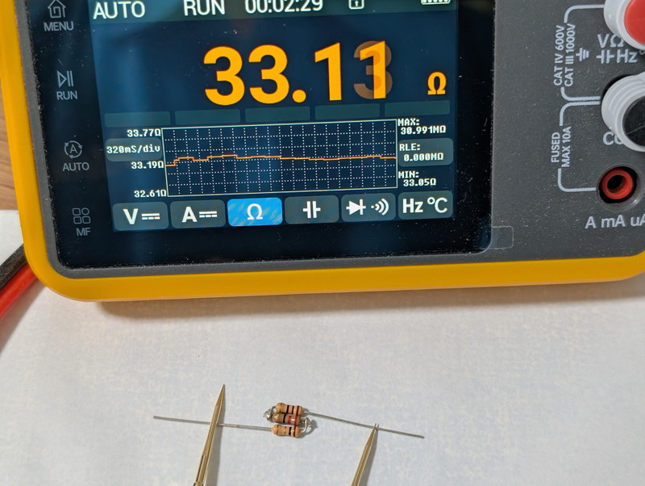
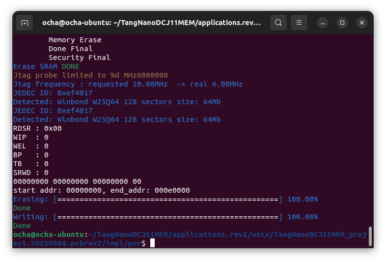

本記事はPDP-11の命令セットを持つ[DCJ11(Jaws)CPU](https://gunkies.org/wiki/J-11_chip_set)を動作させるためにRyo Mukaiさんが開発した[TangNanoDCJ11MEM](https://github.com/ryomuk/TangNanoDCJ11MEM)を使用しています。GitHubで公開されています。

## PDP-11 DCJ11 CPUでUNIXを動かしたい

１年前に[PDP-11 DCJ11 CPUでMini-UNIXを動かしてみました](https://kanpapa.com/2024/08/tangnanodcj11mem-pdp-11-dcj11-cpu-mini-unix.html)という記事を掲載しましたが、最近PDP-11 DCJ11 CPU界隈にアップデートがありました。なんと上位モデルのFPGAボードである[Tang Console 138K](https://akizukidenshi.com/catalog/g/g130972/)を使用して256KB RAMを実装しUNIX V6をPDP-11 DCJ11 CPUで動かすTangConsoleDCJ11MEMという試みです。それと同時に**TangNanoDCJ11MEM**もRev.2となり動作が安定したようです。これらのアップデートの詳細についてはGitHubでご確認ください。

https://github.com/ryomuk/TangConsoleDCJ11MEM

https://github.com/ryomuk/TangNanoDCJ11MEM

ここでは私が持っているTangNanoDCJ11MEM Rev.1.1をRev.2にアップデートしたうえで、TangNanoDCJ11MEMのメモリ容量に適している[Mini-UNIX](https://unixhistory.tavi.co.uk/mini-unix.html)がどこまで動作するかを確認してみました。Rev.1では残念ながらまだ不安定なところがあり、カーネルのセルフビルドを正常に行うことができませんでしたが、Rev.2ではどうなるかを追試します。

## TangNanoDCJ11MEM Rev.2にアップデート

TangNanoDCJ11MEMをRev.2.にアップデートするのは以下のステップだけなので非常に簡単です。

- Rev.1で行ったパターンカットおよびジャンパーは変更無し。

- シリアルRXとCLK2を33Ωのダンピング抵抗を挟んで接続する。

- ファームウェアをRev.2用に書き換える。

### ハードウェアの修正

まずはハードウェアの修正です。私の場合は手元に33Ωの抵抗が無かったので手持ちの1Ω＋10Ω+22Ωを接続して33Ωにしました。



この抵抗をシリアルRXのピンヘッダの根元にはんだ付けし、空中配線でDCJ11 CPUのCLK2のピンソケットに差し込みました。


再びジャンパー線を接続しTangNanoDCJ11MEM Rev.2のハードウェアが完成しました。


### ファームウェアのアップデート

Rev.2のファームウェアはGitHubのapplications.rev2のツリーに[TangNanoDCJ11MEM\_project.fs](https://github.com/ryomuk/TangNanoDCJ11MEM/blob/main/applications.rev2/unix/TangNanoDCJ11MEM_project.20250904.pcbrev2/impl/pnr/TangNanoDCJ11MEM_project.fs)というファイル名で登録されていますので、前回の記事と同じ手順でTangNano 20Kに書き込みます。

```
$ cd
$ git clone https://github.com/ryomuk/TangNanoDCJ11MEM.git
$ cd TangNanoDCJ11MEM
$ cd applications.rev2/unix/TangNanoDCJ11MEM_project.20250904.pcbrev2/impl/pnr
$ openFPGALoader -b tangnano20k -f TangNanoDCJ11MEM_project.fs
```

Ubuntu22.04で[openFPGALoader](https://wiki.sipeed.com/hardware/en/tang/Tang-Nano-Doc/flash-in-linux.html)で書き込んだ時の画面です。このようにEraseされたあとWriteが終了すれば完了です。



なお、私の場合はTangNano 20Kの開発環境であるGOWINでソースからビットストリームを再生成しopenFPGALoaderでTangNano 20Kに書き込みました。

## Mini-UNIXを起動してみる

まずはMini-UNIXのファイルシステムが書き込まれたmicroSDカードを準備します。[前回の記事](https://kanpapa.com/2024/08/tangnanodcj11mem-pdp-11-dcj11-cpu-mini-unix.html)の手順のように[simh](https://github.com/simh/simh)で作成したファイルシステムをmicroSDカードに書き込みます。

```
$ dd if=/dev/zero of=sd.dsk bs=512 count=1024
$ dd if=system.dsk of=sd.dsk bs=512 seek=1024 conv=notrunc
$ dd if=source.dsk of=sd.dsk bs=512 seek=7168 conv=notrunc
$ dd if=doc.dsk of=sd.dsk bs=512 seek=13312 conv=notrunc
$ sudo dd if=sd.dsk of=/dev/sdb
```

microSDカードに書き込むときのデバイス名（この例では/dev/sdb）は**必ずmicroSDカード**であるかを確認してください。間違えてハードディスクやSSDを壊してしまうと取り返しがつきません。

コンソールはTangNano 20KのUSBシリアルを使用します。Teratermでは以下の設定にします。


ポートはお使いのPC環境で異なりますので確認してください。なお、PDP11GUIのターミナルも使えます。

TangNano 20Kに作成したmicroSDカードを取り付けて174000番地のBootstrap loaderを実行し、RKディスク用のカーネルのファイル名である rkmx を入力すればMini-UNIXが起動します。

```
@174000g
@rkmx

RESTRICTED RIGHTS

USE, DUPLICATION OR DISCLOSURE IS SUBJECT TO
RESTRICTIONS STATED IN YOUR CONTRACT WITH
WESTERN ELECTRIC COMPANY, INC.

;login: root
# ls -l 
total 168
drwxrwxr-x  2 bin      1136 Sep 18 01:02 bin
drwxrwxr-x  2 bin      1824 Sep 18 01:24 dev
drwxrwxr-x  2 bin       496 Sep 18 04:30 etc
-rwxrwxrwx  1 root    19278 Sep 18 08:09 hpmx
drwxrwxr-x  2 bin       464 Sep  4 03:37 lib
drwxrwxr-x  2 bin        32 May 13  1975 mnt
-rwxrwxrwx  1 root    19010 Sep 18 01:18 mx
-rwxrwxrwx  1 root    19062 Sep 18 08:09 rkmx
-rwxrwxrwx  1 root    19218 Sep 18 08:09 rpmx
drwxrwxrwx  2 bin       272 Sep 18 08:23 tmp
drwxrwxr-x 13 bin       240 Jun 17 13:38 usr
# 
```

問題なく起動できました。ここまではRev.1でも動作は確認できています。

## Mini-UNIXのカーネルをビルドしてみる

前回はMini-UNIXのカーネルをビルドしようとしたら途中でエラーとなってしまいどうしてもビルドができませんでした。今回のRev.2ではどうでしょうか。

カーネルのソースは/usr/sysの下にあります。ここに用意されているrunスクリプトをshで実行するとカーネルがビルドされます。なおビルドにより/rkmx, /rpmx, /hpmxのカーネルファイルが上書きされますので、現在のカーネルをコピーしてバックアップしておくことをお勧めします。

```
# chdir /usr/sys
# sh run
alloc.c:
bio.c:
clock.c:
conf.c:
fio.c:
iget.c:
main.c:
mem.c:
nami.c:
partab.c:
rdwri.c:
sig.c:
slp.c:
subr.c:
sys1.c:
sys2.c:
sys3.c:
sys4.c:
sysent.c:
trap.c:
tty.c:
cat.c:
dc.c:
devstart.c:
dh.c:
dhdm.c:
dhfdm.c:
dn.c:
dp.c:
hp.c:
hs.c:
ht.c:
kl.c:
lp.c:
pc.c:
rf.c:
rhstart.c:
rk.c:
rp.c:
tc.c:
tm.c:
vs.c:
vt.c:
3018
rk = 0
rp = 1
3018
841
/*&nulldev,&nulldev,&rkstrategy, &rktab,       */
&nulldev,&nulldev,&rpstrategy, &rptab,       
843
3018
rp = 0
hp = 1
3018
843
/*&nulldev,&nulldev,&rpstrategy, &rptab,        */
&nulldev,&nulldev,&hpstrategy, &hptab,       
845
3018
hp = 0
rk = 1
3018
845
/*&nulldev,&nulldev,&hpstrategy, &hptab,        */
&nulldev,&nulldev,&rkstrategy, &rktab,       
847
# 
```

特に問題なくビルドが完了しました。かかった時間は約８分でした。ルートディレクトリにあるカーネルも書き換わっているようでファイルの日時が変わっています。

```
# chdir /
# ls -l 
total 168
drwxrwxr-x  2 bin      1136 Sep 18 01:02 bin
drwxrwxr-x  2 bin      1824 Sep 18 01:24 dev
drwxrwxr-x  2 bin       496 Sep 18 04:30 etc
-rwxrwxrwx  1 root    19278 Sep 18 08:34 hpmx
drwxrwxr-x  2 bin       464 Sep  4 03:37 lib
drwxrwxr-x  2 bin        32 May 13  1975 mnt
-rwxrwxrwx  1 root    19010 Sep 18 01:18 mx
-rwxrwxrwx  1 root    19062 Sep 18 08:34 rkmx
-rwxrwxrwx  1 root    19218 Sep 18 08:34 rpmx
drwxrwxrwx  2 bin       272 Sep 18 08:34 tmp
drwxrwxr-x 13 bin       240 Jun 17 13:38 usr
# date
Sat Sep 18 08:37:31 EDT 1976
# 
```

このカーネルを使用してブートしてみます。

```
@174000g
@rkmx

RESTRICTED RIGHTS

USE, DUPLICATION OR DISCLOSURE IS SUBJECT TO
RESTRICTIONS STATED IN YOUR CONTRACT WITH
WESTERN ELECTRIC COMPANY, INC.

;login: root
# ls -l
total 168
drwxrwxr-x  2 bin      1136 Sep 18 01:02 bin
drwxrwxr-x  2 bin      1824 Sep 18 01:24 dev
drwxrwxr-x  2 bin       496 Sep 18 04:30 etc
-rwxrwxrwx  1 root    19278 Sep 18 08:34 hpmx
drwxrwxr-x  2 bin       464 Sep  4 03:37 lib
drwxrwxr-x  2 bin        32 May 13  1975 mnt
-rwxrwxrwx  1 root    19010 Sep 18 01:18 mx
-rwxrwxrwx  1 root    19062 Sep 18 08:34 rkmx
-rwxrwxrwx  1 root    19218 Sep 18 08:34 rpmx
drwxrwxrwx  2 bin       272 Sep 18 08:34 tmp
drwxrwxr-x 13 bin       240 Jun 17 13:38 usr
# df
/dev/rk0 667
/dev/rk1 773
# 
```

問題なくブートができました。これで好きなだけカーネルをいじることができます。

## まとめ

TangNanoDCJ11MEMはメモリ空間が小さいという制限はありますが、Unix v1やMini-UNIXなどのメモリが少なくても動作するソフトウェアの利用ができます。過去のPDP-11の資産もある程度は動かせますし、過去の記事で紹介した[PDP11GUI](https://www.retrocmp.com/tools/pdp11gui)を使うと強力なデバック機能を使いながら、実際のPDP-11の動きを知ることができます。他にも[simh](https://github.com/simh/simh)という優れたシミュレーターもありますが、やはり本物のCPUを動かすのは一味違います。

ここまできたらやはりフルセットのUnix V6をDCJ11 CPUで動かしてみたいので、準備ができたらTangConsoleDCJ11MEMにもチャレンジしてみたいと思います。

PDP-11 DCJ11 CPUを楽しませていただき、開発者のRyo Mukaiさんに感謝します。
