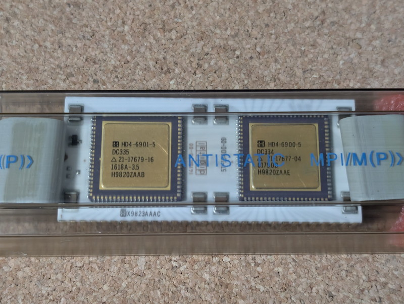
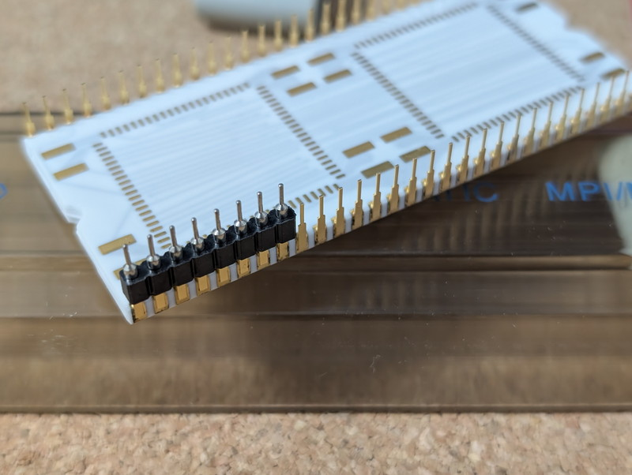
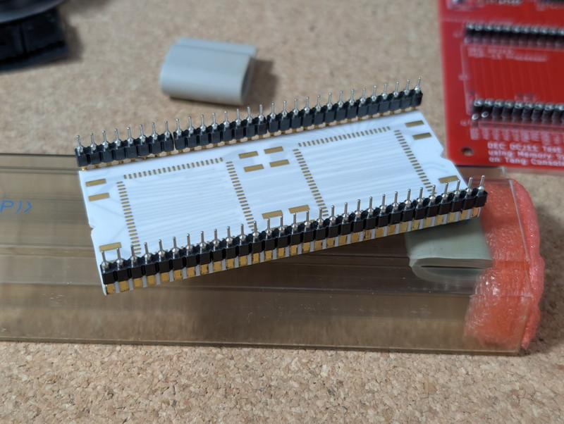
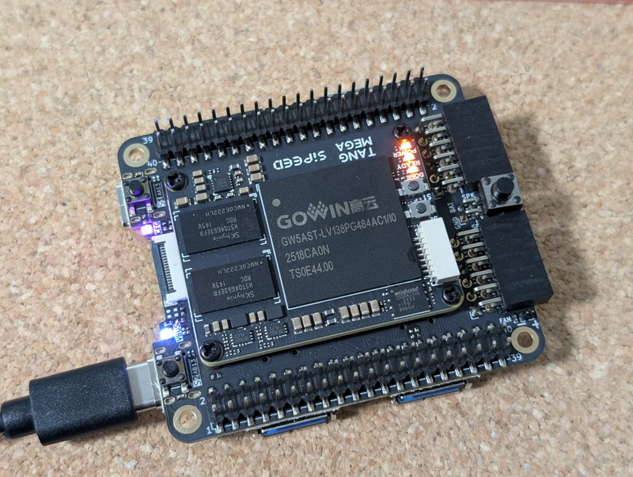
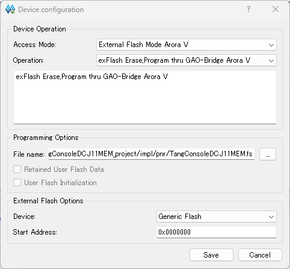
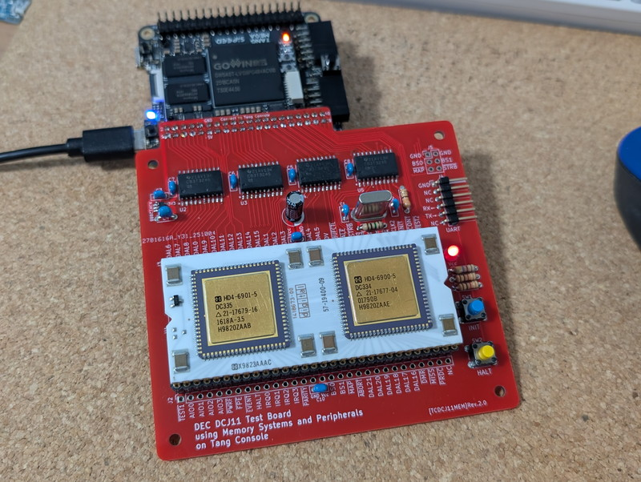

本記事はPDP-11の命令セットを持つ[DCJ11(Jaws)CPU](https://gunkies.org/wiki/J-11_chip_set)を動作させるためにRyo Mukaiさんが開発した[TangConsoleDCJ11MEM](https://github.com/ryomuk/TangConsoleDCJ11MEM)を使用しています。GitHubで公開されています。

これまで[TangNanoDCJ11MEM](https://kanpapa.com/2025/09/tangnanodcj11mem-pdp-11-dcj11-cpu-mini-unix-rev2.html)を使用してPDP-11のDCJ11 CPUを動かしていましたがFPGAボードのTangNano 20Kで接続できるピン数の制約でメモリ空間が64KBと制限されていました。

一つの目標であるUNIX V6を動かすべく、TangConsole 138Kを使用することでメモリ空間を248KBに拡張した[TangConsoleDCJ11MEM](https://github.com/ryomuk/TangConsoleDCJ11MEM)が発表されました。私はもう１つDCJ11 CPUを購入していたこともあり、TangConsole 138Kを入手してTangConsoleDCJ11MEMを組み立ててみました。

## TangConsole 138Kの入手

TangConsole 138KはAliExpressにある販売元のお店で購入しました。[秋月電子さんでもTangConsole 138Kは販売](https://akizukidenshi.com/catalog/g/g130972/)されているのですが、最小限の構成で購入することで送料を含めても若干低価格で購入できました。ただし円安の影響など流動的なところもありますので、その都度構成や価格を比較しながら購入されることをお勧めします。

## 基板の発注

TangConsoleDCJ11MEMのGitHubにガーバーデータが登録されていますので、これをダウンロードしてそのままJLCPCBに発注しました。せっかく製作するので基板の色を赤にしてみました。

到着した基板です。赤が映えます。製作が楽しみです。

## パーツの購入

SN74CB3T3245DWRと18MHz水晶はDigiKeyさんで取り扱っているのでマルツさん経由でオーダーしました。５日間程度で入荷しましたので秋葉原営業所まで取りにいきました。ついでに秋月電子さんに寄って残りのパーツを購入してすべてのパーツが揃いました。

## 基板の組み立て

特に難しいところはありませんが、NJM12888F33のチップは少し足の間隔が狭いので注意が必要です。SN74CB3T3245DWRのチップは足の間隔は1.27mmと余裕があるので0.3mmのはんだを少しずつ流し込んではんだ付けしました。

## DCJ11 CPUの取り付け

今回使用するDCJ11 CPUです。このCPUの足は金メッキされていて美しいのですが、かなり薄くて曲がりやすいです。

TangNanoDCJ11MEMの製作時にはピンソケットに挿す際に一部のピンが曲がってしまい、何とかラジオペンチで復旧させました。これを防ぐために今回は10ピン程度の丸ピンソケットを少しずつ取り付けていきます。

すべてのピンに丸ピンソケットを取り付けることができました。

これを基板に取り付けた丸ピンソケットに差し込むことでピンにダメージを与えずに取り付けができました。完成したTangConsoleDCJ11MEM基板です。

## TangConsole 138Kにビットストリームを書き込む

TangConsole 138Kに書き込むビットストリームの作成はTangNano 20Kの時に使用したGO WIN IDEのEducation版を使用しました。GitHubにプロジェクトファイルが登録されていますのでそのままビルドすることでビットストリームが生成されました。

TangConsole 138Kへの書き込みはGO WIN Programmerを使用しますが、ここで問題が発生です。GAO-Bridgeを指定するとどうやってもSPI Flashに書き込めないのです。GAO-Bridgeを使わないexFlash Bulk Erase 5Aは問題ないので、Flashの異常というわけではなさそうです。

いろいろ調べたところ[FPGAのチップにはB版とC版がある](https://wiki.sipeed.com/hardware/en/tang/common-doc/questions#How-to-Identify-Device-Version)ようです。私の基板のFPGAのチップのマーキングを確認すると２行目に「2518**C**A0N」とあります。この５文字めのCがC版であることを示しています。

TangConsoleDCJ11MEMのプロジェクトはB版で作成されているので、デバイス設定をC版に変更してビットストリームを作成しなおしました。

しかし、書き込みは相変わらず行えません。そこでEducation版ではなく商用版のGowin Programmer V1.9.12 SP1をダウンロードして実行したところ、GAO-Bridgeの名称がArora Vと新しくなっています。

これを指定したところ正常に書き込めました。

## TangConsoleDCJ11MEMの動作確認

TangConsole 138KとTangConsoleDCJ11MEMの基板を接続して電源を投入しました。

USBシリアルの出力を確認したところ、ODTのプロンプトであるアットマークが表示されているようなのですが、別のデータがどこからか混入しているように見えます。

このため一度電源を切断して再投入したところ、変なデータ入力は無くなってODTのプロンプトだけが表示されました。早速[PDP-11/HACKのサイト](http://madrona.ca/e/pdp11hack/index.html)に掲載されているPDP-11 Test #2をODTで入力してみました。

入力が終わりGOコマンドで10番地から実行すると「B」の文字が連続して出力されました。HALTスイッチを押して停止することも確認しました。

この状態で[PDP11GUI](https://retrocmp.com/tools/pdp11gui)を動かして、こちらも問題がないことを確認できました。

## まとめ

今回はTangConsoleDCJ11MEMを製作し、PDP-11 CPUに標準実装されているODTを使用してPDP-11 DCJ11 CPUが動作していることを確認しました。

TangConsole 138KのPMODコネクタにSDカードやLEDなど取り付けることでPDP-11の周辺デバイスとして動作するので、次回はそれを使ってUNIX V6を動かしてみます。

PDP-11 DCJ11 CPUをさらに楽しませていただき、開発者のRyo Mukaiさんに感謝します。
