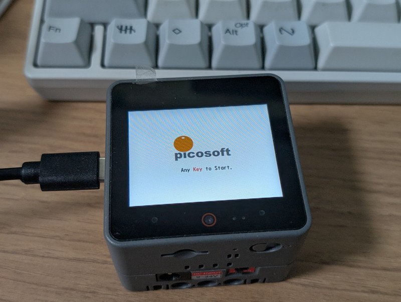
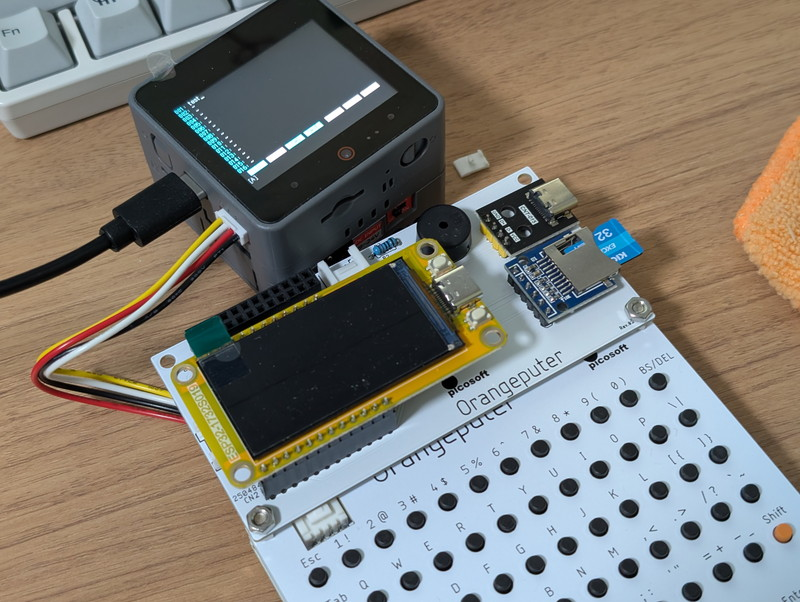
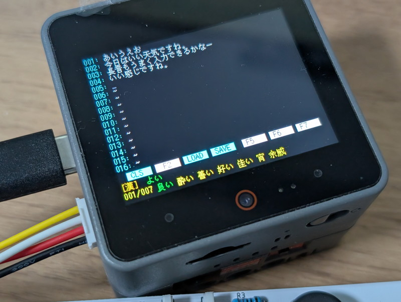

[前回の記事](https://kanpapa.com/2025/11/orangeputer-kb-skk-japanese-editor.html)ではOrangeputerとOrangeputer-KBを使って日本語入力エディタを動かしてみました。今回は[M5Stack CoreS3](https://docs.m5stack.com/ja/core/CoreS3)とOrangeputer-KBによる日本語入力です。

新たにピコソフトさんから[Orangeputerのページ](http://www.picosoft.co.jp/Orangeputer/index.html)が公開されていて、その中にM5Stack CoreS3版のバイナリファイルが公開されています。これとOrangeputer-KBがあれば日本語入力が試せるようです。

- [Orangeputer](http://www.picosoft.co.jp/Orangeputer/index.html)

## ダウンロードしたバイナリを書き込む

ホームページで公開されているバイナリをM5Stack CoreS3に書き込む方法はマニュアルに記載されています。私の場合はWindows11のVSCode＋PlatformIOでESP32開発環境を構築しているので、このpython環境を使いました。コンソールを起動して以下のように入力するとesptoolがインストールされます。

```
pip install esptool
```

あとはマニュアル通りのコマンドラインを入力するだけです。COMポートはデバイスマネージャーであらかじめ確認しておいたものを指定しました。

```
esptool --port COM6 -b 115200 write-flash 0x00000 M5CoreS3.bin
```

次のように書き込みが始まります。


書き込みが終わるとPicosoftのスタートアップ画面が表示されました。



## Orangeputer-KBを接続する

次にOrangeputer-KBを接続します。キーボードはI2C接続ですので、M5Stack CoreS3のPORT Aのコネクタに接続します。Orangeputer-KBに付属のGroveケーブルはツメがついているので、これをニッパーで切り落とす必要があります。



## 動作確認

まずダウンロードしたSKKの辞書をmicroSDカードに書き込んで、M5Stack CoreS3にセットします。Orangeputer-KBを接続しスタートアップ画面の状態でキーボードのキーを押すと日本語エディタが立ち上がります。M5Stack CoreS3の場合はOrangeputerと比べて画面サイズが小さいので、文字が読みにくくなるかなと思ったのですが、特に問題はなかったです。



## 日本語入力の方法

ここで簡単に日本語入力の例をあげておきます。以下のビデオで入力しているものです。

https://youtu.be/6wtpaKj05y8

入力したい文章は「いい天気ですね。」とします。

まず日本語入力モードにするために、Ctrl-J を押します。その後以下のように入力します。

```
iiTennki(Enterで確定)desune.
```

これで文章が完成します。注意すべき点としては漢字に変換したいときはシフトを押して頭の文字を大文字で入力する必要があります。また、漢字の候補が複数ある場合はスペースキーを押すと次の候補になります。慣れてくると違和感なく入力できます。

このビデオを撮るときは片手でスマホを持っていたので入力がゆっくりですが、片手だけでも文章を入力できることがわかると思います。

## まとめ

人気のあるM5Stack CoreS3で日本語入力エディタが試せるようになりました。M5Stackには様々なオプションがあり、話題のLLM Moduleなどと連携すればこの日本語入力がさらに活用できるように思います。[Orangeputerのページ](http://www.picosoft.co.jp/Orangeputer/index.html)にも今後の計画が書かれていますので、こちらも楽しみです。
